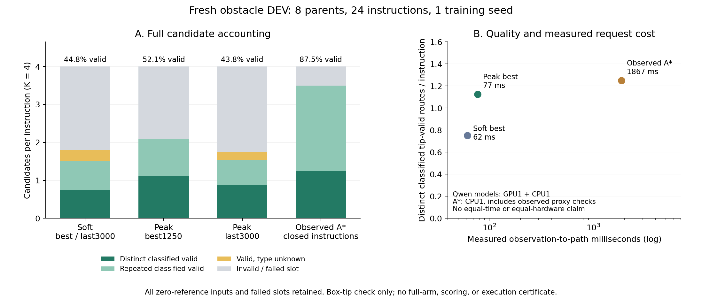

# 新96 TRAIN / 8 DEV：普通几何头与同数据传统规划器

固定训练源码 `6c4446921317fab43066d4928e7a5cdcbbf340d1` 的soft/peak seed0两臂均实际完成、exit0。预先声明的选模标准为 `UniqueClassifiedTipValidAtK + 0.05 * TipValidAtK`，没有在看到本轮结果后替换标准。旧ADE选模结果完整保留，不能将跨选模协议的差异当作纯模型收益。

两臂使用同一96 TRAIN父、288训练指令中的285个有参考指令；8个fresh DEV父共24指令全部计入语义和Tip评价，23条有参考指令计入ADE。每臂3000更新×32样本×K4=384000候选槽，学习率3e-4，grounding权重0.02，H24，seed0。没有验收几何/目标坐标进入模型输入或路径修复。此DEV随后已参与开发分析，不是锁定最终测试。

固定分析源码 `90535b3cf38edc7a43e07368c1c72497b3664613` 已实际CPU运行：4项定向测试通过；完整两臂和planner审计exit0、计算1.82秒。核验包括配置除anchor/output/实测预处理时间外一致、相同数据文件hash、训练源码hash、384000实际曝光、完整last采样器状态与3000步采样流重建一致、best为原历史首个最大选模分数、actual checkpoint与prediction SHA一致。源码/seed重建初始化SHA两臂相同；训练时未保存初始权重，不能声称有当时的初始checkpoint。

| 原协议结果 | 步数 | TipValid@4 | AnyTipValid@4 | UniqueClassifiedTipValid@4 | 严格语义 | 参考ADE |
|---|---:|---:|---:|---:|---:|---:|
| soft best / last | 3000 | 44.79% | 62.50% | 0.750 | 65.63% | 18.607cm |
| peak best | 1250 | 52.08% | 62.50% | 1.125 | 66.67% | 18.533cm |
| peak last | 3000 | 43.75% | 66.67% | 0.875 | 80.21% | 18.297cm |

原best的类型增益为+0.375/指令、TipValid增加7.29百分点；按父平均类型数比较，8父中6胜2平0负。last则3胜3平2负。这里只有一个训练种子，尚不能称稳定的方法优势；单纯继续提高终点准确率也没有保证路径质量。

完整96候选的失败分解：soft best有63个正确语义终点、34条碰撞，其中20条终点正确仍碰撞；peak best分别64、25、14；peak last分别77、44、35。peak best的25条碰撞有15条首次碰撞在自身路径前25%弧长，正确终点碰撞14条中的9条发生在此前段。peak last的44条碰撞有33条在前25%，正确终点碰撞35条中的26条在此前段。有限性、起点与事件检查本轮全部通过。无参考DEV的4个候选两臂均未达到正确目标；仍计入96候选分母，参考ADE为null。

类型也有重复：soft best的43条有效候选中18条分类重复、7条未知类型有效；peak best的50条有效候选中23条分类重复、无未知；peak last的42条有效候选中16条分类重复、5条未知有效。未知有效路线没有被当成失败，也没有被发明成新类型。全部24指令、8父配对差异、所有候选首次碰撞位置和分类保存于分析目录。

同96 TRAIN/24 DEV的传统观测A*v2实际完成：固定K4共96槽，12失败槽全部保留，TipValid和AnyTipValid均87.50%，UniqueClassified为1.250，每指令分类有效重复2.250，未知有效0。它在当前闭合颜色指令任务上仍是更强的路线有效性对照，不能隐去。该系统由TRAIN端点监督拟合精确指令的颜色原型，再使用真实RGB-D观测网格进行四次搜索；不支持开放词汇，未见指令拒绝，没有测试目标或完整真几何作为推理输入。

planner拟合耗时3.996秒，全部24次生成46.908秒，单请求中位1867.17ms、P95 3822.05ms（含观测读取/处理/定位/四次搜索，独立验收0.126秒另计）。神经soft/peak训练耗时160.107/161.376秒、约0.04447/0.04483 GPU小时，峰值allocated显存均951.23MiB，共用Qwen缓存成本另外记录。其RGB-D读取/反投影/头单请求中位7.56/7.27ms排除了Qwen、验收与评分；不能将这一数字与planner完整请求宣称为公平端到端加速。固定时间预算比较尚未完成。

所有Tip指标仅验收新增实体箱体的完整tip线段、原2cm余量、目标/起点/事件；不验证桌面、整臂体积、IK、控制跟踪或机器人执行。传统规划器的可见空间网格也不等于完整实体重建。当前观察到的是普通grounding基线修复和传统强对照，尚无清楚的新路线集合贡献。

证据索引：

- `reports/observed_obstacle_reserved96_v1/{soft_seed0,peak_seed0}`：原配置、summary、history、best/last逐场景指标。
- `reports/observed_obstacle_reserved96_analysis_v1/analysis.json`：同初始化/数据/采样/预算核验、全量失败分解与父配对结果。
- `reports/observed_obstacle_reserved96_analysis_v1/actual_predictions_index.json`：实际pt/npz的服务器路径、字节数与SHA256；二进制已同步本地 `runs/observed_obstacle_reserved96_v1`。
- `reports/observation_astar_obstacle_reserved96_v2/dev_model/report.json`：全部24指令和失败槽；原始与H24预测同步 `runs/observation_astar_obstacle_reserved96_v2`。
- `reports/observed_obstacle_reserved96_analysis_jobs`：实际命令、PID、日志、退出码；只读复算不需要GPU。

下一步实际决定：保留本轮结果，先按固定TRAIN正参考/草稿审计前段可见点支持，再准备相同参数和一次草稿更新的局部距离池化/全局均匀池化普通头对照。TRAIN离开区域72/72单分支的结果否定该区域分配器表示，不据此追加allocator。局部几何方案见 `OBSERVATION_LOCAL_GEOMETRY_PLAN.md`，尚未训练。

## 实际在线Qwen请求补充

固定90535b3、真实Qwen revision89644892、GPU1/CPU1，在相同24条DEV输入上逐请求重新读取RGB-D、processor、Qwen、反投影和路径头，未读取特征缓存。soft/peak的全部请求中位61.73/77.20ms、P95 68.75/84.26ms；首请求601.99/624.40ms，模型加载3.059/2.785秒分别保留，峰值allocated显存均4,300,707,840字节。这里的推理没有路径校验、评分或执行；不能称完整机器人时延。顺序实测会受共享服务器负载影响，不将soft/peak的时差归因于定位操作本身。

与训练后保存的同checkpoint、全24预测逐ID核验，路径最大绝对差soft1.431e-6m、peak1.192e-7m，事件最大差1.192e-7；均在预声明1e-5范围。真实在线质量与缓存头输出一致，未将缓存吞吐充作请求延迟。复现入口`scripts/benchmark_observed_full_inference.py`及本地对照`scripts/audit_observed_full_predictions.py`；原始job、summary、输出hash见`observed_obstacle_reserved96_full_inference_v1`。

图中GPU神经生成与CPU规划的硬件、计时范围不同；它展示实测取舍，不是固定时间或固定硬件公平性结论。全部失败、重复与未知有效类型保留。
