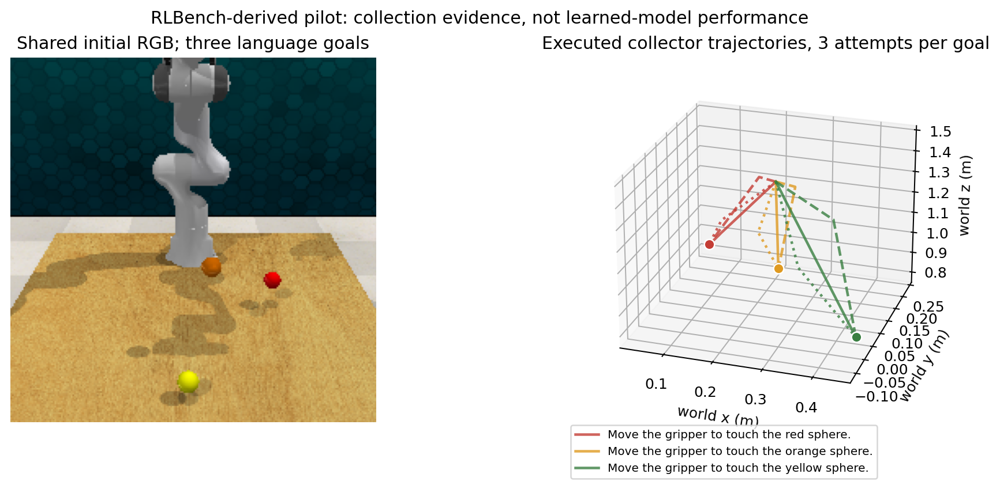

# 观测任务链路核验（2026-10-02）

## 已核验的环境

服务器真实根目录为 `/home/wzy/dpvlm/route_set_v1`。历史环境 `.venv` 是 Python 3.8.10、PyTorch 2.4.1+cu121、Transformers 4.44.2；原数据是固定三路合成数据、冻结 CLIP 特征和两张 3DWay 示例图。原环境没有 Qwen、RLBench 或 PyRep。此前结果不能作为 Qwen 或机器人实验。

本轮独立准备 `.venv-qwen`（Python 3.11.13、PyTorch 2.4.1+cu121、Transformers 4.57.1）和 `.venv-sim`；不升级原 `.venv`。固定公开来源：

| 组件 | 固定版本 / revision | 来源与核验 |
|---|---|---|
| Qwen/Qwen3-VL-2B-Instruct | `89644892e4d85e24eaac8bacfd4f463576704203` | [官方模型](https://huggingface.co/Qwen/Qwen3-VL-2B-Instruct/tree/89644892e4d85e24eaac8bacfd4f463576704203)，官方API逐文件blob/LFS哈希在 `scripts/observation_model_manifest.json` |
| Qwen weights | 2,127,532,032 BF16 parameters / 4,255,140,312 bytes | 官方权重 SHA256 `7de1838c87a5349b016c26a1c3f7d2bc400a3d485f95ef39a7059ffd734977a0`；下载完成后必须核验，未完成时不称已加载 |
| RLBench | `02720bba4c73fe02eb75df946b8791b806028a9d` | [官方代码](https://github.com/stepjam/RLBench/tree/02720bba4c73fe02eb75df946b8791b806028a9d) |
| PyRep | `8f420be8064b1970aae18a9cfbc978dfb15747ef` | [官方代码](https://github.com/stepjam/PyRep/tree/8f420be8064b1970aae18a9cfbc978dfb15747ef) |
| CoppeliaSim | EDU 4.1.0 Ubuntu20.04 | [RLBench官方安装所指定的二进制](https://downloads.coppeliarobotics.com/V4_1_0/CoppeliaSim_Edu_V4_1_0_Ubuntu20_04.tar.xz)，仅解包在项目 `.observation-deps/CoppeliaSim` |
| Xvfb | 2:1.20.13-1ubuntu1~20.04.20 | 用系统已配置 Ubuntu 官方包源下载deb，项目内解包；不安装系统包、不改共享X配置 |

服务器 Hugging Face 直连超时，下载使用 hf-mirror 传输；以官方模型 API 的 git blob/LFS SHA256 判定字节是否一致。Python 和固定源码从官方 GitHub 下载到本地后 SCP 到服务器，绕开服务器极慢的 GitHub 下载。Qwen下载可续传。独立环境的已安装全量依赖在 `scripts/observation_*_freeze.txt` 记录。

实际下载的Python/模拟器/源码压缩包SHA256与固定URL另见 `scripts/observation_dependency_manifest.json`。PyRep初次构建因standalone Python默认寻找未安装的clang失败；使用系统现有 `CC=gcc CXX=g++` 在独立环境构建成功。未安装或修改共享编译器。此轮项目新增主要占用约 `.venv-qwen` 5.4GiB、`.venv-sim` 278MiB、模拟器与源码/安装包1.6GiB、Qwen权重4.0GiB，低于授权的初步30GB。

## 四个任务的源码适配审计

| 原任务 | 可核验内容 | 多路线采集范围 | 当前限制 |
|---|---|---|---|
| reach_target | 颜色指定目标、两个不同颜色干扰球、末端被成功传感器检测 | 接近目标前的自由运动 | 原任务没有离散通道；不同弯曲不能自动计为不同路线类型 |
| pick_and_lift | 颜色指定方块、抓取和抬升事件、干扰物 | 抓取前的自由运动 | 保留原接触/抓取轨迹，不把插入引导点当推理条件 |
| push_button | 按钮基座颜色、按钮关节位移条件 | 下压前的接近运动 | 单个按钮，原指令变化主要是改写，不足以证实目标选择 |
| take_lid_off_saucepan | 抓盖与抬起传感器条件 | 抓盖前的自由运动 | 单一目标；未来需增加同图多目标/约束配对 |

试采明确称为 **RLBench-derived free-approach pilot**。原任务成功条件保持；新加自由运动方案不冒称原 benchmark 的多解标注。不因轨迹欧氏差异给唯一类型数；`unique_valid_route_types=null`。连续碰撞认证尚未完成，仅显式检查新加自由段的模拟步碰撞。

官方 `TaskEnvironment._get_live_demos` 在每条示范前调用 `reset()`，因此连续 `get_demos(K)` 不是同初态多解。实测发现，仅重设 NumPy RNG 也不足够；单独恢复 configuration tree 仍未恢复物理引擎状态。稳定实现采用 `stop → 恢复任务/机械臂/夹爪树、颜色、关节与控制目标 → start → 恢复位置控制标志 → 固定10步稳定化`，将这个可重复稳定状态作为父场景基准。每次仍逐对象核验姿态、关节、速度、颜色与机器人状态，并检查RGB；超过容差立即拒收。已成功的单父场景9次路线尝试中，完整状态最大绝对差与RGB逐像素最大差均为 **0**。所有失败、总尝试数与近重复率保留。新增任务要重新核验，不能将一次成功推广到所有任务。

四任务切换时还需在导入下一个模型前停止模拟；否则 CoppeliaSim 在之后 `stop()` 时会移除运行中导入的任务模型。此失败已记录并修复。没有为通过审计而放宽恢复容差。

## 输入与缓存契约

`scripts/observation_cache_qwen.py` 真正调用 `Qwen3VLForConditionalGeneration` 的底层模型，使用最后隐藏状态（不生成或输入真实路线答案token）。输入JSONL仅允许 `id,parent_id,split,image,instruction` 五个字段，拒绝多余标签字段，检查父场景跨划分泄漏。输出缓存包含冻结Qwen最后token与mean hidden，记录图像hash、模型/processor revision、token数与单请求耗时。

深度、相机、当前夹爪状态单独存储用于观测几何/状态头；不输入 `task_low_dim_state`、真实目标坐标、完整障碍几何或未来路线。路线监督文件和采集引导点审计文件与输入JSONL分离。LoRA/骨干更新后禁止复用冻结缓存。Qwen真实前向验证本身仍不等于观测路线训练或语义泛化证据。

## 运行与恢复

```bash
# 可恢复公开权重下载：只重用已通过官方哈希的文件
cd /home/wzy/dpvlm/route_set_v1
bash scripts/observation_download_job.sh

# 四任务，各1父场景，3次独立恢复后的路线尝试；项目Xvfb与软件渲染
bash scripts/observation_rlbench_job.sh observation_rlbench_pilot_20261002 --parents-per-task 1 --attempts 3

# 需在GPU协调后执行；单进程显存上限为35%，只用物理GPU1
CUDA_VISIBLE_DEVICES=1 OMP_NUM_THREADS=4 OPENBLAS_NUM_THREADS=4 \
.venv-qwen/bin/python scripts/observation_cache_qwen.py \
  --model data/qwen3-vl-2b-instruct-89644892 \
  --manifest data/observation_rlbench_pilot_20261002/observations.jsonl \
  --output data/observation_rlbench_pilot_20261002/qwen_cache --device cuda
```

每个作业在 `runs/<run_id>` 保存 PID、status、log、开始/结束时间与退出码。稳定版wrapper先将执行脚本复制到 `run/source`、记录SHA256，再从该副本执行。第一批成功的运行在启动后补存了仍未改动的实际源码，并用 `source_captured_after_start_at` 明示该时间；较早失败修复轮只有日志、traceback和工具修改历史，没有启动时源码hash，不能事后声称某个新commit就是当时运行版本。Xvfb是本作业子进程，退出时只清理自己的Xvfb。后台下载/采集并不代表会话结束后继续自主分析。

## 当前实测状态

### 已完成的真实Qwen前向

`observation_qwen_forward_20261002` 已退出0，使用真正的官方Qwen3-VL-2B-Instruct BF16权重和冻结隐藏状态；模型与processor所有文件官方hash均通过。输入为同一张真实模拟RGB的三个颜色目标指令，三者图像SHA256一致。

| 检查 | 实测 |
|---|---:|
| 真实模型参数 | 2,127,532,032 |
| 可训练骨干参数 | 0（本步仅冻结编码，未LoRA） |
| mean / last hidden维数 | 各2048 |
| 输入token数 | 84 / 请求 |
| 模型加载时间 | 12.000秒 |
| 首次冷前向请求（含该次预处理） | 2.592秒 |
| 后两次单请求编码 | 0.0555 / 0.0507秒 |
| 峰值PyTorch allocated显存 | 4,279,397,376 bytes，约3.99GiB |
| 同图不同语言mean hidden L2差 | 0.444 / 0.404 |
| 同图不同语言last hidden L2差 | 6.023 / 6.550 |

上述时延只覆盖观测编码，不包括路线头、候选更新/检查/评分，不是完整方法端到端时延。特征变化不等于目标正确率。此步骤证实真实Qwen加载、输入隔离和编码链路；本报告不借此前向声称完成LoRA、机器人路径训练或泛化。

随后 `observation_qwen_reach32_cache_20261002` 用 commit `b684b3e620012361bf309709669d6ed8eac0d5bd` 中缓存脚本的冻结副本完成正式96条指令，wrapper退出0。96/96缓存通过id、图像hash、输出hash、有限数值和维度复核；mean/last各2048维。文件页已热时加载2.507秒，总计7.687秒；单请求编码中位数46.51ms、P95 48.55ms、该轮首个请求471.72ms，峰值allocated显存4,279,413,760 bytes。同图变指令的last hidden最小L2差3.915，仅说明语言确实进入编码。正式输入manifest SHA256为 `31fb89f7a68df597d059f8c0a5be5367395ed58873766cd8b87c3000243a0bb3`；96个特征文件hash索引在 `reports/observation_reach32_audit/qwen_cache_hashes.json`。

### 真实同图三目标小批

`observation_derived_reach_pilot_20261002d`：1个父场景、同图3条不同颜色目标指令、9/9路线采集成功；每次完整状态/RGB恢复差为0。9条保存路线均有限且通过3cm终点阈值复核，平均终点误差0.706mm、最大1.181mm，0条1cm近重复。真实机器人运动由固定PyRep路径规划与模拟执行产生；此处是采集器验证，**不是学习模型性能**。没有离散通道标注，唯一有效路线类型数仍为null。

`observation_derived_reach32_20261002` 已完成：32独立父场景和32唯一初图，24 TRAIN / 8 DEV_MODEL，每父3条不同颜色目标指令，共96条。288总尝试中，275条采集成功，13条因 `ConfigurationPathError: Could not create path.` 失败；全部失败保留。全部288次恢复的完整状态与RGB差均为0；275条保存路线全部有限并通过3cm终点阈值独立复核，平均终点误差 **0.677mm**，最大 **10.844mm**。1cm近重复0条；这不是拓扑路线数。实际采集耗时707.112秒。

`observations.jsonl`（严格5字段）与 `supervision.jsonl` 分离；当前观测npz含深度、相机和夹爪状态，监督npz才含未来路径，目标坐标和目标index仅在supervision用于训练监督/评价。父场景划分同时约束图像、语言和所有路线变体。参考集不完整，未匹配路线不得当不存在。审计结果与全数据文件hash在 `reports/observation_reach32_audit/`；hash清单自身SHA256为 `b6cb09f782d8bd8d3755ec33671cf6399bf7d5c2a57c7a47b52e6b3d9c93e81b`。首父场景从不同进程、相同种子独立重建的RGB SHA256一致。

每指令成功参考条数分布：88条指令有3条参考、5条有2条、1条有1条、2条没有成功参考。TRAIN保存208条路线、DEV_MODEL保存67条。没有参考的2条不是无解标签；它们不能参与参考路径loss/ADE，但必须保留在有独立目标标签的语义评价中。96条观测指令仍全部保留并缓存Qwen，避免把规划器采集失败误写成语义目标不存在。32场景初图montage已检查，见 `reports/observation_32scene_montage.png`；实例mask可见率尚未量化。



### 四原任务可采集性复核

`observation_rlbench_pilot_20261002d` 已完成四任务各1父场景、每父3次路线尝试，**12/12通过各原任务成功条件**；全部12次完整状态/RGB恢复差为0，0条1cm近重复。实际耗时433.585秒。它验证了四任务的同状态采集链路和事件执行可行性；接近段插入引导方案仍属derived采集，规模不足以作为任务泛化或benchmark主结果。全轨迹连续碰撞认证和离散通道类型仍缺失，不能根据此表给学习模型的Valid@K或UniqueValid@K。

| 原任务 | 父场景 | 成功/尝试 | 原任务事件 |
|---|---:|---:|---|
| reach_target | 1 | 3/3 | 末端到目标检测区域 |
| pick_and_lift | 1 | 3/3 | 抓取目标并抬升至成功区域 |
| push_button | 1 | 3/3 | 按钮关节下压 |
| take_lid_off_saucepan | 1 | 3/3 | 抓盖并抬起 |

### 保留的失败与修复

| run_id | 真实结果 | 判断/修复 |
|---|---|---|
| observation_rlbench_pilot_20261002 | 审计JSON numpy数组序列化异常 | 转为明确JSON数组，未收录路线 |
| observation_rlbench_pilot_20261002b | 12/12恢复审计拒收 | RNG重设不足；开始显式恢复模拟状态 |
| observation_derived_reach_pilot_20261002 / b | config tree后仍有joint_velocity及RGB差 | 停启物理引擎并统一稳定化，不放宽标准 |
| observation_derived_reach_pilot_20261002c | 3/3恢复差0，但3条终点失败 | stop/start重置了位置控制flag；恢复位置控制 |
| observation_derived_reach_pilot_20261002d | 9/9成功且完整恢复0差 | 启动32父正式pilot |
| observation_rlbench_pilot_20261002c | reach采集成功，切换pick_and_lift时模型句柄不存在 | 在停止状态导入新任务；以d版重新核验四任务 |
| observation_derived_reach32_20261002 | Python采集与数据审计完成，但外层wrapper实际退出1 | 运行期间为补source冻结而修改了shell，Python结束后bash读剩余行时报unexpected EOF；保留为 `collection_complete_wrapper_failed`，不伪记exit0。275轨迹、summary与hash审计均已完整写出；后续使用不可变wrapper/commit release |

### 冻结Qwen普通头失败后的实测定位

`runs/observed_frozen_v1/seed0` 的best checkpoint为750步；本轮使用CPU1重新读取实际checkpoint并同时评价TRAIN和DEV_MODEL，没有改动3cm验收标准。94条有路线监督的指令参与路径评价（TRAIN71、DEV23）；无成功参考的两条仍保留但不计入路径训练/评价。

| checkpoint / split | 轨迹ADE (m) | 候选终点误差 (m) | 严格语义目标正确率 | 仅最近目标身份（诊断，不是成功率） |
|---|---:|---:|---:|---:|
| best750 TRAIN | 0.06451 | 0.12675 | 2.11% | 88.73% |
| best750 DEV_MODEL | 0.09966 | 0.19544 | 0% | 81.52% |
| last1000 TRAIN | 0.05552 | 0.10751 | 3.17% | 88.38% |
| last1000 DEV_MODEL | 0.11156 | 0.22283 | 0% | 56.52% |

结论是米制定位不足并伴随后期过拟合；不能把它简化为训练集已经掌握任务。best模型在TRAIN本身仍有12.7cm终点误差。同图仅换语言时，TRAIN/DEV平均终点响应分别28.55/28.49cm，说明语言并未被完全忽略；但每组4候选的终点分散度只有约6mm，也未产生可靠的新方案。

RGB-D与标签核验：96/96目标中心投影在图像内；目标中心到最近观测表面平均22.24mm、最大22.97mm，中心射线观测点到目标最大25.70mm，与球表面到球心距离相符。PyRep内参负焦距是其约定，按原符号反投影、外参按camera-to-world、无上下翻转，可以得到一致的世界坐标。此诊断使用真实目标坐标仅核验数据，绝不进入模型条件。它不等于实例mask可见率或完整遮挡证明，但不支持“全部目标不可见/坐标系整体错误导致约20cm误差”的解释。

诊断源为 `scripts/observation_diagnose_head.py`，汇总、逐场景与可重建预测在 `reports/observation_head_diagnostic/`；服务器同目录包含实际预测NPZ，普通Git按既有规则不收录NPZ。复现：

```bash
OMP_NUM_THREADS=1 OPENBLAS_NUM_THREADS=1 MKL_NUM_THREADS=1 \
PYTHONPATH=<recorded-release> .venv/bin/python -m scripts.observation_diagnose_head \
  --run runs/observed_frozen_v1/seed0 --output reports/observation_head_diagnostic
```

据此实现常规观测定位修复：`routeset/observed_geometry.py` 从当前RGB-D、原相机参数产生12,544个无标签观测点；冻结Qwen条件与当前夹爪状态对可训练点特征作空间attention，产生学习的表面anchor和128维上下文。已有普通集合头共享该上下文；终点为预测anchor加逐坐标有界残差（默认5cm），起点仍为当前夹爪位置。该模块是强观测基线的输入修复，**不是论文核心创新**；未增加真实目标、实例分割标签、完整几何或路径答案输入。

`scripts/train_observed_geometry.py` 默认与原头对齐1000步、batch32、K4、128维头和2层集合块，保留相同已知正例匹配目标及DEV选择标准。总参数1,231,965，其中观测几何321,537。仅缓存原始观测点；可训练点编码每步重算。训练支持完整模型、AdamW、调度器、随机状态、采样器和曝光量恢复，保存best/last。记录原始RGB-D读盘/反投影、geometry与头的单请求时延；明确Qwen编码须另外计入总延迟，尚不冒称端到端机器人系统时延。

CPU1验证已实际完成：6项测试通过；真实两样本各12,544点前后向和参数更新0.167秒，点编码、任务query和路径输出参数确实更新；小配置4步完整训练与2步中断后恢复2步的最终模型逐位相同。详见 `reports/observation_geometry_validation.json`。这证明实现和恢复链路可运行；geometry版本的训练收益需由随后固定commit的真实GPU实验判定。

### 评价协议修复：observation_eval_v2

发现并修复了真实分母错误：最初loader因规划器未采到参考而同时删除了两条观测，导致DEV语义只评23条。参考集不完整不意味着目标不存在，因此新版保留全部96观测，TRAIN loss仍只用71条有参考指令；DEV语义评价改为24条，参考ADE/终点/事件仍只统计原23条，缺参考行这些指标为null，不当作失败或有效。

严格颜色身份和3cm阈值完全不变，DEV checkpoint选择仍基于原23条参考ADE。旧23条历史输出完整保留。CPU已用原冻结头best750权重重新评价：24条严格语义仍0%，23条参考ADE仍0.09965624m、终点误差仍0.19544326m。新增证据在 `reports/observation_eval_v2/observed_frozen_v1_seed0/`，包含metrics、逐场景、原checkpoint/config SHA、原训练release和实际评价源SHA；没有覆盖旧训练summary。该目录的TRAIN子目录保留71条有参考训练样本诊断；新geometry训练结束会另对完整72条TRAIN观测评价，参考指标分母71。

新版loader/指标与geometry共12项CPU测试通过，特别验证无参考语义失败会降低完整分母、无参考ADE保持null、输入数量不减少。真实数据确认TRAIN监督71、DEV全部24，其中23有参考。新版geometry完整4步与中断恢复再次逐位相同，见 `reports/observation_geometry_validation_v2.json`。在线冻结/LoRA对照必须使用其实际骨干按同协议重评，不能用旧冻结缓存替代已微调骨干。

### 图像必要性弱对照与固定失败可视化

`scripts/observation_language_control.py` 只用TRAIN有参考指令的末端：先对一个父场景/指令的多条参考末端取平均，再按完全相同的instruction跨父场景平均，因此参考多的场景不会额外加权。该弱诊断不读RGB、深度或当前状态，也不生成完整路线。实际TRAIN监督71条，DEV全部24条，未见指令0条；DEV严格语义正确率0%，目标中心平均误差0.281939m，23条有参考的末端误差0.281923m。逐场景、训练均值和源码/数据hash保存在 `reports/observation_language_only_control.json`。这说明该数据中的语言位置先验不足，不证明任意语言模型都无法解决，也不将其作为强路线基线。

几何版本 `runs/observed_geometry_v1/seed0/best.pt`（750步，SHA256 `a5260c2899298a2aabb8db60553805b9cb43b4250bd76eedd106b044eca5d706`）已由 `scripts/visualize_observed_geometry.py` 实际加载。固定选择按ID排序的前两个DEV父场景261024与261025，各三个目标，未依据结果选择。两张图包含全部6条指令的真实RGB/attention、预测终点投影、H24三维及俯视路线；目标坐标只用于可视化标记和既定评价。每条均为0/4严格命中，完整索引、逐场景误差、attention和预测见 `reports/observation_geometry_fixed6/`。

这些固定例子中，目标中心4cm内的观测点仅获得8.3%–33.9%的attention质量，48.8%–55.5%的质量位于三个目标邻域之外；其余在多个目标之间分散，学习anchor常落在球之间。4cm仅为解释attention的诊断邻域，不是新的成功标准；仍使用原3cm终点标准。它支持下一步检查语言条件空间选择及anchor监督，而不能把未命中的平均位置描述为已完成开放词汇定位。

### 自然布局256父数据扩展：正式采集已完成

`scripts/collect_derived_reach_fast.py` 保留原可靠native stop/start恢复与原任务自然随机布局，不创建障碍、不重定位目标。每父场景3种目标语言、每目标3个自由运动提案；不同欧氏路线不标为不同类型。每步读tip pose和真实gripper_open，并沿用 `collect_obstacle_reach.py` 的arm/gripper外部碰撞检查。初末均与固定RLBench版本 `Scene.get_observation` 的同名字段逐值比较，任何非零差值拒收。状态、完整对象inventory、RGB恢复要求严格零差；失败保存partial轨迹。父初始化失败单独记录，并为其9个未执行提案记录原因，不自动换种子补齐。原free-derived版本已经直接读取tip，因此本轮不声称未经实测的提速收益。

固定release `bb5289c3e9a2c8bc5c60035aaf6cc666f88207e3` 的试采 `observation_reach_fast_pilot_20261002` 使用独立seed261900、1个DEV父，实际耗时27.9879秒、9/9成功；9/9完整恢复零差，初末官方字段等价均通过，零近重复。独立保存轨迹审计9/9数值有限、9/9终点通过，平均终点误差0.691mm、最大1.178mm。见 `reports/observation_reach_fast_pilot_audit/` 与 `observation_reach_fast_pilot_summary.json`。

正式作业 `observation_reach_fast256_20261002` 于2026-10-02 08:45:32 UTC启动，PID159691，CPU线程1、软件渲染、无GPU。使用全新seed262000–262255，与旧32父及试采父不重叠。启动时原始manifest写作192TRAIN/64DEV，后续已由下述预注册分区限制用途，不能整体作为开发数据使用。

实际采集已完成，耗时6324.26秒（约1.76小时）：256/256父成功初始化、2304/2304提案实际执行、2281成功与23失败全部计数，1条近重复成功；2304次strict状态/RGB恢复与初始官方字段等价通过，2281条成功路线末端官方字段等价通过。总机械状态见 `reports/observation_reach_fast256_final_mechanical_summary.json`。这是全体计数与恢复审计，未读取任何保留父的图像、目标或路线进行研究选择；不据这些总量报告模型效果、路线类型覆盖或连续全机器人碰撞认证。

运行证据、PID、实际命令、源码hash和下一步审计见 `reports/observation_reach_fast256_job.json`；早期快照见 `observation_reach_fast256_progress_snapshot.json`。服务器每完成一父原子更新data目录summary，并逐尝试落盘。不要重复启动同run；若中断，保留父场景/attempt日志与已写数据，当前采集器会拒绝覆盖现有目录，不能盲目同命令重跑。会话后的后台进程只执行既定采集，不代表仍会自主分析或改代码。

### 已完成父场景的版本化开发学习曲线

`scripts/snapshot_observation_learning_curve.py` 在不修改运行collector或正式256划分的前提下，对已完成父场景原子生成快照。完整性要求为每父3条观测、3条监督、9个已执行提案结局，且每个监督route列表严格对应实际成功记录；缺参考指令仍保留，不按成功条数挑父。源行和所有父场景文件逐项hash，生成前后复核一致，未完整父和正在追加的JSON尾行不能进入快照。标准库自测覆盖这些边界。

第一份32新TRAIN父＋旧8DEV父快照于08:59:15 UTC发布为 `data/observation_curve_new32_olddev8_v1`；主任务08:59:41创建的 `data/observation_learning_curve_new32_v1` 具有完全相同的输入manifest SHA `b10909644f66dd86e3275b181e86318b2c459bbc2e77869f8b8d4765beda1f11`。**实际缓存/训练只使用后者**；前者只是同内容只读备份，不能计作额外样本或独立结果。共120观测，96条新TRAIN监督指令，DEV严格语义24条、参考评价23条。旧8DEV已经反复参与选择，该学习曲线只作探索性开发证据，不宣称独立确认。64新TRAIN父版本将在满足完整性后另行选定唯一目录，不改变正式256的192/64划分。

64新TRAIN父的唯一快照已于09:15:21 UTC从固定release `a85096a197d0a34c147396a874ec3aef95f0abbe` 实际生成：`data/observation_learning_curve_new64_v1`。共216条观测，192条新TRAIN有参考监督、旧DEV语义24条/参考23条，输入manifest SHA `43205853a21731b3be3f133210031f50016d1ca9208d5c50e26b23a3c9252c31`；父文件来源及逐项hash见 `reports/observation_learning_curve_new64_manifest.json`。前64个新父的576次采集尝试中568次成功、8次路径规划失败，全部576次严格状态/RGB恢复通过；失败保留在快照，不以成功率挑选父场景。缓存和训练由主任务统一排队，不重复创建同内容版本。

### 全Qwen＋当前RGB-D＋集合头的实际逐请求推理

`scripts/benchmark_observed_full_inference.py` 已由主任务在 `runs/observed_full_inference_v1/grounded_seed0` 实际运行，使用原grounding auxiliary seed0 best权重，逐次处理24个不同DEV输入。每次重新读RGB/当前观测、反投影、调用原processor和真实冻结Qwen、再调用可训练几何编码器及集合头；没有使用缓存Qwen或缓存点特征。模型加载7.812秒，首请求760.76ms，24请求中位数54.99ms；排除前两请求后中位数54.96ms、P95 56.38ms，峰值allocated显存4,300,630,016 bytes（约4.005GiB）。文件系统页可能已热。计时覆盖从观测到预测路线，**不含尚未实现的碰撞验收、评分器或机器人执行**。详细逐阶段值见 `reports/observation_full_inference_measured.json`。

`scripts/observation_compare_full_inference.py` 已用实际输出与原缓存特征评价逐元素核对：24×4×24×3轨迹坐标最大差3.576e-7m、平均差2.697e-8m，最大末端间距2.468e-7m；夹爪open最大差1.192e-7。96个候选的严格身份＋3cm判定完全相同，语义目标正确率均33.3333%。原权重及两个预测文件SHA、逐场景一致性见 `reports/observation_full_inference_agreement.json`。这验证了真实完整观测推理链路与所报头部评价一致，不增加泛化或执行成功的主张。

### 传统颜色RGB-D定位对照高于当前学习头

固定 `7474782` 的 `observation_prototype_grounding.py` 已分别用旧TRAIN71指令、新32父TRAIN96指令学习颜色原型，再按同一旧8DEV/24指令严格3cm＋身份验收：分别19/24（79.17%）、20/24（83.33%），CPU完整单请求中位12.49/10.73ms。该对照使用TRAIN参考末端附近的当前可见RGB学习原型，测试只看RGB-D、相机与instruction，未知词表明确拒绝；没有测试目标/几何/mask筛点。

它仅输出一个观测表面端点，不产生路线；不能据此报告多路线Valid或执行成功。少数非目标颜色区域会造成米级错误，全部保留后目标误差均值仍33.50/21.22cm。旧版本失败5条、新版本失败4条，包括完整保留的无参考DEV。它显示普通神经空间attention在当前颜色数据上的定位尚不充分；不将这种定位修复包装为研究创新。具体机制、所有失败、语言交换与运行成本见 `reports/OBSERVATION_PROTOTYPE_BASELINE.md` 和对应逐场景JSON。

### 在线RGB-D冻结/LoRA配对入口与CPU验证

新增独立入口 `scripts/train_observed_geometry_lora.py`，复用原在线Qwen的末两层q/v LoRA实现，不改变旧训练脚本行为。两臂必须从同一完整RGB-D辅助模型权重开始，核验架构、官方Qwen/processor、manifest和监督来源；geometry与普通集合头全部继续训练。Qwen逐请求读真实RGB和instruction，不接受隐藏特征缓存。训练可以预处理未学习的RGBXYZ，评价逐请求重新读RGB-D、反投影并执行真实Qwen与头，所有处理计时。

预定新增曝光为每臂1000更新×4观测，K4共16000候选槽；共同预训练128000槽单独记录，不能把新增训练当全部成本。两臂学习率均1e-4、相同endpoint attention权重0.02；step0纳入原23参考ADE选模。最后一步和最优权重分别保存真实在线预测/指标、adapter梯度/参数hash，并保留优化器、调度器、RNG、采样器和全局步数恢复。

固定 `093a1b4` 的首次CPU预检在参数审计阶段失败：旧hash函数无法直接把geometry标量log_attention_scale view为字节。原失败log/exit1完整保留，旧模型/评价无改动。局部修复在新入口flatten后计算hash，固定 `9c19288b0e2fb86b6bea42ac23758314134872c0` 后真实小Qwen结构CPU自测通过：8/8 adapter有非零梯度且真实更新，46/46几何与头参数张量更新，冻结base不变；零B初始化输出与冻结模型逐位相同，optimizer/RNG/sampler/scheduler恢复后的参数最大差为0。小模型测试不等于本轮2B模型已训练成功。

同release的完整new64初始化核验也实际通过：216输入、192有参考TRAIN、24 DEV语义/23 DEV参考；每请求12544观测点、头1231965参数（几何321537），全部训练。共同best SHA `281aa924fd78207ad55795214a232ce87aab7000a8b2da8ea81c805f06d9a5f8`，全部当前图像、RGB-D与路线来源hash和预训练一致。验证不加载隐藏特征缓存、2B骨干或GPU。失败及成功的真实命令、PID、源码SHA、退出码和完整审计在 `reports/observed_online_geometry_preflight/`；GPU正式配对由主任务统一启动与记录。

正式2B在线配对现已完成：frozen与LoRA均完成1000×4新增曝光并exit0，8/8 LoRA张量实际更新。两臂原DEV-ADE选模均停在共同step0，最优预测逐元素相同；last1000语义分别16.67%/12.50%，低于step0的19.79%。不能把参数真实更新当作任务收益。完整负结果、成本和权重索引见 `reports/OBSERVATION_ONLINE_RGBD_PAIR.md`。

随后基于全DEV注意力诊断实施常规peak-anchor修复，已在natural64与obstacle32各完成soft/peak三真实种子，并对双方12个last权重实际统一CPU重评。自然旧DEV选中语义17.36±13.19%→83.68±6.62%，三配对参考误差也改善；障碍原选模结果波动大，peak seed1语义0且平均ADE恶化，固定1000步存在不同取舍。该定位修复不作为路线集合创新，两个旧DEV仍反复参与选择。完整best与fixed协议、失败和分母见 `reports/OBSERVATION_PEAK_ANCHOR.md`。

### 正式新父场景的预注册保留分区（更正原初始开发计划）

正式collector原始manifest仍按启动时的192TRAIN/64DEV写入，不改运行源码或重写历史标签。但正式导出必须应用 `configs/observation_partition_reservation_v1.json`（2026-10-02 10:10:31 UTC注册、commit6799d83），不能继续按早期“后64父全部开发”的描述使用数据。

natural父262000–262191为TRAIN，262192–262207为DEV_MODEL，262208–262223为DEV_SCORE，262224–262239为CALIBRATION，262240–262255为TEST_LOCKED。所有轨迹、语言、视角和条件变体随父继承角色。旧261024–261031仍是已反复使用的开发集；新64学习曲线的TRAIN来自262000–262063，配套旧8DEV，所以现有方法选择没有读取新保留父。

同预注册也保留obstacle父272120–272127为TEST_LOCKED，评分/校准与生成器开发分开。研究期间不读取锁定图像、轨迹、目标或逐场景/总体模型结果；只允许格式、恢复、hash和总采集失败机械审计。不得直接对整个raw collector目录训练或评价，也不以新成功父替换失败父。OOD_LOCKED尚未建立，需要另外声明真实分布变化，不能把这批IID保留父改名为OOD。

固定release `4f348c73aaf1411e9c02ba04806a5134326651e8` 的 `export_observation_roles.py` 已实际完成CPU1自测与正式导出，均exit0。自测包括过滤后才decode监督行、锁定行故意不可解析而不读取、setup失败父保留、零参考输入保留、未完成父拒绝、跨父路径及Linux真实symlink拒绝。导出只扫描unselected行的parent_id标量；仅对已选TRAIN/DEV_MODEL父打开文件并hash，不调用旧的全raw inventory。

唯一导出 `data/observation_natural_reserved_development_v1` 含192 TRAIN＋16新DEV_MODEL父，624个严格5键观测输入（576 TRAIN、48 DEV），本次这些指令均有至少一条正参考。父范围完全按预注册，没有成功率筛选或补父；源行/选中父文件生成前后hash一致，原raw split保持不变。输入manifest SHA `aa17ecef147f73ada2e902ac30f7de39be0acc47a25ced5959607619bf945495`，完整父来源hash见 `reports/observation_natural_reserved_development_manifest.json`，命令/PID/exit见 `reports/observation_reserved_export_jobs/`。真实Qwen缓存由主任务统一启动；后续独立transfer入口只加载已选old64六best，不重写其训练fingerprint或假装resume。

主任务实际启动的该导出真Qwen缓存已于10:50:10 UTC完成、exit0：624/624条RGB＋语言输入，官方revision与processor仍为 `89644892e4d85e24eaac8bacfd4f463576704203`，2,127,532,032个骨干参数全部冻结。耗时40.636秒（含加载3.308秒），峰值allocated显存4,279,413,760 bytes；此为连续缓存作业总成本，不能冒充完整路线单请求延迟。另以CPU逐项核验624份NPZ SHA和对应图像SHA全部与samples日志一致。运行/source/launcher/config/status SHA与完整审计保存在 `reports/observation_reserved_qwen_cache_v1/`。缓存不读取监督manifest或路径目标；该步骤本身不构成路线质量证据。

固定 `7f27f93514850973fba93260e8569f2a7fec27ea` 已实际完成旧natural64 soft/peak三seed原best在新16 DEV父/48指令上的CPU迁移评价、exit0。没有新增训练或重新选模：严格语义从28.47±3.18%提高到72.05±3.14%，参考ADE从6.60±0.28cm降到6.21±0.14cm，三个配对方向一致。所有失败与144场景配对差异保留，三个peak种子共同失败的green/azure/violet/gray四指令完整列出。新DEV仍是开发泛化检查，不是最终锁定测试；详见 `reports/OBSERVATION_FRESH_DEV_TRANSFER.md`。新的192 TRAIN从头配对与旧64 prototype公平迁移由主任务排队，未完成前不记作结果。

两项随后均已真实完成：new192同384000候选槽的seed0原best为soft66.67%/peak95.83%，但peak last3000退至87.50%，详见 `OBSERVATION_RESERVED192_PAIR.md`。旧64已拟合prototype未追加训练，在同48新DEV上40/48=83.33%，保留全部8离群失败，详见 `OBSERVATION_PROTOTYPE_FRESH_DEV.md`；它仍只是K1端点定位，且与新192神经模型训练数据和预算不同，不能混作公平路线比较。

随后固定 `3fc6fd77c060bfb5b94bca3466be56837afb4fe4` 完成障碍old32 TRAIN-only检查：94有参考输入的181条原始路线与实际训练H24全部满足原2cm TipValid，70未知类型仍有效，排除这批参考重采样/余量冲突。seed0 peak last在96 TRAIN/384候选上已有338语义正确，但其中154条仍碰撞，115条首次碰撞在自身路径前25%弧长；真实raw DEV文件未读取。该单种子训练诊断支持转向早段绕障问题，详见 `OBSERVATION_TRAIN_GEOMETRY_DIAGNOSTIC.md`，不当作独立测试或完整机器人有效性证据。

新障碍96 TRAIN/8新DEV配对训练前，预先固定可选选模协议 `dev_tip_unique_valid_v1`：DEV分数为 `UniqueClassifiedTipValidAtK + 0.05 * TipValidAtK`。它复用原2cm箱体余量、3cm目标与事件判据，对全部DEV（含无参考指令）计数；未知路线类型保持有效并计入次项。几何验收标签只在全部预测完成后读取，不进入生成条件、损失或推理修复。原脚本默认仍为参考ADE选模，旧结果和门槛不变；新配对两臂必须同协议，best与last分别保留。此调整加强基线与任务指标的一致性，不当作方法创新。

固定release `870fc45aaf963946d7ec06c08ab3d23c8f585f38` 的实际CPU1预检已exit0：`tests/test_observed_selection.py` 与 `tests/test_observed_geometry.py` 合计14项通过，pytest耗时2.76秒。覆盖默认历史输出、公式/无参考分母/未知有效、标签读入顺序及不影响forward、恢复协议拒绝和原几何/peak梯度兼容。原始命令、PID、日志、源码SHA在 `reports/observed_tip_selection_preflight/`；通过测试本身不代表新配对已有实测收益。
