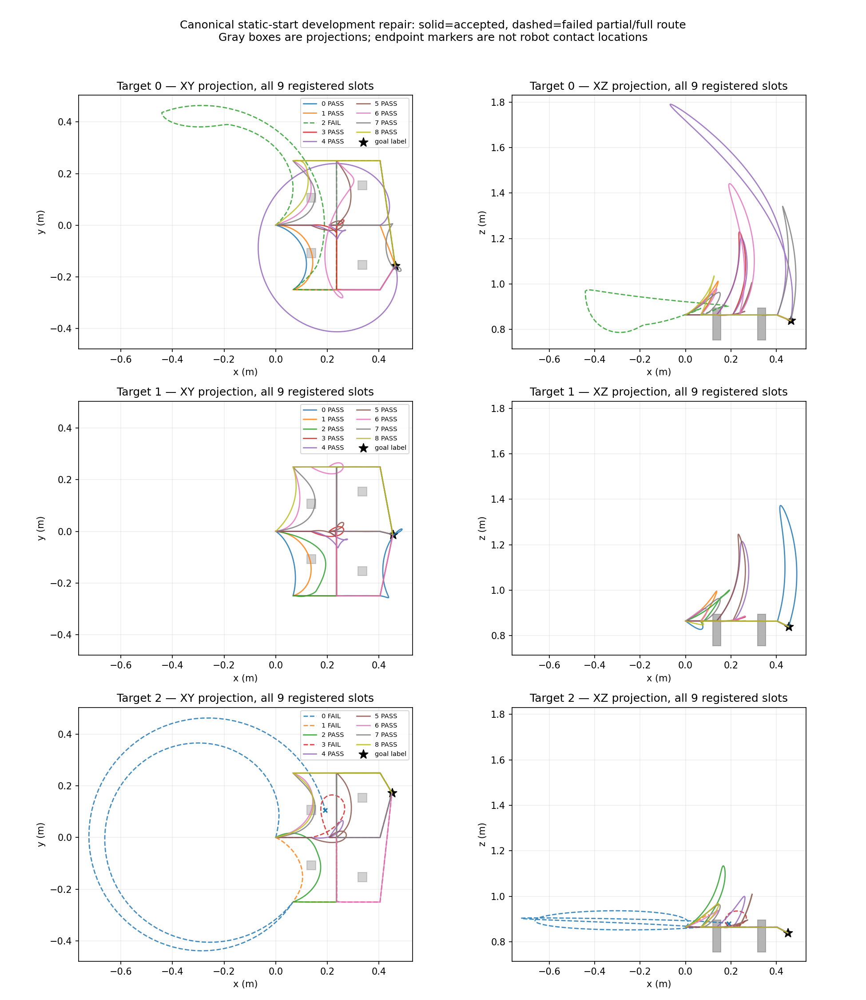

# v6 实测：静态起点门禁通过，原失败布局可采

固定 `60a01ea33b53e40add76183a0f529dc5fef30321` 的一次有界采集已完成，服务器81项检查通过（1.38 s），record_job/collector 均退出0。四个原 v5 几何组的新静态初态全部通过；仅原失败组283102执行27槽，**23条参考接受，14条已知lateral、9条有效unknown、4条失败，0未尝试**。另三个父只做初态审计，没有新路线。

| 目标 | 请求/尝试 | 接受 | 已知类型（全部lateral） | 有效unknown | 失败 |
|---|---:|---:|---:|---:|---:|
| 0 | 9/9 | 8 | 5 | 3 | 1 |
| 1 | 9/9 | 9 | 7 | 2 | 0 |
| 2 | 9/9 | 6 | 2 | 4 | 3 |

有效率23/27=85.19%，unknown占接受9/23=39.13%，已知类型无重复。两个目标有真实R>K，第三目标只有两个已知类型；不强行声称每个目标九类或完整解集。全部数据仍是 DEV_COLLECTION，相同几何组不能转入正式TRAIN/TEST。

## 初态与实际门禁

四父初态碰撞/逐settling步碰撞均未命中，原图像、depth、camera、current、motor targets、全world及inventory的同父恢复严格零差。四组实际1mm几何hash与v5的对应组一致且互不重复。三个目标每球可见148–158像素，柱面RGB-D一致性检查通过。四个初态的实际FK相同：`[0.0002692863,0.0004219357,0.8647353053]` m，距声明entry0.566223mm。没有期望或宣称与旧动态world/RGB完全一致。

返回283102的同一进程内native snapshot后再通过严格检查，其27次路线前恢复全部通过。模型输入三条语言共用同一初始RGB-D/camera/current；坐标、post、guide、mask、类型仍只在监督/审核侧。四个初态的native `.ttt`已保存并列hash，但没有声称验证了跨进程动态roundtrip。

初始化/恢复规划入口数均为0。实际路线236次显式get_path，每个都进入linear入口；35次进入nonlinear/sampling，记录到35次低层配置查询。入口是嵌套关系，不能相加当候选数；27个候选槽保持完整分母。这版避免了旧task.reset的未插桩验证规划，且保留所有真实调用成本。

## 四个失败未作挽救

| 目标/槽 | 实测原因 | 终点误差 | 判定 |
|---|---|---:|---|
| 0/2 | raw与H24 tip都未通过2cm | 1.435mm | 拒绝 |
| 2/0 | 逐仿真步arm_environment碰撞 | 未到终点 | 拒绝，保留partial |
| 2/1 | raw tip通过，H24不通过；类型均negative_y→middle | 1.447mm | 拒绝 |
| 2/3 | raw tip不通过，H24通过；类型均middle→negative_y | 1.091mm | 拒绝，不能用重采样掩盖raw失败 |

九条有效unknown保留，不把guide当真实类型。接受路径长度0.829–3.773m、均值1.459m，包含较大绕行；没有通过事后长度筛选改善结果，也不把这些示范声称为最短或最优路线。后续任务层生成比较仍须同时报告长度与质量。



## 来源、成本与下一决定

四父初始化审计分别6.922/5.800/5.699/5.686s，总24.107s；collector187.412030s、record_job187.880661s，其中显式规划21.309933s、路线模拟44.758709s。CPU固定core2/GPU隐藏。数据和run为服务器 `/home/wzy/dpvlm/route_set_v1/{data,runs}/observed_two_row_canonical_repair_v6`，PID469607/child469608已退出。

wrapper SHA `dd4a9e207f11f8c00bccce5cca67cbf7d3db4e879bb14f45b97b46d232781fb2`，传输archive SHA `601bd7a12d762f99dfa2e1b8d160a4013fe4d2806cbab29dd2e43198466823bd` 双端一致。76文件纳入[来源/二进制索引](observed_two_row_canonical_repair_v6/artifact_index.json)，58个原始artifact hash全部匹配。只读重算全部接受条件通过，见[分析](observed_two_row_canonical_repair_v6/analysis.json)、[逐槽交叉/段诊断](observed_two_row_canonical_repair_v6/all_attempt_diagnostics.json)、[原summary](observed_two_row_canonical_repair_v6/metadata/summary.json)。图已完整目视检查。

```powershell
$env:PYTHONPATH='.'
python scripts/analyze_two_row_canonical_repair.py --data <v6原数据> --source-v5 <v5原数据> --output <新分析目录>
```

结果支持固定canonical q作为**新的RLBench-derived数据初态定义**，不支持“执行setup更好”或旧动态初态的因果配对主张；v5的25% setup失败原样保留。下一项已获授权仅实现和预登记：116个新物理父（64TRAIN、12DEV_MODEL、12DEV_SCORE、12CALIBRATION、16TEST_LOCKED），沿窄±5mm ID范围、每父全部三目标27槽、无重抽替换。正式源码/角色表冻结后才启动，旧四组永久留DEV_COLLECTION；独立宽OOD尚未执行。
