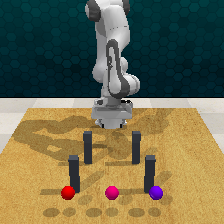

# 24 次端点 IK：竖直朝向无收益，碰撞约束仍是已见瓶颈

固定源 `0eeeecbe3d02adac413083a9edc0df674aa53be2` 已完成一次预登记诊断。27 个服务器测试通过（0.26 s）；24/24 个端点查询均执行，前后共 48 次严格恢复全部通过，0 未尝试、0 重试。原朝向和竖直朝向在完全相同的六个点上都只有 **3/6** 次碰撞过滤 IK 返回配置。关闭过滤后两者都返回 **6/6**，但新增的三个点均被独立 `arm_environment` 检查判为碰撞。故本轮不支持采用竖直朝向作为修复，也不启动路线批采。

| 条件 | 返回配置 | 返回后未检出 arm/gripper 碰撞 | 最大位置误差 | 实际底层搜索 |
|---|---:|---:|---:|---:|
| 原朝向，碰撞过滤开 | 3/6 | 3/3 | 0.1783 mm | 387 |
| 原朝向，碰撞过滤关 | 6/6 | 3/6 | 0.1297 mm | 6 |
| 竖直朝向，碰撞过滤开 | 3/6 | 3/3 | 0.1082 mm | 387 |
| 竖直朝向，碰撞过滤关 | 6/6 | 3/6 | 0.2715 mm | 6 |

全部 18 个返回配置的 joint-position readback 与请求值差为 0，最大旋转误差 0.04315°，tip 的 2 cm 点余量均通过。这使“tip 几何通过不代表整个机器人无碰撞”的区别十分直接。表中配置数量不是路线成功率、任务有效率或参考解集数量；忽略碰撞的结果未加入训练参考。

## 六点完整矩阵

`清` 表示返回配置且独立端点机器人检查未检出碰撞；`碰` 表示返回配置但检查为 `arm_environment`；`未找到` 表示用完本次 128 个配置搜索额度。无一项代表已验证从初态到端点的连接路径。

| xyz（m） | 原朝向／过滤开 | 原朝向／过滤关 | 竖直／过滤开 | 竖直／过滤关 |
|---|---|---|---|---|
| (0.14, −0.25, 0.865) | 清 | 清 | 清 | 清 |
| (0.14, 0, 0.865) | 未找到 | 碰 | 未找到 | 碰 |
| (0.14, 0.25, 0.865) | 清 | 清 | 清 | 清 |
| (0.34, −0.25, 0.865) | 未找到 | 碰 | 未找到 | 碰 |
| (0.34, 0, 0.865) | 清 | 清 | 清 | 清 |
| (0.34, 0.25, 0.865) | 未找到 | 碰 | 未找到 | 碰 |

六次未找到各消耗完整 128 次搜索；其余 18 次均首次返回配置，共 786 次，未额外换种子或补调用。几何与完整机器人碰撞约束参与了当前瓶颈，但有限预算未找到不能证明所有关节分支都不可行。`arm_environment` 尚未记录具体 link/body 对，故不能进一步断言一定是柱体、桌面或某一连杆碰撞。

## 共同初态与朝向

这次在同一进程完成一次两段 setup 后建立共同 snapshot，未复活 v1 隐藏状态。24 次查询之前和之后的完整 world/inventory/RGB/depth/current/calibration，以及新增 joint-target position/velocity 核验均严格零差异。模拟器内部随机流仍未证明逐位配对，不能以这次二元结果估计统计成功率。

实测 tip local +Z 与 attachment→tip 方向点积为 **0.99983538**，原轴相对世界向下偏 **13.73959°**。竖直四元数从这次真实 tip 朝向投影得到 `[0.0011023725, 0.9999993924, 0, 0]`，与旧 v2 数值略有不同，未用旧状态假装新共同初态。完整矩阵和 readback 在 [逐查询文件](observed_two_row_endpoint_ik_v1/metadata/endpoint_queries.jsonl) 与 [汇总分析](observed_two_row_endpoint_ik_v1/analysis.json)。

## 成本与复现

- setup：1 个动作、2 次 `get_path`、173 模拟步；规划 0.427455 s，模拟 1.361189 s，setup 含初始化/核验 7.384480 s。
- 查询：24 次端点 API、786 次底层配置搜索；IK 总耗时 **8.484529 s**。
- 每查询前后固定恢复合计 960 个 canonicalization 步，**134.953977 s**；端点临时 FK 放置没有 physics step 或路径插值。初始共同状态 canonicalization 另有 20 步。
- 完整诊断 **153.009063 s**，record_job 墙钟 **153.424961 s**；没有用 8.48 s 求解子项冒充端到端时间。
- setup 后完整路线提案 **0**，新增正参考 **0**，GPU 用量 **0**，CPU1 已释放。

服务器 data/run 均为项目根下同名 `observed_two_row_endpoint_ik_v1`。不可变 launcher 为 `research_v2/launch_endpoint_ik_0eeeec.sh`，SHA256 `1516ace0545f10a1e7b84fc212cb5a1372ffd1fe818ae68d4cf143db092cb293`；[原副本](observed_two_row_endpoint_ik_v1/run/frozen_job.sh)、[实际进程状态](observed_two_row_endpoint_ik_v1/run/endpoint_ik.status.json) 已归档。31 个实际文件入索引，13 项 artifact hash 全部匹配；NPZ 保留于服务器和忽略的本地原始归档，见 [hash 索引](observed_two_row_endpoint_ik_v1/artifact_index.json)。

## 决定

否定“仅把当前 tip 倾角改为竖直就能解决三处失败”的低成本假设，保留现有碰撞与通道判定。下一步最小有信息量的工作是：只重放本轮已保存的六个碰撞配置（query 5/7/13/15/21/23），记录具体 link/body 碰撞对及静态几何位置；不再做 IK 搜索，不生成新路线。该诊断尚未实现或启动，需另行冻结授权。它能决定应改柱体位置还是另有桌面/自身碰撞约束，避免盲目平移或降低碰撞标准。

即使后续某几何版本获得端点正例，也必须重新通过真实整机模拟路径、原 tip/H24 检查及实际类型分类，才能作为 >K 数据可采性证据。本轮既没有证明物理无解，也没有证明数据升级目标已实现。
