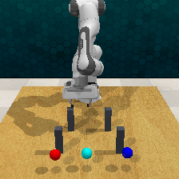
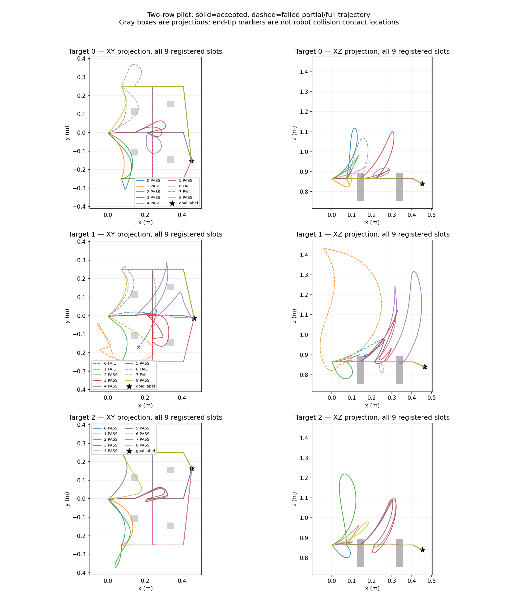
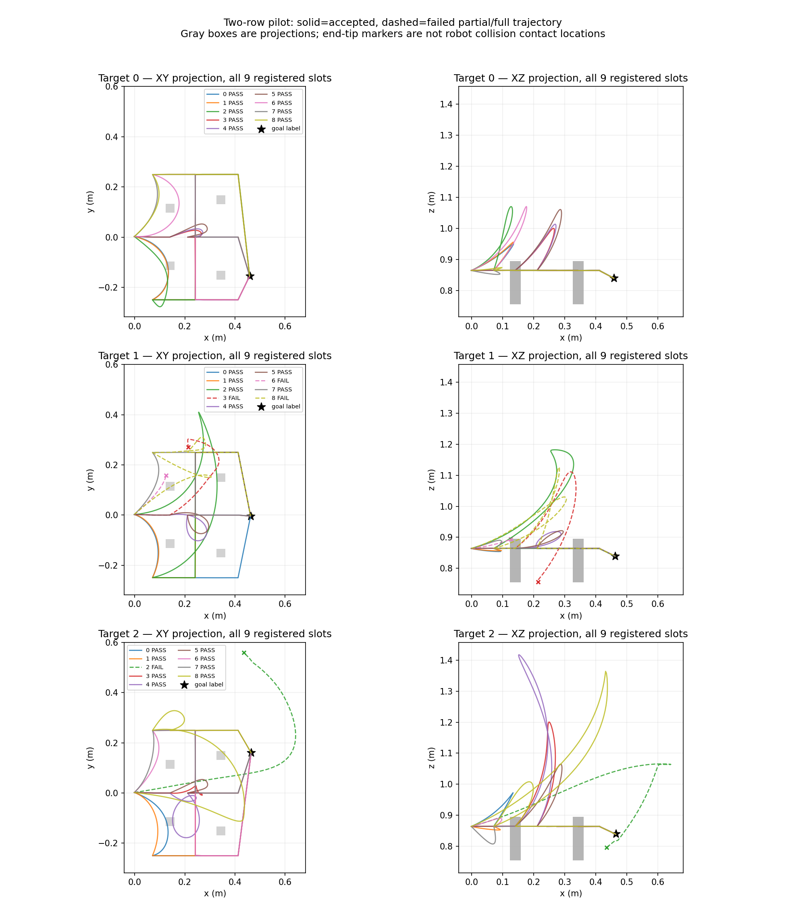
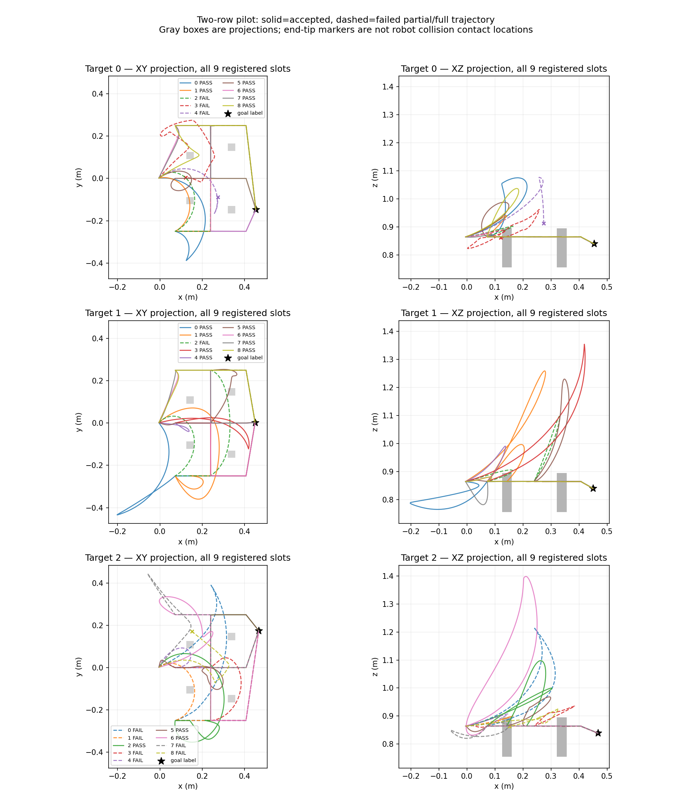

# v5 四布局实测：六个目标条件有至少五种真实路线

固定 source `9324efcf2cb59263225e4dd4a40234160bcd23b6` 的唯一四父批次已完成，62 项服务器测试通过（1.24 s），作业正常退出。四父、12 目标、108 路线槽全部保留在分母：**三父完成路线采集、一父 setup 失败；实际 81 槽中 61 条参考通过，49 条已知类型、12 条有效 unknown，20 条路线失败，27 槽未尝试。** 没有重抽布局、替换父场景或修改检查阈值。

| 父场景 | 目标 | 接受参考 / 9 请求槽 | 已知类型 | 其中 lateral | 有效 unknown | 路线失败 | 未尝试 |
|---|---:|---:|---:|---:|---:|---:|---:|
| 283100 | 0 | 7 | 7 | 7 | 0 | 2 | 0 |
| 283100 | 1 | 5 | 4 | 4 | 1 | 4 | 0 |
| 283100 | 2 | 9 | 8 | 8 | 1 | 0 | 0 |
| 283101 | 0 | 9 | 8 | 8 | 1 | 0 | 0 |
| 283101 | 1 | 6 | 5 | 5 | 1 | 3 | 0 |
| 283101 | 2 | 8 | 7 | 7 | 1 | 1 | 0 |
| 283102 | 0 | 0 | 0 | 0 | 0 | 0 | 9 |
| 283102 | 1 | 0 | 0 | 0 | 0 | 0 | 9 |
| 283102 | 2 | 0 | 0 | 0 | 0 | 0 | 9 |
| 283103 | 0 | 6 | 3 | 3 | 3 | 3 | 0 |
| 283103 | 1 | 8 | 6 | 5 | 2 | 1 | 0 |
| 283103 | 2 | 3 | 1 | 1 | 2 | 6 | 0 |

六个目标达到至少五种已知类型，同样六个也有至少五种 lateral 类型。已知类型无重复；283103/目标1 中另有一条包含 over 的已知关系。成功率按已尝试槽为 61/81=75.31%，按全部请求槽为 61/108=56.48%；unknown 占接受参考 12/61=19.67%，占已尝试槽 14.81%。未知不能用于增加 Unique，未采到也不能当作不存在。

全部 81 次路线前恢复的 world、完整 inventory、RGB、depth、camera/current 均严格零差。三个可用父均为同一初始 RGB-D 对应三个不同颜色目标指令。四个实际 post/goal 几何的精确与 1 mm 指纹均不同；失败父的几何来自失败 setup 的 world capture，仅证明布局对应，不能伪造有效路线初态。来源见[完整审计](observed_two_row_layout4_v5/analysis/analysis.json)。

## 失败保留与 setup 定位

20 条路线失败为 11 条 raw tip 2 cm 检查失败、7 条逐仿真步 arm 碰撞、2 条 H24 检查失败。在已记录终点的失败中，没有大于 3 cm 的终点错误。两条 H24 失败不同：283100/目标0/槽7 的 raw/H24 都 tip-clear，但 unknown 被重采样变为 `(over,middle)`；283103/目标2/槽3 的 raw tip-clear 而 H24 有碰撞，双方类型都是 unknown。均按原判据拒绝，没有重采样救数据。

283102 的两段准备 `get_path` 均成功返回。第一段 49 步完成，第二段第 96 步发生 `arm_environment` 碰撞，共 145 步。末端停于 `(0.140128,-0.052373,0.905687)`，距预登记 entry 153.338 mm；这不是目标 IK 被拒绝，也不能由单次失败推断场景无解或纯随机原因。保存的准备轨迹本身通过 tip 2 cm 检查，说明整机检查确实增加约束。

只读 OBB 检查将失败 world 中机器人姿态与相同固定模型的已存 shape bbox 对照，唯一代理重叠为 `Panda_leftfinger_respondable` 与 post0。这是包围盒诊断，**不是原时刻的真实 mesh 接触对象证明**，没有重新模拟或添加 IK。完整失败 setup、146 点 partial 的 SHA、逐段 planning/step 成本与诊断位于[审计 JSON](observed_two_row_layout4_v5/analysis/analysis.json)和[原 setup](observed_two_row_layout4_v5/metadata/raw/283102/two_row_reach_283102/setup.json)。



## 成本、计数边界和复现

四 worker 总计 516.581599 s（分别 170.649005、166.560398、5.921846、173.450351 s），外层 record_job 516.906451 s。显式 collector setup/guide `get_path` 合计 683 次，所插桩规划 56.830990 s、模拟步执行 133.515722 s。CPU1、GPU 隐藏。

**成本口径补充：** pinned RLBench `Scene.init_episode → Task.validate → _feasible` 会在 `task.reset()` 中调用 waypoint `get_path(ignore_collisions=True)`；本版初始 setup 和路线前 reset 的这些框架验证调用，以及 get_path 内部 IK/OMPL 搜索，未逐项插桩。683 不是全系统规划调用数；完整 worker 耗时包含这些开销。原 runtime JSON 的 complete 字段只对应 collector 显式计数，不能外推成全规划调用完整。没有事后编造内部次数或把配置搜索当独立候选。v4 的 83 次同样限于 collector 显式调用。

用三成功父均值 170.220 s 粗线性外推，116/128 父约 5.49/6.05 小时；把一个快速 setup 失败也计入当前四父均值则约 4.16/4.59 小时。这只是两种成本场景，不是吞吐保证，更不能靠快速失败“提速”。

服务器原数据 `/home/wzy/dpvlm/route_set_v1/data/observed_two_row_layout4_v5`，作业同名 `/runs/observed_two_row_layout4_v5`。wrapper SHA `8ac2a191fca3f76c300eb5281eec9d26aee9c0c64eea0be17914d3c4c727365c`；archive SHA `1eed1670109919d0579c478a4c31cfac917e8bf78d81bd164db17ad3adec0ce5` 双端一致。176 个文件纳入索引，四子集 133 个原始 artifact hash 全匹配；NPZ/模型不入普通 Git。[索引与成本边界](observed_two_row_layout4_v5/artifact_index.json)、[原作业状态](observed_two_row_layout4_v5/run/collection.status.json)均保留。

只读重分析命令：

```powershell
$env:PYTHONPATH='.'
python scripts/analyze_two_row_layout4.py --data <原数据目录> --output <新分析目录> --shape-provenance reports/static_contacts_mesh_api_fix2/metadata/shape_mesh_provenance.json
```

全部 81 槽可视化已逐张核验，失败为虚线，没有只画成功样例：







## 判断与唯一后续修复

真实 R>K 的可采性得到部分支持，但四布局都是两排位置/柱间距约 ±5 mm 的局部扰动，不能称广泛泛化；其中 25% setup 失败也不能删除。正式批次尚未启动。旧 v1/v2 的侧向可采性负结论保留。

下一项仅准备有界数据初始化修复：预先定义从已通过 v4 的合法机器人关节值构造新的 RLBench-derived 静态起点，在全部四个既有 v5 布局检验整机/夹爪碰撞、RGB-D 几何和同父严格恢复；只有原失败 283102 通过门禁才尝试三个目标共 27 槽。它不声称执行过 setup 轨迹，也不声称复现旧动态时刻；不改变高度/guide/碰撞/分类阈值，不增加初始化 IK 或 fallback。仍是相同开发 geometry groups，绝不变成正式 TRAIN。源码和协议须先冻结，尚未执行。
