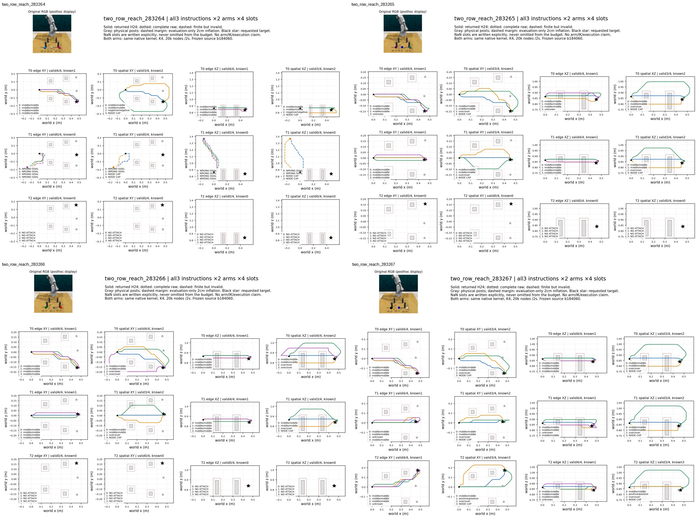

# 同内核 native A* 两臂：实际结果与历史逐槽差分

两臂共同使用 C++ 内核后，空间惩罚在固定 K4 下提供更多已分类有效类型，但仍牺牲有效候选比例和请求时间。DEV 的 Unique 从 edge 的 `.6667` 升至 spatial 的 `1.4444`，TipValid 从 `66.67%` 降至 `51.39%`，实际请求中位时间从 `.6264s` 增至 `.9263s`。AnyTipValid 均为 `24/36`。**这是更强传统基线的工程修复及质量—覆盖—成本取舍，不是核心方法贡献，也不是固定时间预算优势。**

源固定 `b184060b4ed165e8ad0a1d203b8a3567044b201c`。没有修改原观测图、接入集合、搜索代价、tie 顺序、26邻居/supercover、2cm/3cm评价或 K4/20000节点/2秒上限；两臂都用同一生产动态库。三阶段分别由 root 启动，均实际 exit0，不自动串联 DEV、不失败补采样。方案见 [预登记](OBSERVED_TWO_ROW_NATIVE_ASTAR_PROTOCOL.md)。

## 相同算法实现的实际证据与范围

服务器 Linux 上 **74 项测试通过、零 skip**；门禁单独核验 24 个不同 native 测试的实际 testcase，而不以其他测试凑总数。包含完整路径及全部确定性计数差分、ties、多接入、空间场、失败、20000节点上限和每64节点 deadline 检查。测试编译与生产编译的源码、编译器、flags 一致。

此外，离线读取历史 Python edge 与本轮 native edge 的所有封存槽，按 ID/slot 检查：

| 范围 | 全部槽 | 历史完整 raw 数 | raw 逐值一致 | H24 / open 一致 | 全部确定性搜索计数/状态一致 | 保存的检查结果一致 |
|---|---:|---:|---:|---:|---:|---:|
| 首四 TRAIN 父 /12指令 | 48 | 32 | 48/48 | 48/48 | 48/48 | 48/48 |
| 全12 DEV 父 /36指令 | 144 | 100 | 144/144 | 144/144 | 144/144 | 144/144 |

历史 edge 没有搜索超时，故此处不是把超时差异忽略后再宣布相同。所有 NaN 槽也核验。完整 raw 不同但 H24 偶然相同、路径相同但展开计数不同，均会在脚本中单独保留，不容差匹配、不重采样、不重试。本轮实际上述差异均为零。证据仅覆盖这些保存输入与合成测试，**不证明任意输入的全局浮点/tie 等价**。

原 native 两臂的首路径机械门另为 TRAIN12/12、DEV36/36 raw/H24 完全一致；它与历史逐槽差分是两份不同证据。离线脚本没有新的搜索/模型调用，也没有重新读取验收标签；[TRAIN差分](observed_two_row_native_astar_v1/TRAIN_PREFLIGHT_SAVED_ANALYSIS.json)、[DEV差分](observed_two_row_native_astar_v1/DEV_SAVED_ANALYSIS.json) 保存所有192槽的比较。

## 固定样本、信息和完整候选预算

共同 TRAIN 拟合仍为 prefix44：32请求父，实际31父/93输入/556正参考，缺图283220不替换。prototype+workspace canonical SHA 为 `384bc02b2d0237dfa7a1331257502a6858db1b5df62e62d463010ae8921d6b1b`，只排除实测拟合秒数，其他参数、源hash及训练行完全绑定原对照。

TRAIN 仅首四父全部12指令、两臂24请求/96槽；DEV 是固定12父全部36指令、两臂72请求/288槽。所有历史路径包括后置检查失败的完整 raw 都进入空间场；生成时只有观测、语言、当前状态与 TRAIN 拟合。验收几何在每请求池封存后读取。没有返回的候选不补造，参考不完整、unknown 不当负例。这些 DEV 已反复开发使用，不能称 LOCKED、OOD 或最终确认。

| 设置 | TipValid | AnyTipValid | 已知 Unique /条件 | 已分类重复总数 | 有效 unknown | 已知正例类型覆盖 | 完整 raw | 生成失败槽 |
|---|---:|---:|---:|---:|---:|---:|---:|---:|
| TRAIN native edge | 32/48 = 66.67% | 8/12 | 8/12 = .6667 | 22 | 2 | 8.1944% | 32 | 16 |
| TRAIN native spatial | 24/48 = 50.00% | 8/12 | 17/12 = 1.4167 | 7 | 0 | 8.1944% | 24 | 24 |
| DEV native edge | 96/144 = 66.67% | 24/36 | 24/36 = .6667 | 65 | 7 | 3.1944% | 100 | 44 |
| DEV native spatial | 74/144 = 51.39% | 24/36 | 52/36 = 1.4444 | 22 | 0 | 5.4630% | 76 | 68 |

两臂 DEV 有效条件都是相同24个。spatial 每个有效条件均有2或3个已知类型；3个条件保留4条有效、20个条件保留3条、1个条件保留2条。edge 所有已分类有效均是 middle–middle；spatial 的74条有效包括45条 middle–middle、22条 over–over、5条 negative_y–negative_y、2条 positive_y–positive_y。类型增加不是完整解集覆盖声明。

| DEV 父 | edge有效/12 | spatial有效/12 | edge已知类型总数 | spatial已知类型总数 |
|---|---:|---:|---:|---:|
| 283264 | 4 | 3 | 1 | 2 |
| 283265 | 8 | 6 | 2 | 4 |
| 283266 | 8 | 7 | 2 | 4 |
| 283267 | 12 | 9 | 3 | 7 |
| 283268 | 8 | 6 | 2 | 4 |
| 283269 | 8 | 7 | 2 | 5 |
| 283270 | 8 | 7 | 2 | 5 |
| 283271 | 8 | 6 | 2 | 4 |
| 283272 | 8 | 6 | 2 | 4 |
| 283273 | 8 | 6 | 2 | 4 |
| 283274 | 12 | 9 | 3 | 7 |
| 283275 | 4 | 2 | 1 | 2 |

该表按父累加三指令，不能把不同目标的类型合池后称为单次K4覆盖。逐条件仍各自独立计分。

## 失败与绑定的预算

| 失败 | TRAIN edge | TRAIN spatial | DEV edge | DEV spatial |
|---|---:|---:|---:|---:|
| 无合法 goal attachment | 16 | 16 | 44 | 44 |
| 20000节点预算耗尽 | 0 | 8 | 0 | 24 |
| 两秒搜索超时 | 0 | 0 | 0 | 0 |
| 有限返回但目标错误 | 0 | 0 | 4 | 2 |

有限目标错误仍全部来自 `283264_target1`；所有返回路径都通过原 tip 线段检查。没有以改变碰撞标准产生收益。与历史 Python spatial 的56个DEV超时不同，本轮24个失败都确实达到节点上限：

| 24个DEV节点上限槽的实际量 | 最小 | 中位 | 最大 | 总量 |
|---|---:|---:|---:|---:|
| 展开节点 | 20000 | 20000 | 20000 | 480000 |
| 搜索秒（含ctypes准备） | .017730 | .018434 | .019609 | .443635 |
| C++ kernel 秒 | .015572 | .016084 | .017307 | .388140 |
| ctypes 准备秒 | .001934 | .002209 | .002496 | .053192 |
| 前置field秒（搜索计时器外） | .145372 | .195009 | .257521 | 4.764539 |

它们远未用完两秒，但 20000 节点上限保持原样且先触发。没有据此扩预算、换图或发出额外候选。全部24条原始 attempt 及所属条件保存在 [图和节点上限索引](observed_two_row_native_astar_v1/FIGURE_MANIFEST.json) 中；root 后续决策独立记录，不在本轮预设动作。

## 实际成本与历史实现对照

| 设置 | 完整请求中位秒 | p95秒 | 全请求秒 | 其中field总秒 |
|---|---:|---:|---:|---:|
| TRAIN native edge | .643171 | .664545 | 5.921676 | 0 |
| TRAIN native spatial | .935304 | .994965 | 8.378550 | 3.114093 |
| DEV native edge | .626415 | .687261 | 17.892368 | 0 |
| DEV native spatial | .926279 | 1.137913 | 26.471807 | 10.231245 |

此处主时间是新 runner 的 `native_full_request_latency_seconds`：从 native context 建立前到原请求检查/落盘完成后，包含邻居表初始化及context退出；同时保留更窄的原 `request_latency_seconds`，不混用。IO/hash、反投影、定位、建图/接入、field、ctypes、kernel、原proxy、封存和检查全部实测。field占本轮spatial DEV全部请求时间约38.65%，不能沿用先前Python版的成本解释。

历史 Python edge/spatial 的 DEV 中位时间分别 .914419s /6.142537s；它们不是本轮 native 两臂的时间。Python spatial 42/144有效、Unique .8056；native spatial 74/144有效、Unique1.4444，这一变化含实现速度解除原时间瓶颈，不能写成新的学习机制或空间代价本身的新发现。公平主要对照是同一native实现下的edge与spatial。

Linux `g++9.4.0`，flags为 `-std=c++17 -O3 -shared -fno-fast-math -ffp-contract=off -fPIC`。生产编译只执行一次，`.876926s`；测试编译、生产编译与完整构建检查合计阶段内部 `5.020754s`，不混入每请求延迟、不重复计训练费用。TRAIN/DEV各自共同拟合一次，分别3.022821s /2.882348s，canonical参数一致。

| 作业 | PID / child | UTC起止 | 内部秒 | 外层秒 |
|---|---|---|---:|---:|
| tests+build | 586538 /586540 | 21:54:40.059840 →21:54:45.292543 | 5.020754 | 5.232703 |
| TRAIN双臂 | 586933 /586935 | 21:55:09.896685 →21:55:27.900117 | 17.633468 | 18.003432 |
| DEV双臂 | 587494 /587496 | 21:56:29.862193 →21:57:17.922722 | 47.529944 | 48.060529 |

CPU core1，OMP/OpenBLAS/MKL/NUMEXPR各1，GPU隐藏，GPU小时0；0 Qwen调用、0训练更新、0模拟器调用。没有新增付费资源或工具链安装。

## 全图、哈希与复现

[全部12父图索引](observed_two_row_native_astar_v1/FIGURES.md) 包括原RGB、三条目标指令、两臂的XY与XZ投影、raw与H24、每槽类型/失败，288请求槽均有路径或文字表示。已目视检查三张全覆盖contact sheet：无挑选赢家；283264错误目标的大幅抬升路径及所有 NoAttach/NodeCap 保留。绘图才读取这12个DEV父的已封存验收几何/goal，输入hash逐项核验；它们不进入任何生成调用。投影不是机械臂/IK/机器人执行认证。



其余全部父：[283268–283271](observed_two_row_native_astar_v1/figures/contact_sheet_1.jpg)、[283272–283275](observed_two_row_native_astar_v1/figures/contact_sheet_2.jpg)。

- 生产库 SHA256：`295a5e662d1a8726a9960c7d786006940fd1a312494bde9b442869b67f22f8d1`。
- 生产build receipt SHA256：`273794735abbe8d9c6fb145428d86fe39b47e90e4d17bc7c9ff962c180c54dd1`。
- tests报告 SHA256：`bdace237e62e17411f8b59d6dc9ebb6d45298b113c815c8dbbeb9b237b777b3e`。
- TRAIN报告 SHA256：`8c337a8c75d1fe8e46c6becf671227850752457d1b30d24951e38898aba39b3c`。
- DEV报告 SHA256：`5872653890b74dedcb19dabaabed0365a9a066042ec3a00dee0cfd6dd6adb599`。

实际根目录 `/home/wzy/dpvlm/route_set_v1/runs/observed_two_row_native_astar_v1`。完整命令、退出码、源路径见各阶段 status；既定三阶段已完成，不应重新启动。760份服务器实际文件逐字节归档，245份NPZ/动态库等二进制仅在 ignored `runs/observed_two_row_native_astar_v1/`，索引见 [SYNC_SHA256_INDEX](observed_two_row_native_astar_v1/SYNC_SHA256_INDEX.json)。原生成源码保持不变。

离线新增8项差分测试加原8项保存池测试共16项通过。所有实际分析/作图都是CPU本地、0额外搜索。复算可对新的输出文件运行：

```powershell
& 'F:/ProgramData/anaconda3/python.exe' -m pytest tests/test_native_astar_saved_analysis.py tests/test_spatial_penalty_saved_analysis.py -q
& 'F:/ProgramData/anaconda3/python.exe' -m scripts.analyze_native_astar_saved --run reports/observed_two_row_native_astar_v1/dev --binary-root runs/observed_two_row_native_astar_v1/dev --historical reports/observation_two_row_astar_prefix44_v1/dev_model --historical-binary runs/observation_two_row_astar_prefix44_v1/dev_model --output <fresh-analysis.json>
```
