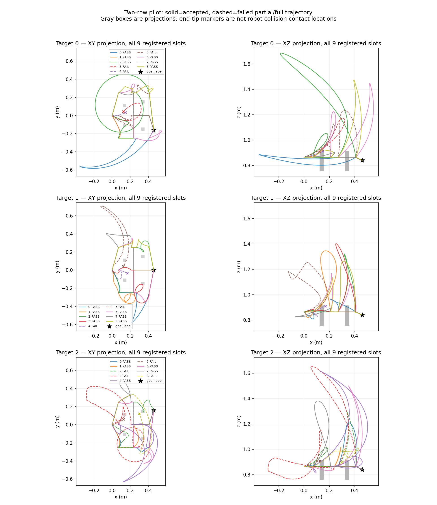

# 两排低柱 v1：真实采集与失败诊断

v1 在固定源 `a91427bc58ccad5fb80e3c1ad24d859dc0205585` 完成一次 CPU1 单父采集，退出 0，配置未修改、27 个槽均无重试。低位初态准备成功，27/27 恢复通过严格世界、inventory、RGB、depth、相机和当前状态检查；18/27 路线通过既定逐模拟步机器人碰撞与连续 tip 段/目标/H24 检查。但是三个目标分别只有 3、1、1 个不同的有效侧向通道序列，尚未达到本 pilot 要求的任一目标 >4 门槛，不扩为预算机制正式数据。

| 目标 | 接受参考 | 全部已分类不同类型（含 over） | 不同有效侧向序列 |
|---|---:|---:|---:|
| 0 | 6/9 | 3 | 3 |
| 1 | 7/9 | 4 | 1 |
| 2 | 5/9 | 3 | 1 |

18 个接受参考中：5 条侧向序列、6 条带 over 的已分类序列、7 条未知类型，已分类中有 1 条同目标重复。不同目标不能合并候选池或合并解数；9 个预声明组合不是已知全部可行解。未知类型保留为有效参考，不虚构类型或判定其不存在。

## 全部九次失败

| 目标/槽（0 起） | 直接失败原因 | 已知细节 |
|---|---|---|
| 0/3 | 模拟 arm_environment 碰撞 | 第 0 段；此前 tip 2 cm 检查未见相交 |
| 0/4 | 模拟 arm_environment 碰撞 | 第 0 段；此前 tip 2 cm 检查未见相交 |
| 0/5 | raw tip 2 cm 余量失败 | 目标误差 1.879 mm；首次违规 raw 段 21 |
| 1/4 | 模拟 arm_environment 碰撞 | 第 1 段；partial tip 首次违规段 66 |
| 1/5 | 模拟 arm_environment 碰撞 | 第 0 段；partial tip 首次违规段 164 |
| 2/2 | raw tip 2 cm 余量失败 | 目标误差 1.784 mm；首次违规段 24 |
| 2/3 | raw tip 2 cm 余量失败 | 目标误差 1.844 mm；首次违规段 76 |
| 2/5 | 模拟 arm_environment 碰撞 | 第 0 段；此前 tip 2 cm 检查未见相交 |
| 2/8 | 模拟 arm_environment 碰撞 | 第 1 段；partial tip 首次违规段 139 |

即 6 次模拟 arm 碰撞、3 次完整 raw tip 余量失败；没有只因 H24 拒绝的路线，也没有终点定位误差导致的失败。`arm_environment` 只标识 arm collision collection，v1 未记录具体 link/body 对，不把末端图上的终点标记误认成实际 arm 接触位置。全部 partial pose/open/joint 路径及首个 tip 违规线段坐标已保存；没有忽略失败后重采。

## 引导点到达不等于实际穿过通道

18 条接受路径的所有 guide 到达误差最大仅 **2.768 mm**，但段内相对端点直线的最大偏离达到 **0.981567 m**。10/18 至少一次实际越过某排柱顶；7 条未知的具体 crossing xyz、方向、弧长进度和所属规划段在 [逐槽诊断](observed_two_row_pilot_v1/crossing_diagnostics_v1/all_attempt_diagnostics.json)。未知包含柱顶/底附近的分类高度灰区、同一排 over/侧向混合穿越及跨排回退。当前类型规则诚实地保持 null。

图显示全部三个目标、每目标九条提案：实线为接受参考，虚线为失败的完整或部分轨迹；灰柱在 XY/XZ 图中是投影，不能据投影重叠判断三维碰撞。图中末点叉号不是整机碰撞位置。

只读核验服务器固定 PyRep `arm.py`（SHA `4c0d5e09aa777de145c184f05a24ac74bb770aedb534dc0c9501d726c17ebe5d`）：`get_path` 先尝试线性路径，失败后调用非线性规划。v1 只逐段记录了 `get_path`，没有插桩实际子分支，故不能把每条上绕路径归因于 OMPL；实际保存的路径本身足以说明仅限定两个端点未保证期望通道。

下一假设只是在每排平面增加同高度中间引导点。独立 v2 仍按真实路径分类，不强判类型，不改物理布局、碰撞/余量/高度规则，不强制 linear 或增加重试。7→9 段的更多计算明确计入；其目的是采集可用参考，不作为路线生成方法创新。执行前协议见 [v2](OBSERVED_TWO_ROW_PILOT_PROTOCOL.md)。

## 成本、源与复现

- 单独 setup 动作：2 个规划段、141 模拟步，5.958670 s。
- 全部实际 `get_path` 调用 157（包含 setup）；规划时间合计 27.243332 s，模拟及碰撞检查合计 48.106968 s。
- collector 总耗时 181.095623 s；外层 record_job 墙钟 181.499249 s。0 未尝试槽、0 自动补采。
- 服务器数据 `/home/wzy/dpvlm/route_set_v1/data/observed_two_row_pilot_v1`，run 同名位于 `runs/`，父 `two_row_reach_283000`，角色 DEV_COLLECTION。
- launcher `/home/wzy/dpvlm/route_set_v1/research_v2/launch_two_row_pilot_a91427.sh`，SHA `e70c3baef8c800e77c02f7aa2a42de54e7769116b369050624aaba2a6b20305e`；run 内保存不可变副本、源 hash、PID、日志和退出码。
- 归档索引包含 59 个实际文件；41 项 collector artifact hash 与下载字节全匹配，27 条候选 raw 文件 hash 另逐条验证。31 个 NPZ 留在服务器/忽略的本地原始归档，不进普通 Git。见 [索引](observed_two_row_pilot_v1/artifact_index.json)。

固定源先实际运行 8 个测试（0.25 s），再用 `.venv-sim/bin/python -u scripts/collect_observed_two_row_pilot.py --config <release>/configs/observed_two_row_pilot_v1.json --output <fresh-output>`。完整环境、CPU1 限额、Xvfb 与命令在 [不可变 launcher](observed_two_row_pilot_v1/run/frozen_job.sh) 和 [record_job](observed_two_row_pilot_v1/run/pilot.status.json)。复现必须使用新的输出与 run，不覆盖当前数据。

本结果是可采性研究的负结果与真实参考证据；没有连续整机碰撞证书，也没有模型生成的机器人任务有效性结论。
