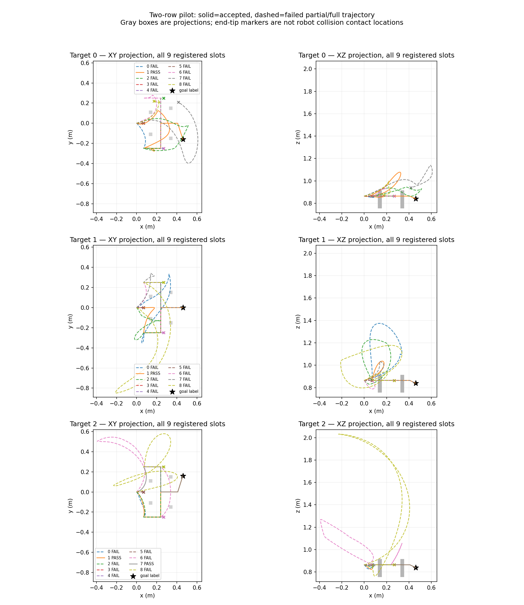

# 两排低柱 v2：仍未达到多于 K 的可采性要求

v2 固定源 `41df2d783c72bf551af6d9ae2884a27f993fa1ed`、原物理配置和 seed，只增加两个 row-plane guide 后实际完成 1 次 setup＋27 个提案槽。4/27 参考通过，侧向已知模式为三个目标 0、0、2；没有达到任一目标 >4 的数据目标。测试、采集和同源分析均退出 0，失败全保留，没有重试或改变碰撞/分类阈值。

**这不是严格配对的 v1/v2 初态比较。** 新流程按要求复核实际输入，发现虽然相机/物理配置一致，setup 后末端 pose 最大分量差只有 0.000496，机器人关节最大差却为 **2.889690 rad**；RGB 最大像素差 244、depth 最大差 3.150224 m。两个运行各自 27/27 的严格恢复都通过，但恢复的是不同的机器人全身初态。不能把 v1 的 18/27 与 v2 的 4/27 的差归因于插入 guide，也不能把这些同布局实例当作独立父场景跨划分。

## 实际失败集中于明确的 row-plane 姿态

| 分类 | 槽数 | 直接证据 |
|---|---:|---|
| 接受参考 | 4 | 2 条侧向已分类，2 条未知，无 over 已分类 |
| 路径规划失败 | 20 | 第 1 段（第一排 plane）9 次；第 6 段（第二排 plane）11 次 |
| 模拟 arm 碰撞 | 2 | 均发生第 0 段，之后即停止 |
| raw tip 2 cm 检查失败 | 1 | 不用正确末端掩盖中途余量违规 |
| 仅 H24 失败 | 0 | raw/H24 标准均保持原值 |

第一排 plane 的 9 次规划失败恰为所有目标 × 第一通道 `middle` 的 3 个后续提案；第二排 plane 的 11 次失败都请求负/正 y 外侧通道。其余第一排为正/负 y、第二排 middle 的组合提供了少量正例。20 个 `ConfigurationPathError` 只能证明当前求解过程在这次给定配置/姿态/预算下未找到路径，不能据此证明几何或完整机器人不存在解。

4 个接受参考的 guide 到达误差最大 1.751 mm，段内最大偏离仍为 0.370621 m。实际完整 crossing 规则继续保留未知，不因经过显式中点就赋予提案类型。全部 27 槽路径、crossing xyz/方向/弧长进度、段目标与真实到达误差见 [完整诊断](observed_two_row_pilot_v2/run/analysis/all_attempt_diagnostics.json)。

## 判断与下一步边界

显式 plane 点让当前机器人姿态下的可达性限制暴露为规划失败。v1 的纯 tip 几何 9 类并不证明这些受姿态约束的完整机器人配置可行；同末端位姿也不确定全身关节分支。当前证据不支持继续批量采集本设置。

若继续定位，应先把机器人初态本身变成可记录、可重放和跨进程逐位核验的配置，在同一个全身状态上比较两种引导协议；还需针对失败的 plane 姿态保留 IK/碰撞诊断。不能仅以 same seed 代替此审计。v1 未插桩 `get_path` 内部实际分支，v2 亦未修改这一点；不能把所有上绕或失败都归因于 OMPL。没有在本轮追加新模拟、改变高度/开口、放松余量或强制线性规划。

## 预算与来源

- 预注册最大调用 27×9＋setup 2=245；实际 **144** 次，失败槽提前停止。
- 实际规划 80.268852 s，模拟/碰撞检查 31.478442 s，setup 5.888834 s。
- collector 211.869664 s；record_job 墙钟 212.297127 s。0 未尝试槽、0 额外重试。
- 数据 `/home/wzy/dpvlm/route_set_v1/data/observed_two_row_pilot_v2`，run `/home/wzy/dpvlm/route_set_v1/runs/observed_two_row_pilot_v2`；9 个 Linux 测试 0.22 s。
- launcher SHA256 `62e01ccad9e697c9f117ba14ff45da22aacf5d8b8fcfc0e2eabc050db6fbcc15`，[不可变副本](observed_two_row_pilot_v2/run/frozen_job.sh)。该 launcher 在新目录依次实际执行 tests、pilot、`analyze_observed_two_row_pilot.py --compare-initial-with <v1data>`。
- [归档索引](observed_two_row_pilot_v2/artifact_index.json) 保存 64 个实际文件及 SHA；41 个 collector artifact hash 全匹配，31 个 NPZ 留在服务器/忽略的原始归档。模型输入和源 collector 均未在运行时修改。

此结果是一次完整且保留混杂限制的数据可采性实验，尚无 >K 模式证据，也不是生成模型有效性或完整机器人连续安全证明。
