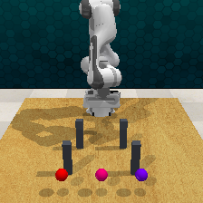

# 两排低柱 v3：重建门禁严格失败，27 槽未尝试

固定源 `41238b1b67fb7e3084c32d8f30d6ec5c5f24c3d3` 实际执行 17 个 Linux 测试（全部通过，0.30 s）和唯一一次记录状态重建。门禁失败后按预登记停止：`setup_failed`、1 次重建、0 次 setup IK、0 次路线规划、0/27 路线尝试、27 未尝试。没有重试、替换参考、放宽阈值或继续生成路线。进程退出 0 仅代表受控失败和归档流程正常完成。

| 初态核验项 | 实测结果 |
|---|---:|
| 完整 inventory / 字段集合 | 相同，无缺失；数值均有限 |
| 全世界逐数值比较 | 122 个字段中 43 个变化 |
| arm joint 最大绝对差 | 4.76837158203125e-7 rad |
| arm measured velocity 最大绝对差 | 1.9073486328125e-5 rad/s |
| gripper joint 最大绝对差 | 6.705522537231445e-8 |
| 当前 gripper pose 最大分量差 | 0.0001419559121131897 |
| RGB 最大像素差 | 125 |
| depth 最大绝对差 | 2.6004836559295654 m |
| gripper open、相机内外参差 | 0 |

原始世界数值最大差 2.0 来自 `waypoint0.pose` 四元数近反号，其位置差为 0；该数值不能解释为物体移动 2 m。两四元数相加后最大残差约 4.37e-8，另有 robot link pose、joint/velocity 和实际观测差异。此补充诊断没有改变预登记逐位比较，也没有把非零误差归零。全部变化值见 [逐字段差异](observed_two_row_pilot_v3/recorded_world_differences.json)，原门禁见 [readback](observed_two_row_pilot_v3/metadata/two_row_reach_283000/v1_anchor_readback.json)。

v1 缺少 native 配置树、joint target readback、gripper/link velocity 和控制器/接触求解器隐藏状态。v3 明确是“从已存记录重建后核验”，本轮失败说明这次重建没有得到逐位相同的记录状态，不能据此判定同一进程 native 恢复无效。`arbitrary_hidden_dynamic_state_equivalence` 保持 null；未通过门禁，因此没有保存或声称已验证 native scene 往返恢复。

唯一重建耗时 4.463594 s，固定 canonicalization 20 步单列记录；collector 总耗时 7.981850 s，record_job 墙钟 8.371416 s。未尝试的 27 槽没有算作实际路线失败或成功。请求父场景分母为 1，接受参考为 0。

服务器数据和 run 分别为 `/home/wzy/dpvlm/route_set_v1/data/observed_two_row_pilot_v3` 与 `/home/wzy/dpvlm/route_set_v1/runs/observed_two_row_pilot_v3`。不可变 launcher SHA256 为 `33791ff06b7cb9540d39126b7544096da66755d1436bd9825811d61a136555ed`；[副本](observed_two_row_pilot_v3/run/frozen_job.sh)、[进程状态](observed_two_row_pilot_v3/run/pilot.status.json) 与全部源 hash 已同步。归档 29 个实际文件，11 项 collector artifact hash 全匹配；3 个 NPZ 留在服务器和忽略的本地原始归档，见 [索引](observed_two_row_pilot_v3/artifact_index.json)。

判断：停止继续重建旧隐藏状态。下一步先只读诊断固定姿态与开口位置的可达性，再预登记有限 IK 检查或新几何 pilot；尚未启动任何 v4、额外 IK 或新路线。本轮没有建立 >K 类型证据，也没有生成模型有效性结论。
