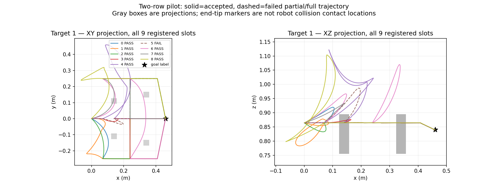

# v4 实测：同初态同目标取得五种真实侧向路线

固定 `7b496e24a85512f23fe448d50288c14b27ed6f12`，新父 `two_row_reach_283001`、中央目标、九个预登记提案的唯一实跑完成。48 项服务器检查通过（0.34 s），collector/record_job 均正常退出。**八条参考通过，五种实际 lateral 关系，三条有效 unknown，一条 H24 类型不稳定被拒绝。** 九次世界/全 inventory/RGB-D/camera/current 恢复均严格零差，已知类型没有重复。

| 槽 | 提案序列 | 实际接受类型 | 结果 |
|---|---|---|---|
| 0 | negative_y → negative_y | negative_y → negative_y | 通过 |
| 1 | negative_y → middle | negative_y → middle | 通过 |
| 2 | negative_y → positive_y | negative_y → positive_y | 通过 |
| 3 | middle → negative_y | middle → negative_y | 通过 |
| 4 | middle → middle | unknown | 有效参考保留 |
| 5 | middle → positive_y | raw unknown；H24 over → positive_y | 拒绝，表示改变了实际关系 |
| 6 | positive_y → negative_y | unknown | 有效参考保留 |
| 7 | positive_y → middle | unknown | 有效参考保留 |
| 8 | positive_y → positive_y | positive_y → positive_y | 通过 |

通过要求仍是逐仿真步 arm/gripper 碰撞检查、真实 2 cm tip 全线段检查、3 cm 目标误差和 H24 检查/类型一致性；不是连续完整机器人碰撞证书。五种实际类型已经超过 K=4，且本次无需靠 over 达标。新版本执行前明确允许 lateral/over 关系的判据没有回写 v1/v2 的旧 lateral 门槛或负结果。

## 失败与未知未作修复

唯一失败槽 5 的真实终点误差为 1.827 mm，raw 与 H24 的 tip 检查均通过；但 raw 在第一排先 over 正穿，再 middle 反穿/正穿，因此关系为 unknown，H24 恰好丢失局部混合穿越而变为 `(over, positive_y)`。按照原稳定表示判据拒绝，不重新采样挽救或偷偷改标签。

槽 4 在第一排包含高度模糊带与 over 的反复穿越；槽 6/7 在第一排混合 over 与 positive_y。它们的 raw/H24 仍都为 unknown，作为有效路径保留，但不计入已知类型数。槽 3 虽同一排反复穿越，三次都为 middle，符合原允许同通道重复穿越的规则。所有 crossing xyz、方向和轨迹进度见[九槽诊断](observed_two_row_pilot_v4/all_attempt_diagnostics.json)和[失败/未知明细](observed_two_row_pilot_v4/failure_and_unknowns.json)。没有把 guide 编号当实际类型。

## 成本与复现

一请求父/一 setup/九请求路线全部实际执行，0 未尝试。setup 为 5.653865 s；collector 总计 62.996343 s。实际 83 次 get_path（setup 2 + 路线 81），规划 7.067439 s、模拟执行 15.754542 s；其它时间含严格恢复、渲染与初始化。get_path 内部配置搜索未逐项计数，不能称只搜索九条路径。所有九条完整/失败轨迹的 SHA 均匹配。

数据服务器位置 `/home/wzy/dpvlm/route_set_v1/data/observed_two_row_pilot_v4`，作业同名 `/runs/observed_two_row_pilot_v4`。LF wrapper SHA `7c8c36e312b11d9257b42f7fbc1746b5957998da72936669261b1718b97ab7df`，传输 archive SHA `ed3e1ea541e61615dd4d5f9dd2ae84a40dba8681d416a7db8fdacc4080a22eac` 双端一致。完整[来源/文件/恢复命令索引](observed_two_row_pilot_v4/artifact_index.json)、[原 summary](observed_two_row_pilot_v4/metadata/summary.json)、[作业状态](observed_two_row_pilot_v4/run/pilot.status.json)已同步。

可采性达到预登记标准，仍只有一个狭窄物理布局和一个指令目标；这不是方法优势或正式泛化证据。初态为新动态 setup，不与旧版声称严格配对。下一步固定柱高 0.14 m，不扫描高度/朝向；预登记四个真实变化布局，每父同图三个颜色目标各九提案，共 108 槽，全部 DEV_COLLECTION。必须先核验独立几何/重复、初态恢复与完整分母后，再决定正式规模和角色划分。
