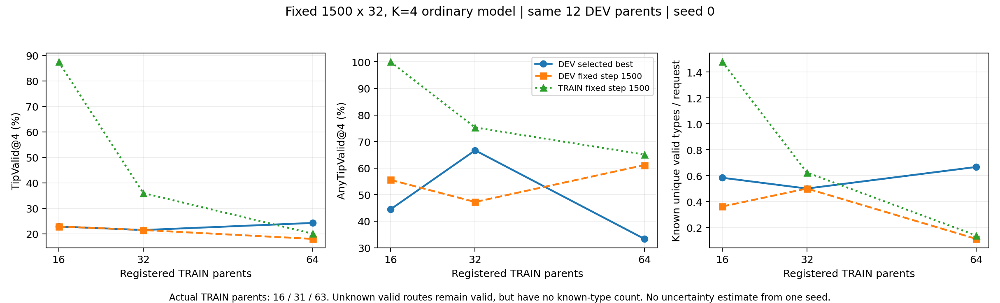

# 两排真实观测普通基线：固定64请求TRAIN父的实际结果

本轮从头训练、缓存、固定最后步TRAIN诊断和36次真实在线推理均已完成。1500×32固定曝光下，64请求TRAIN父的最佳DEV有效率为24.31%，但AnyTipValid降到33.33%；最后1500步有效率18.06%，AnyTipValid61.11%。这不是稳定的数据规模收益。更关键的是最后TRAIN有效率只有20.11%，虽然目标正确率92.99%；路线本身仍明显欠拟合，不能用这组结果支持“普通模型已经充分拟合、只差泛化机制”的结论。

原始证据见 [索引](observed_two_row_prefix76_v1/INDEX.md)、[原summary](observed_two_row_prefix76_v1/training/peak_seed0/summary.json)、[固定last TRAIN](observed_two_row_prefix76_v1/last_train/analysis/report.json) 和 [本地逐父复核](observed_two_row_prefix76_v1/OFFLINE_ANALYSIS.json)。本次归档没有训练、生成、重选检查点或改变评价标准。

## 数据、信息条件与预算

代码固定 `9e0094aff152d48cd34eadd24e554a05f0cf4a0f`；采集源仍为 `262648796fd47b25a2051cc227b6838515b651c6`。第一64个注册TRAIN父均已闭合后才导出。63个父实际有输入，共189条指令、1108条正参考；283220没有初始观测，3个请求输入/27个未尝试路线槽原样保留，不补采成功父。原12个DEV父、36指令、205正参考保持不变。合计75个实际父、225输入、1313正参考；不是76个成功父。准备阶段详情见 [准备报告](OBSERVED_TWO_ROW_PREFIX76_PREPARATION_RESULTS.md)。

TRAIN全部1108条参考通过surface±5cm末端容量检查和模型H24的原2cm tip检查。460条类型unknown、217条raw长度>2m、67条>3m（最长7.304m）均保留；这些是容量/数据一致性检查，不证明模型已能学会。未知类型不被标无效，未采到的解不当负例。没有读取SCORE/CALIBRATION/TEST_LOCKED原图、路径或结果。

模型仍为冻结真实Qwen3-VL-2B-Instruct（官方revision `89644892e4d85e24eaac8bacfd4f463576704203`，RGB+指令、mean+last共4096维），当前RGB-D/相机的12544点空间编码、当前夹爪状态，普通集合回归H24/K4。peak observed-surface anchor±5cm、endpoint辅助0.02/sigma0.025、width128/depth2/point64、lr3e-4/seed0，全已知正参考saturation匹配不变。没有真实目标/完整障碍/类型标签进入forward，没有路径修复、筛选或额外候选；1次forward输出4个完整path states，语义交换控制重用同父已生成池，额外forward为0。

16/32/64三组均为1500×32=48000训练请求、192000路径状态，初始化hash逐位相同 `7f81eba70dfcef2a3df19ebd5661ace3881abd552a1f2d4614cf490bf153bc13`。同一超参数逐项核验、旧36DEV输入/监督行/源hash/Qwen特征完全一致。新增数据使每条实际TRAIN指令的期望抽取次数从1000降到约516和254；这是固定总预算学习曲线，不能解释为每样本训练曝光相同。actual sampler chain记录保留，不声称不同大小数据的抽样索引流相同。颜色词TRAIN覆盖也从17增到20，非纯布局父数效应。

## 同12DEV、同K4的三组结果

下表每行均为36请求/144槽；TipValid为原tip-only标准，不能简称完整机器人有效率。best遵守预注册 `UniqueClassifiedTipValid + .05×TipValid`、每250步选优；last固定1500。当前state和事件全正确，所有预测有限，没有格式失败。原2cm线段余量、3cm目标标准未变。

| 注册TRAIN父/实际父 | 检查点 | TipValid | AnyTipValid | 已知Unique/请求 | unknown有效/请求 | 已知重复/请求 | 目标正确率 | TipClear |
|---|---|---:|---:|---:|---:|---:|---:|---:|
|16/16|best500|33/144=22.92%|16/36=44.44%|0.5833|0.3333|0|47.22%|42.36%|
|32/31|best1000|31/144=21.53%|24/36=66.67%|0.5000|0.2778|0.0833|72.22%|30.56%|
|64/63|best500|35/144=24.31%|12/36=33.33%|0.6667|0.1944|0.1111|41.67%|62.50%|
|16/16|last1500|33/144=22.92%|20/36=55.56%|0.3611|0.5556|0|64.58%|33.33%|
|32/31|last1500|31/144=21.53%|17/36=47.22%|0.5000|0.3056|0.0556|58.33%|38.19%|
|64/63|last1500|26/144=18.06%|22/36=61.11%|0.1111|0.6111|0|72.22%|26.39%|

64父best的35条有效路径集中在12个指令条件（11个各3条、1个2条），另24个条件全部失败。last有18个条件各1条、4个各2条、14个全失败。不能将best已知Unique较高单独视为候选质量全面改善，也不改成选Any更高的中间步；1250步虽然Tip35/144、Any23/36，但预定选择分数0.567708低于500步0.678819。

| 固定64父DEV | 候选→最近参考ADE | 参考→最近候选ADE | 候选→最近参考末端误差 | 已知正参考类型覆盖 |
|---|---:|---:|---:|---:|
|best500|11.358cm|15.242cm|14.066cm|0.006944|
|last1500|11.355cm|14.452cm|5.612cm|0|

这些reference距离不等于目标中心距离；同一36目标中心的checker末端均值分别14.165cm/5.710cm。目标定位改善而路线碰撞变多可以同时发生。

## 失败和类型分解：保留所有槽

| DEV144槽 | 目标正确且clear | 目标正确但碰撞 | 目标错误但clear | 目标错误且碰撞 |
|---|---:|---:|---:|---:|
|best500|35|25|55|29|
|last1500|26|78|12|28|

best只有60/144目标正确，last增到104/144，但其中78条撞到2cm膨胀箱体。best28条已知有效路径全部第一排为over（over→middle16、over→negative_y5、over→positive_y7）；去重后24个已知类型计数。另7条有效unknown仍计有效。last仅4条已知有效（over→middle1、over→positive_y3），22条有效unknown不计已知Unique，但没有当无效删掉。

best有4个条件出现有效已知类型重复且存在未覆盖的已知正参考类型；即使假设能完美替换，已知类型数可增加的诊断上限也只有4条，对109条失败路径无直接修复含义。last重复为0，不能把其118条失败归因于去重不足。36个条件中8个已知正参考类型数>K，其余不要求强制生成4种类型；参考集合不完整，类型覆盖只是已知正例覆盖。

按目标索引0/1/2分组（各12请求、48槽），best有效14/0/21，Any5/0/7，语义正确20/12/28；last有效7/8/11，Any7/7/8，语义正确32/28/44。索引仅事后报告，未作为模型条件。对原16父TRAIN未见的gray/red/teal所对应8个DEV指令，64模型best9/32、last6/32有效；这些词现在在TRAIN里，不能称开放词汇泛化。

跨目标已知类型一致性筛查best和last各有72个有向父内目标对，但**可评价预测对均0**，报告fraction=null，不能写成0%成功率或支持集合transport。独立请求池之间的描述性一致性本身也不是执行过解集更新的证据。

## 同一父场景完整配对

每父三个目标、12候选；表内数字顺序为16/32/64请求TRAIN父。保留全部12个DEV父，不挑赢家。best有效槽数相对16组6父增/1平/5降，相对32组7增/2平/3降；last相对16组3增/4平/5降，相对32组4增/2平/6降。

| DEV父 | 检查点 | 有效槽数16/32/64（每组12） | Any条件数16/32/64（每组3） | 已知Unique总数16/32/64 |
|---|---|---|---|---|
| 283264 | best | 3 / 3 / 0 | 1 / 2 / 0 | 1 / 1 / 0 |
| 283265 | best | 1 / 2 / 3 | 1 / 1 / 1 | 1 / 2 / 2 |
| 283266 | best | 4 / 5 / 3 | 1 / 2 / 1 | 2 / 2 / 2 |
| 283267 | best | 5 / 2 / 2 | 2 / 2 / 1 | 3 / 2 / 2 |
| 283268 | best | 3 / 1 / 3 | 2 / 1 / 1 | 3 / 0 / 2 |
| 283269 | best | 1 / 3 / 3 | 1 / 3 / 1 | 1 / 2 / 2 |
| 283270 | best | 2 / 2 / 3 | 2 / 2 / 1 | 2 / 1 / 2 |
| 283271 | best | 4 / 2 / 3 | 2 / 2 / 1 | 3 / 2 / 2 |
| 283272 | best | 2 / 2 / 3 | 1 / 2 / 1 | 1 / 2 / 2 |
| 283273 | best | 3 / 2 / 6 | 1 / 2 / 2 | 2 / 1 / 4 |
| 283274 | best | 0 / 5 / 3 | 0 / 3 / 1 | 0 / 2 / 2 |
| 283275 | best | 5 / 2 / 3 | 2 / 2 / 1 | 2 / 1 / 2 |
| 283264 | last1500 | 6 / 2 / 1 | 3 / 1 / 1 | 3 / 1 / 0 |
| 283265 | last1500 | 2 / 3 / 1 | 1 / 2 / 1 | 1 / 3 / 0 |
| 283266 | last1500 | 3 / 2 / 3 | 2 / 1 / 2 | 2 / 1 / 2 |
| 283267 | last1500 | 3 / 1 / 3 | 2 / 1 / 2 | 0 / 1 / 0 |
| 283268 | last1500 | 4 / 5 / 2 | 2 / 2 / 2 | 1 / 3 / 0 |
| 283269 | last1500 | 3 / 0 / 2 | 2 / 0 / 2 | 2 / 0 / 0 |
| 283270 | last1500 | 4 / 4 / 4 | 3 / 2 / 3 | 1 / 3 / 0 |
| 283271 | last1500 | 0 / 3 / 1 | 0 / 2 / 1 | 0 / 1 / 0 |
| 283272 | last1500 | 1 / 2 / 2 | 1 / 1 / 2 | 0 / 1 / 1 |
| 283273 | last1500 | 3 / 1 / 3 | 2 / 1 / 2 | 1 / 1 / 1 |
| 283274 | last1500 | 0 / 5 / 2 | 0 / 2 / 2 | 0 / 2 / 0 |
| 283275 | last1500 | 4 / 3 / 2 | 2 / 2 / 2 | 2 / 1 / 0 |

[全部12原图](observed_two_row_prefix76_v1/INDEX.md)逐父同时展示3目标、4候选、best/last、XY/XZ和全部接受参考；三页contact sheet已经逐页查看，原图SHA与原索引相等。可以看到best许多不同语言条件保留相近整体路线形状和错误终点，last端点随目标变化更多，但不少中间线段穿过障碍。该目视描述不替代逐槽数值，也不证明新的学习机制会有效。

## 固定最后步TRAIN：路线尚未充分拟合

固定last TRAIN诊断只对189个现有TRAIN输入新增189次缓存Qwen的CPU head请求/756路径状态；0新Qwen编码、0DEV预测、0优化器更新。已选best TRAIN来自原保存池。

| 固定last1500 TRAIN | TipValid | AnyTipValid | 目标正确率 | 原saturation MSE | 匹配正参考顶点ADE | 顶点误差P95 |
|---|---:|---:|---:|---:|---:|---:|
|16父48输入|168/192=87.50%|48/48=100%|185/192=96.35%|0.00026637|2.728cm|5.724cm|
|31父93输入|134/372=36.02%|70/93=75.27%|304/372=81.72%|0.00298756|8.557cm|20.985cm|
|63父189输入|152/756=20.11%|123/189=65.08%|703/756=92.99%|0.00463472|10.618cm|24.576cm|

64模型best TRAIN132/756=17.46%、Any51/189、语义40.74%，匹配MSE0.00647465/ADE12.378cm。last整体匹配残差下降，但703条目标正确路径里551条碰撞；165条tip-clear中13条目标错误，另40条两项都错。不是末端不可表示导致全部失效。last最近参考ADE9.922cm与一对一saturation匹配ADE10.618cm口径不同，不能混用。

64模型的last在原16父上仅31/192有效，后15个实际父40/180，新增32父81/384。原16父在原小数据模型上168/192有效，因此不是只因新增父更难而拉低宏均值。保留全部unknown和长弧正参考；尚未区分固定曝光不足、优化/匹配困难和表示瓶颈的各自贡献。训练报告loss从250步0.10535降到1500步0.08305，但不能用下降本身宣称收敛。计入缺初图的3请求，注册TRAIN分母口径为152/768=19.79%、Any123/192=64.06%；这只是可用性分母，不把缺输入称为模型生成失败。

既定下一项应是已预登记的普通32父6000步收敛控制，先通过原1500完整状态重放门禁，再看额外训练是否弥补拟合不足。不能先把这组64模型当作已饱和强基线，不能靠增加新模块或重复种子解释掉这些负结果。本轮报告不授权追加训练。

## 真实单请求成本与一致性

固定best500全部36实际输入逐请求执行RGB读取、真实Qwen、RGB-D反投影/可训练几何、K4头、预测封存、该请求标签读取与原checker。所有请求均成功生成有限值；无warmup请求、无重试、无修复、无生成100留4。标签在该请求预测封存后用于评价；SelectedValid和真实机器人执行成功保持null。

| 连续请求阶段 | 中位ms | P95 ms | 首次ms |
|---|---:|---:|---:|
|完整请求含封存/check|75.466|83.035|591.151|
|生成阶段|67.174|74.540|581.790|
|原始输入IO/hash|3.602|4.646|9.930|
|Qwen processor/传输|3.960|4.998|23.877|
|真实Qwen forward/池化|51.853|59.309|460.398|
|RGB-D反投影/传输|2.257|2.998|3.850|
|可训练几何/集合头及输出|3.132|4.136|81.984|
|预测封存|2.628|2.773|2.793|
|标签IO/原checker|5.683|6.867|6.568|

不同阶段分位数不可直接相加。启动模型2.673s、元数据门禁4.472s、36请求串行3.267s、整个入口10.720s，record_job壁钟11.718s；峰值CUDA分配4,283,784,192bytes（约3.989GiB）。文件页缓存可能温热，已明确记录。相对原缓存mean/last隐藏状态逐元素0差、token数相同，XYZ最大差1.1921e-7m，事件最大差1.1921e-7，全部144候选判定一致；一致性校验没有额外模型forward。原缓存head+RGBD中位7.314ms不作为端到端时延。

| 已完成阶段 | 内部秒 | record_job秒 | child PID | 退出码 |
|---|---:|---:|---:|---:|
|重新编码全部225输入Qwen|16.727（加载2.568单列、不重复加）|21.918|543690|0|
|普通头1500训练|66.419|72.907|543995|0|
|保存池分析/全部12图|21.833|22.275|545197|0|
|固定last TRAIN189请求|6.372|8.899|545431|0|
|固定best真实36请求|10.720|11.718|545326|0|

前三个使用GPU的阶段为缓存、训练、online：内部合计93.867s=0.026074预留GPU小时，record_job合计106.543s=0.029595小时；两套口径不相加，CPU诊断不计GPU时间。CPU亲和：缓存/训练/online为0，分析/lastTRAIN为1；各1线程，GPU1/35%。模型头1,231,965参数，其中几何321,537；基础Qwen冻结。训练中另计477个评价请求/1908path states，延迟诊断24请求/96states；不能把这些预算隐藏在192000训练路径状态中。语言控制额外请求0。

## 可复现索引与范围

实际执行命令及恢复策略见各 `*.status.json`；[wrapper原样副本](observed_two_row_prefix76_v1/wrappers/)和[22项实际源码索引](observed_two_row_prefix76_v1/SOURCE_INDEX.json)同时保存。22项运行源码SHA均与9e不可变Git字节的精确LF/CRLF形式匹配。公共同源服务器测试140 passed/17.16s在validation保留原件，本次未再次执行。过去失败日志未删除或覆盖；本轮各阶段exit0。

- best500 checkpoint SHA：`66f0ee73340ea97369595827431a8a3025ef335a4770d523cd7d14cd68c5b2f9`。
- last1500 checkpoint SHA：`38df15db97342ca37fdd7e8bd5bc8cf5a6d4e5af5f66e6e453bf72552e667721`。
- best DEV pool SHA：`e541c1aa0e366ede3ae6e970e9ebcf25cdd24fb37757ef39e546dde7fb845bae`。
- last DEV pool SHA：`f21dccfacf29882d268f5df1172122273c2d6ec637a7620ab197a48274fd47ae`。
- export SHA：`309966e192a3c582cde503151e607b5ede679eaec596bd8ab2bc1fd06ffdbab1`。
- 本次158项同步archive SHA：`6ab01dc587abc2630b7dc2b537d6bf2aa9a05d27c957eb2671a5c23eab3627f4`。

158项服务器索引中156已逐字节同步，45个NPZ只放ignored的 `runs/synced_two_row_prefix76_v1`，两个checkpoint仅核SHA未复制；12项driver预测收据、原诊断索引、36单请求预测封存均复核相等。完整checkpoint仍在服务器 `runs/observed_two_row_prefix76_v1/peak_seed0/{best,last}.pt`。本地派生复核命令：`python reports/observed_two_row_prefix76_v1/offline_saved_pool_analysis.py`，只读已保存文件、0模型调用。

这是一组seed0、相同12个反复开发使用的DEV父、封闭颜色指令的RLBench-derived普通基线学习曲线。没有最终locked测试、OOD、开放语言、完整机器人执行或新核心方法证据。
