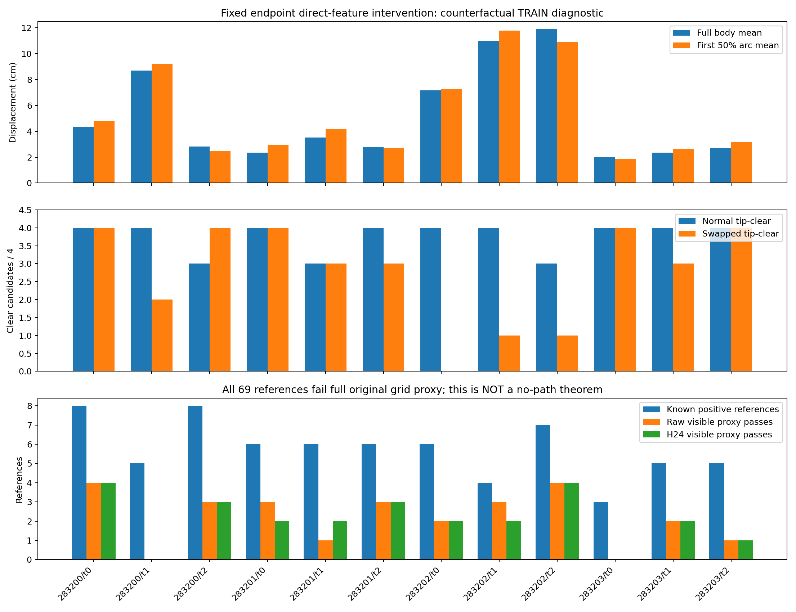
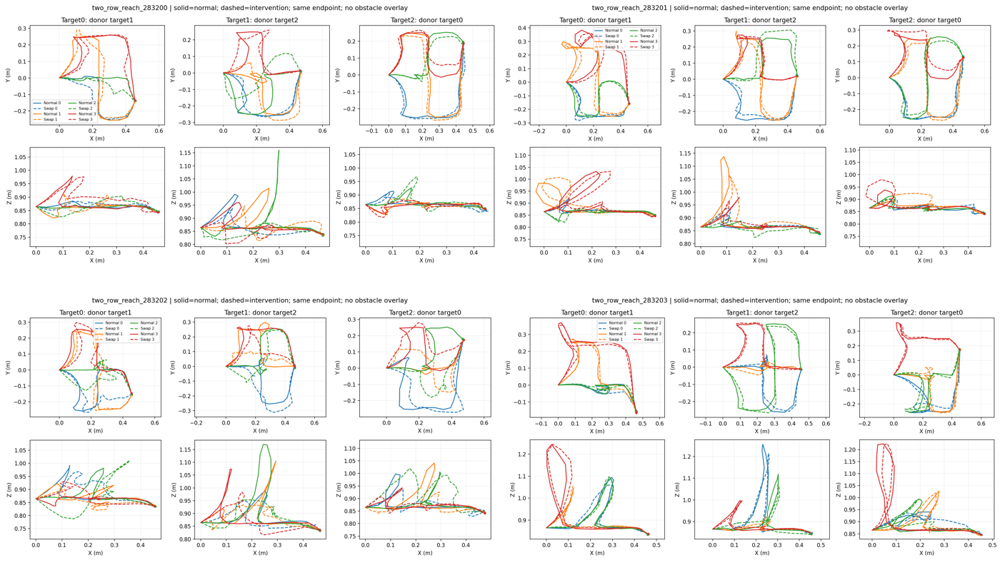

# TRAIN12 direct-feature and graph-support diagnostic — actual result

**固定目标后，direct Qwen分量仍显著改变路线；这只证明通道依赖，不证明DEV泛化失败的因果。原图对全部69正参考的完整支持为0，但该数被共同终点voxel拒绝所限制，不能读成没有其它有效模式。** 本轮不新增训练、搜索或方法优势行。

原协议：[TWO_ROW_ROUTE_CONDITIONING_PROTOCOL.md](TWO_ROW_ROUTE_CONDITIONING_PROTOCOL.md)。实际源`905214e8050d594b157dc7cacf6b446e7c183c85`；唯一cosine last12000 checkpoint SHA`cd1af0b572b80f9e7002ce866b7f3f062fed5afd6ab45ac16290db0c8b67c880`。固定TRAIN父283200–283203全部12指令，无DEV或reserved raw读取。

## 已通过的真实性门禁

服务器14tests/0skip，2.03秒；随后唯一audit实际exit0。normal、identity、cyclic direct swap各12次K4，共36forward/144计算路径状态，0新Qwen、0优化、0搜索、0重试。GPU1/35%、CPU0单核。

identity xyz/open逐值完全一致；geometry context/attention/anchor逐值一致，模型state_dict字节未变，hook异常恢复门禁通过。normal12与已保存189TRAIN池同ID比较最大XYZ差`4.76837158203125e-7 m`、最大event差`1.1920928955078125e-7`，均小于预登记绝对容差1e-5。原12cache均核验固定SHA。所有36池和12图先封存，之后才读取对应12label与69正参考。

这是一项非正常输入分布的干预：仅direct feature_encoder输出替换成同图下一目标的分量，保留recipient其它输入/geometry，并把最终端点固定为normal端点。未钳制的原forward也保存。**不得把交换后的池当正常任务生成成绩或方法有效率。** 间接task-conditioned geometry语义路径没有被移除。

## 路线变化与碰撞变化

48个同槽配对的22个body顶点平均位移**5.1334cm**，逐路径均值中位3.5776cm，最大单顶点37.3846cm。沿normal路径前50%弧长的顶点平均位移**5.3248cm**、逐路径均值中位3.9116cm。完整每顶点位移与normal弧长位置均保留；无重新匹配候选。

原2cm tip线段检查的净空数量**45→33/48**：14clear→collision、2collision→clear。目标、起点、事件在两侧均48/48正确。12条件中6下降、5不变、1改善；四父净下降分别1、1、9、1，变化明显集中在283202。48路径不是48独立父样本；这里不计算独立同分布显著性，不把小TRAIN探针外推为DEV因果。

| TRAIN父/目标 | body平均位移cm | normal→swap净空/4 | 正参考数 | raw/H24 visible-proxy通过 |
|---|---:|---:|---:|---:|
|283200/t0|4.3431|4→4|8|4/4|
|283200/t1|8.7096|4→2|5|0/0|
|283200/t2|2.8152|3→4|8|3/3|
|283201/t0|2.3646|4→4|6|3/2|
|283201/t1|3.5113|3→3|6|1/2|
|283201/t2|2.7631|4→3|6|3/3|
|283202/t0|7.1749|4→0|6|2/2|
|283202/t1|10.9813|4→1|4|3/2|
|283202/t2|11.8895|3→1|7|4/4|
|283203/t0|1.9948|4→4|3|0/0|
|283203/t1|2.3488|4→3|5|2/2|
|283203/t2|2.7049|4→4|5|1/1|

同一条件净空数不变也可能含相互抵消的改善/损坏；逐候选14/2转换保留于原report。visible-proxy是原有限可见点完整线段距离与固定间距ray/contact检查的合取，**不是**完整grid通过数。

## 为什么69个完整参考都被图拒绝

图使用原TRAIN32/31可观测父已冻结prototype/workspace，与神经TRAIN64拟合是两个独立诊断，不能写成同信息性能比较。没有重拟合。所有12图与原附件先构建封存，再检查69正参考的raw及原event-preserving H24：47条具有已知类型、22条类型unknown，全部都是已采正例，unknown未转负。

| 诊断项，分母69参考 | raw | H24 |
|---|---:|---:|
|原完整grid proxy通过|0|0|
|原visible proxy通过|26|25|
|其中有限点线段距离通过|35|35|
|其中ray/contact通过|39|39|
|起点所属voxel被拒|0|0|
|终点所属voxel被拒|69|69|
|原两contact球之外存在被拒voxel中心|65|64|
|前25%弧长涉及的线段触及被拒voxel|41|41|
|中间25–75%弧长涉及的线段触及被拒voxel|12|19|

**共同终点问题确实存在。** 所有参考终点所属的voxel中心投影都位于观测深度之后。这里说的是**格点中心**，不能据此声称69条连续轨迹的真实终点都不可见。实际参考终点距原prototype预测终点2.586–2.730cm，均值2.634cm；两端从未互换，也没有把真终点输入图或模型。全部12起点有16个原合法附件；4个target2预测目标均0合法附件，其他8条件有3–11个。即使有预测目标附件，也不意味着另一个参考终点位于相同可用格点中。

**又不能把全部拒绝仅归因于最后一点。** 原raw有65/69、H24有64/69在原current/预测goal contact球之外仍触及被拒voxel中心。raw被拒的cell–segment出现次数为1768：871次属于深度射线本可见自由、但保守膨胀后的grid仍阻塞；594次格点在观测深度后；299次格点不在有效可见范围；4次位于表面深度带。H24对应461/249/186/2次，共898。重复经过同一格点会重复计数；这些不是独立失败或路径比例。没有任何workspace越界。

raw第一次被拒线段起点弧长下界中位11.849%；H24为9.164%。这是**相交线段的起点下界**，不是精确物理碰撞接触位置。raw“内部segment被拒69/69”包含临近终点的短段，不能用该统计替代上表的contact区域/中段分解。离线补充只调用原supercover/原深度规则，未搜索、未改变阈值、未修剪参考或重算主成绩。

因此目前无法从0完整reference支持得到可学习覆盖的数值上限，也无法证明某通道不存在：保守图、格点量化、目标附件与参考曲线本身的可见性同时影响结果。少量参考曲线被拒不排除同类型另一曲线存在；unknown和没采到的模式仍未知。

## 研究判断

1. 这份固定checkpoint确实依赖direct语义分量来决定body。已有负例与正例都保留，结论超过“代码存在连接”，但仍只是训练样本上的通道干预。已确定的下一实验是**常规no-direct对照**：同冻结Qwen、同观测/共有初始化/抽样与曝光，geometry.query/point/fusion/anchor和剩余decoder继续端到端训练，仅去掉549120参数的direct分支。共有初始化/RNG相同，grounding并未冻结；参数量减少带来的容量解释不能排除。该对照检验普通结构调整是否改善泛化，不能据此称新机制已成立。
2. 暂不直接训练learned marginal field。应先明确可见图与端点附件能表示哪些任务路线，不能将被图拒绝的正参考直接转为负样本或强行回归进去。学习场需要同图的learned-static-cost+原Gaussian强对照，且不能靠改变目标信息或候选数得到优势。
3. 本轮不复活已失败copy-gate/local-refiner/DTW，不追加LR、温度或随机种子。没有DEV新forward，也没有用DEV为该探针选阈值。

## 实际成本与证据

- CPU测试PID618678/618681，2026-10-02 23:08:58.115514–23:09:00.623944 UTC，exit0；pytest14passed/0skip，2.03s。
- 审计PID619059/619064，23:09:22.115903–23:10:13.528460 UTC，exit0，记录器进程wall **51.412557s**。
- 审计内部计时49.615353s，reported reserved GPU hours.013782143；包含原图/参考的CPU检查。完整记录器wall/3600=.014281266h，额外计入导入/启动；不是纯GPU计算时长。
- 36次head forward同步计时合计.387021s：normal.329411、identity.029051、swap.028559；normal包含首调用初始化。12图/附件2.078220s；69×2次参考visible-proxy自身计时合计44.635629s。其它IO/封存/检查计入总wall，分项不伪装成端到端机器人请求延迟。
- CUDA峰值分配30,856,704bytes=29.427MiB；0新Qwen、0训练、0search。后续本地复制/统计/绘图均0新候选；最终离线全参考定位计算约1.958s（不含绘图），中间为补充原因分解有重跑分析，未重跑实际审计。

原件81文件完整SHA验证，原analysis index的68项全部通过。原report SHA`58c3fade9b8119adde1e45ad756e3b6537fe11ea5519b53700474363c74f85dd`；归档tar SHA`2960d7f9d514c093b600cab8aa0eb501ef7c9499fc53a991b04dad127b5f1fb0`。另69已读正参考+4当前observation按原report SHA复制到ignored NPZ目录，输入包SHA`d5b068b77a28909d6b494637e6cfbc6d05219ae5f76b48dabf1e9f85c176c79a`。没有读取新父或DEV路线。

[完整索引](observed_two_row_route_conditioning_v1/INDEX.md)、[原report](observed_two_row_route_conditioning_v1/analysis/report.json)、[离线逐参考诊断](observed_two_row_route_conditioning_v1/SAVED_DIAGNOSIS.json)。模型权重仍在原服务器run；没有新增权重。

四张原尺寸父图均保留；contactsheet覆盖全部12输入、每个K4normal与交换路径，无挑选。实线normal、虚线干预；颜色仅对齐候选槽。没有绘制真实障碍，所以不能从图线外观单独判断净空；碰撞结论来自未改checker。所有端点固定，XY/XZ范围按各子图真实轨迹显示。已逐图目视核对完整性和文字可读性。
