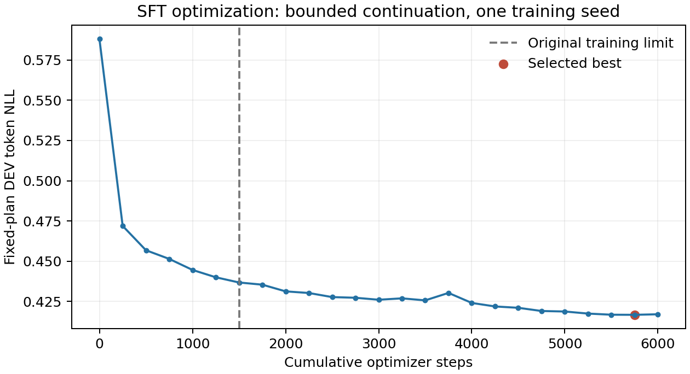

# 有上限的 SFT 续训及 TRAIN8 贪心验证

原目标、原数据及原序列表示下，1500→6000 步续训降低了 teacher-forced DEV token NLL，但没有改善预声明 TRAIN8 的自由生成端点。8/8 输出保持严格 H24 格式；端点3cm通过数仍为0/8，均值由23.391cm升至27.769cm，3父改善、5父变差。按预声明规则停止这支续训/解码扩展，不运行 DEV/K4、更多步数或温度/beam/种子扫描。这是一次有完整证据的强基线训练修复失败，不是对直接 VLM 路径生成能力的一般否定，也不是核心方法结论。

## 实际训练及恢复核验

从 immutable `5bb9087c9ca511c2a68a4da08798e95e8c6d4cdc` 运行，record440253/child440254，2026-10-02 16:52:48.307→17:22:30.501 UTC，exit0。唯一新目录为 `runs/vlm_route_sft_continuation_v1/seed0`。原1500的九个文件逐 SHA 保持不变，继承 journal/history 与原记录精确一致；真实续训采样为连续1…6000步且严格奇K1/偶K4，无重放额外请求。新增阶段8个 LoRA adapter 均有非零梯度和真实参数变化，冻结投影权重保持一致。

配置仅增加总步数及注册的续训 trainer/helper，原96 TRAIN/8 DEV、Qwen revision、last-two-layer q/v LoRA、lr1e-4、constant scheduler、正参考采样/顺序、DEV固定计划/每250步 token NLL 选模均不变。实际 CPU shared-loop 连续6步对照 completed2→新树续至4→恢复至6精确一致；13项相关 tests 通过，详见 CPU receipts。

| 成本/曝光 | 原1500 | 本段新增 | 完整6000累计 |
|---|---:|---:|---:|
| TRAIN requests / optimizer steps |1500|4500|6000|
| TRAIN route slots |3750|11250|15000|
| TRAIN supervised tokens |1273081|3816120|5089201|
| DEV requests |322|828|1150|
| DEV route slots |805|2070|2875|
| 实测 elapsed seconds |556.787|1777.327|2334.114|
| reserved GPU-hours |0.154663|0.493702|0.648365|

峰值 CUDA allocated 为4,833,567,232 bytes。GPU-hours 是占用窗口墙钟，含启动和 teacher-forced DEV，不是利用率归一化 GPU 小时或自回归时延。汇总原/子实验时只加新增成本，不能重复计入556.787秒原投入。

DEV token NLL 从原 best1500的0.4367267降至新 best5750的0.4166331，相对下降4.601%；last6000为0.4169665。所选 best5750的祖先 TRAIN 曝光为5750 requests、14375 slots、4877472 supervised tokens；选择后剩余250步仍计入完整15000槽和实际成本，不能因未选中而抹掉。token NLL 是真值路径前缀条件下的预测指标，不证明视觉端点定位或自由生成成功。



## 唯一续训后 TRAIN8 验证

从 immutable `57e5231d1a5e25f2a8d2d5b2e0f656c49a3eb3d6` 执行新独立 lineage 入口，旧 same-checkpoint 固定 SHA guard 未改。14项实际 CPU tests 通过0.18秒，原数据/九文件/追加成本/selected checkpoint内配置与 lineage 全部通过；新 best5750并非继承原 best。generation record454715/child454716在17:23:30.825→17:24:58.328 UTC exit0，独立 CPU analyzer 在17:24:58.561退出0。

固定 TRAIN272000…272007各 target0，一共8调用/8槽，K1/H24、512token/调用、同语法范围、`do_sample=False`、`use_model_defaults=False`、原请求 seed 身份和180秒请求边界均不变。每次都重读、预处理、编码观测；所有约束开销计时。没有参考路线/目标坐标/真几何进入生成条件。完整请求池冻结并重解析通过后，独立分析才读固定目标元数据，保持原3cm标准。

| TRAIN parent | 原 best1500误差 cm | 新 best5750误差 cm |
|---|---:|---:|
|272000|21.463|37.205|
|272001|20.481|16.099|
|272002|41.925|41.201|
|272003|21.634|27.048|
|272004|25.388|36.026|
|272005|7.650|16.980|
|272006|21.577|14.583|
|272007|27.012|33.007|
|均值|23.391|27.769|
|中位|21.605|30.028|
|3cm通过 / 正确目标通过|0/8 / 0/8|0/8 / 0/8|

新生成8/8 strict finite，0异常、0截断、0未尝试槽位、0预算超限。6194 prompt tokens、2586 output tokens；含启动 elapsed83.116秒（0.023088 reserved GPU-hours），请求循环80.465秒，峰值4,409,023,488 bytes。预声明门槛“至少4/8≤3cm且全8均值≤15cm”未达到。此处没有碰撞/执行评价，也没有按失败样本修路或按新生成结果换 checkpoint。

## 判断及后续边界

此次干预只增加原目标下的训练曝光；较低 teacher NLL 与较差自由生成端点可以同时发生。已有单位、mask/shift、因果性、恢复、实际 adapter 更新及严格格式检查没有发现对应实现错误，但这些检查不排除表示或学习难度。先前 teacher 条件端点7/8接近真值不能充当视觉定位证据，因为前23个真路径点已经暴露方向。不能把此次结果写成“teacher机制坏了”或“VLM无能力”。

完整训练只有15000 route slots，仍远小于连续路线头的数十万槽；这不是同训练曝光的体系排名。停止在这里是预声明的资源/研究选择，不是证明充分收敛到生成能力上限。当前证据不支持继续盲目增加本分支预算；也不立即叠加 endpoint-first 等另一表示以追逐本组8例。主机制工作继续由真实观测路线头、可区分的物理场景及强同信息对照推进，这次工程控制不称新颖贡献。

## 源、结果与复现

- 完成训练30个实际 artifact 全部 SCP 并逐 SHA 核验：`vlm_route_sft_continuation_v1/completed/artifact_index.json`。模型/优化器/RNG小checkpoint在被忽略的 `runs/vlm_route_sft_continuation_v1/seed0/`，未入普通 Git。
- 训练 summary SHA `c1bff2778fa16ddfe39bc6167bb19adda92c780d33e365b744cf5eebc6e55918`；best5750 SHA `777b79b69f8f3e27a87d6c0120a6012970a463dea0db385cdbe7610c23817b8c`；last6000 SHA `ce088cdb861038967bdd64ed141a572d8addb13007922c2db3cb3b9c3e53a7f0`。
- 验证17个实际 artifact 全部 SCP 并逐 SHA 核验：`vlm_sft_continued_train8_v1/artifact_index.json`；NPZ 在忽略的 `runs/vlm_sft_continued_train8_v1/train8/`。全部原始文本、失败字段、实际配置和来源已保留。
- 生成 summary SHA `c48bb6462ddee7ea5c9c2ca67aacddb580520859e37d5b0b87694145e4807be6`；独立分析 SHA `41114813d943c4ff9c307df737fe0ccba26f3961226081912f929d86dc37ffc4`。
- 实际 wrapper、命令和退出码位于对应 completed/与生成报告目录的 `*.status.json`、`launcher.sh`、`source.sha256`。训练恢复命令只用于中断的子目录；当前已完成，不重新启动它。

本地实际只读复现训练统计/曲线命令（需新 output）为：

```powershell
F:/ProgramData/anaconda3/python.exe -m scripts.analyze_vlm_sft_continuation --original reports/vlm_route_sft_v1/training --continued reports/vlm_route_sft_continuation_v1/completed/seed0 --output reports/vlm_route_sft_continuation_v1/analysis
```

该脚本只读已完成日志/元数据，核对7150条 journal 的原前缀、曝光、K schedule 和原 mask receipt，不运行模型/读取真实路线数据。曲线已实际渲染检查。两支本任务作业均已退出，没有后续后台训练或自主生成。
