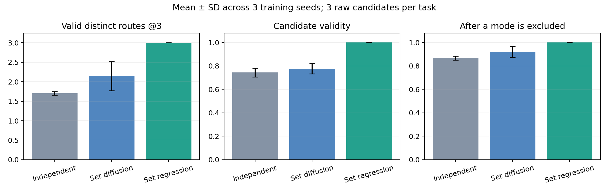
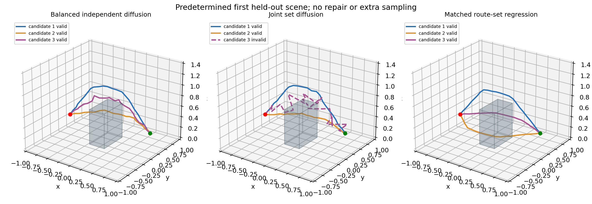

# 基础实验结果与模型选择

2026-09-30，已在 `ssh wzy3090` 上完成实际训练、测试和推理。代码与结果同步保存在 `F:\dpvlm`；服务器独立目录为 `/home/wzy/dpvlm/route_set_v1`。主要实验只使用 GPU 1，训练进程显存上限为该卡 35%，CPU 线程 4；没有管理员操作、修改共享 Python 环境、删除他人文件或中断他人任务。实验已结束。

## 结论

**优先使用“视觉语言条件＋多查询路径集合＋集合匹配训练”作为任务层基础模型。** 本实验中，非扩散集合回归比独立扩散和集合扩散更稳定，直接生成三条有效不同路线；扩散不是实现这个目标的必要条件。集合扩散相比独立采样平均提高覆盖，但存在明显训练种子波动。

推荐后续结构是：VLM 提供任务对象、目标区域、阶段与必要交互锚点；几何编码器表示可通行空间；K 个路线查询共同覆盖不同路线族；每个查询预测连续路径和经过独立校准的检查通过概率。若需要同一路线族内的连续变化，再给查询接扩散头。不要让 VLM 先决定一条完整中间路线后，才在附近生成小扰动。

这是受控路线集合机制的结果。**当前没有证明真实机器人执行成功、开放词汇目标定位、VLM 语义泛化或方法新颖性。**

## 数据、模型与公平性

训练单位是同一场景、同一任务、同一起终点的一组路径。数据含 768 TRAIN、128 VAL、128 TEST、128 OOD 场景，每组 12 条参考路线，24 个三维路点。箱体落地且遮挡直线路径，负 y、正 y、上方各有 4 条几何变体；参考路线全部通过线段级检查。OOD 箱体更宽、更高，x 位置超出训练范围。

所有主要方法共享冻结 CLIP ViT-B/32 图文特征、真实几何与任务起终点，训练 seed 0/1/2，每次 64 场景 × 3 条路线，4,000 次更新，每种方法每个 seed 的路线曝光总数都是 **768,000**。模式标签只用于统一构造平衡目标，测试时不输入模式编号。验证集指标选择 checkpoint；测试标签未用于选择或校准。

候选预算都是 K=3，没有超采样、失败后补采样或碰撞修复。独立扩散与集合扩散都用 40 次 DDIM 前向；集合回归一次前向。扩散每场景评估 4 个随机重复，每个重复各自只有 3 条候选，先计算指标再平均，未合并为 12 条。

网络为 192 维、3 层的条件路线 token 模块。去噪器没有候选 ID，集合注意力数值排列等变检查通过。回归器使用学习查询，以最优集合匹配损失训练。两端硬约束，内部路点预测起终点直线上的残差。默认未启用覆盖辅助损失或几何训练损失。

## 实际测试结果

以下为三个训练种子的均值 ± 标准差；标准差来自训练种子，不是场景置信区间。“有效”只指端点、有限值、工作空间、长度比和完整折线段碰撞检查通过。“不同”按预先定义的参考通道模式计数，路线抖动不会增加计数。

| 方法 | TEST 有效不同路线数 @3 | TEST 候选有效率 | OOD 有效不同路线数 @3 | OOD 候选有效率 |
|---|---:|---:|---:|---:|
| 模式平衡独立扩散 | 1.702 ± 0.050 | 74.37% ± 3.69% | 1.254 ± 0.052 | 49.87% ± 2.87% |
| 集合扩散 | 2.145 ± 0.377 | 77.58% ± 4.38% | 1.493 ± 0.182 | 51.80% ± 3.14% |
| 多查询集合回归 | **3.000 ± 0.000** | **100.00% ± 0.00%** | **2.878 ± 0.027** | **95.92% ± 0.91%** |

集合扩散的 TEST 逐种子结果为 2.352、1.709、2.373，不能只展示最好的 seed 0。回归三个 seed 的 TEST 结果都为 3.000，但固定三种模式的简单任务使集合匹配回归很有优势；要证明真实研究价值，还需可行模式数变化、复杂场景与语义约束。

容量对照只运行 seed 0：加宽独立扩散的活跃参数为 1,467,906，接近集合扩散的 1,431,234，TEST 有效不同路线数仍为 1.701，有效率 76.56%。它没有解释 seed 0 集合扩散的覆盖收益，但这一额外对照只有一个训练 seed。

模式禁用规则测试：生成集合后，分别禁止三个参考模式中的一个，检查是否仍有有效候选。TEST 三种方法的平均保留率是 86.59%、92.01%、100.00%；OOD 为 69.40%、75.80%、99.83%。这是附加任务规则测试，没有往环境插入新实体障碍。

活跃参数数：独立扩散 985,410，集合扩散 1,431,234，集合回归 1,363,266。单卡 batch 32、缓存条件下的生成均摊时间约为 1.47、2.17、0.052 ms/集合；不包含 CLIP 编码或模型加载，不能解释为单请求延迟。实际训练均在约两分钟内完成一组 4,000 步；所有训练/评估日志已保留。

预先指定第一条 TEST 场景的 seed 0 输出如下；没有挑选有利样例。集合扩散的第三条路径在该样例无效，仍计入候选预算。

## 路线置信度

已训练逐路线 Critic，并进行 Platt 校准。训练只用 TRAIN 参考、扰动和生成路线。校准使用前半 VAL 场景的 seed 0 三种生成器输出，混合样本权重为 4:4:1；后半 VAL 对 Critic/校准器留出，但曾用于路径模型 checkpoint 选择。TEST/OOD 未用于拟合。

| 生成器 | TEST Brier | TEST ECE | OOD Brier | OOD ECE |
|---|---:|---:|---:|---:|
| 独立扩散 | 0.0556 | 0.0233 | 0.0997 | 0.0610 |
| 集合扩散 | 0.0838 | 0.0300 | 0.1523 | 0.1094 |
| 集合回归 | 0.0133 | 0.0797 | 0.0743 | 0.1538 |

数值越小越好。回归器分布外预测存在明显低估有效率的现象，当前共享评分器不能称为可靠的分布外成功概率。完整几何已知时，应以确定性几何检查为准；真实执行概率需要固定控制器下的成功标签重新训练与校准。

`demo_candidates.json` 已实际通过完整推理导出第一条 TEST 场景的 3 × 24 个三维路点、对应双视角投影、检查标签和置信度。三个候选均通过检查，评分约为 0.915、0.844、0.958。这些二维点由三维预测投影得到，**不是双视角二维生成模型的输出**。

## 开源数据与几何接入

已限量解析 3DWay-Data 的 12 条真实公开二维标签，下载官方标定和两张 RGB 示例。检查的元数据前缀不含标定或同场景多路线组，多个记录是语言改写；这一结论不能推广为全数据没有多路线。本轮覆盖训练没有使用完整 3DWay 机器人数据。

官方标定示例的 27 个合成三维测试点经过投影与 DLT 重建，最大误差 1.47e-15 m；加 1 像素噪声平均误差 5.27 mm。该烟测验证几何实现和相机约定，未测试路径预测或执行。详见 `3dway_geometry_smoke.json` 和 [一手资料](sources.md)。

## 交付与下一步

- 代码与复现命令：项目根目录 `README.md`。
- 三训练种子原始结果：`multiseed_summary.json`；seed 0 配对场景区间：`paired_comparisons.json`。
- 预测、checkpoint、日志：本地 `runs/main`、`runs/capacity`、`runs/confidence`；服务器对应同名目录。
- 数据/特征 SHA、固定 CLIP revision、依赖 freeze 已保存。
- 15 项几何与模型测试通过；实际训练、评估、Critic 校准和 JSON 推理导出完成。
- 后续优先级见 [下一阶段方案](next_steps.md)：可变可行路线数 → 多障碍 → 真实语言 grounding → RLBench 同场景多路线 → 固定执行器检验。加入 VLM 直接多候选、Particle Guidance、传统规划，并比较真正学习的双视角二维头。

合理的研究贡献应来自困难任务上可验证的有效路线覆盖和可选性，不能仅由“VLM＋扩散/查询”这个模块组合或本轮 toy 高分得出。

2026-10-02研究V2接续：本报告数值和 `demo_candidates.json` 继续作为原三路历史基线保留。新增可变开口、真实Qwen/RGB-D、RLBench-derived障碍/多目标采集、三种子定位修复及新布局开发结果见 [RESEARCH_V2_ZH.md](RESEARCH_V2_ZH.md)、[EVIDENCE_MATRIX.md](EVIDENCE_MATRIX.md) 与 [MAIN_RESULTS.json](MAIN_RESULTS.json)。原TEST/OOD不再作为新方法的未触碰确认集；新的锁定父划分另行登记。不要把历史受控结果与新观测结果混为同一评价。
