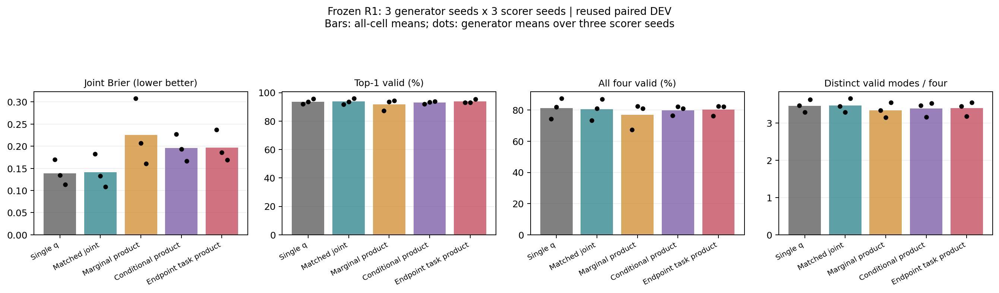
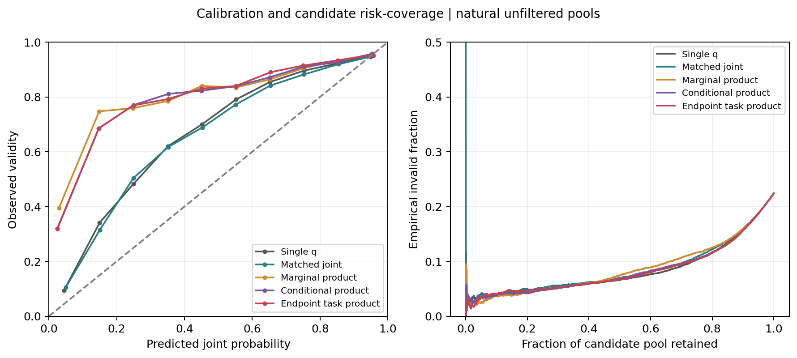

# 双评分多路径规划：完整实验结论

已交付可运行的上层规划研究原型：同一场景输出8条三维路径，每条具有任务匹配、条件几何可行性及两者乘积，能够按乘积选路。完成45组评分训练、18个校准后双评分模型包、真实命令行推理、完整对照及一次诊断驱动修正。

**功能目标成立；“双评分比强单q基线更可靠”的方法优势尚未成立。当前是可继续研究的完整实验雏形，不能据此声称已经达到ICML/ICLR/CVPR/NeurIPS投稿成熟度。**

## 模型结构

RGB与指令经过冻结的真实Qwen3-VL-2B编码；RGB-D、相机与当前状态进入已有观测几何模块。既有R1多查询生成头输出8条24点XYZ路径与reach事件。本轮冻结生成器，只优化实际候选路线的评分，避免将选路收益误写成原始多峰生成提升。

每条路线构造24个顶点与23个线段中点的观测特征。任务头估计a=P(T|观测,指令,路线)，几何头估计b=P(F|T=1,观测,指令,路线)，最终q=a×b。T表示语义目标与任务事件正确，F表示有限坐标、起点一致与连续末端路径几何有效。逐候选验证T且F严格等于原有效性标签。此条件分解使用概率链式法则，不需要假设T与F独立；学到的数值是否准确仍需实测。

任务头对全部候选训练，条件几何头只对T=1的候选训练。两头均为监督学习，本轮没有RL。概率不做候选间softmax，多条合理路线可以同时高分。q只针对上层路径有效事件，不能代替整机执行成功概率。

最终修正版将任务头限制到终点观测特征、场景上下文与reach事件摘要；几何头继续看完整路线。这使任务分数不受中间空间走法干扰。当前事件摘要只适用于本实验的reach任务。

## 实验范围与完整对照

五种方案：单头联合q、等容量双头联合q、两个边际概率相乘、任务与条件可行性相乘、终点任务头修正。前三种双头控制与修正版均为52,098参数，单头为26,049参数。3个冻结生成器种子×3个评分器种子×5方案，共45次1200步训练。所有双头方案初始参数相同，同一单元的实际请求采样顺序完全相同。

SCORE_TRAIN的64父场景/192请求负责拟合；DEV_SCORE的32父场景/96请求负责检查点选择；CALIBRATION的32父场景/96请求负责校准。主结果来自32家族/288请求的paired DEV，另外报告old_dev和dev32。所有这些评估都是开发证据，没有查看TEST_LOCKED。重复的九个模型单元不是九份独立场景。

校准参数数目均为2：单头/联合控制使用正斜率Platt，双因素使用分别温度。参数数量相同不代表函数族或目标相同，因此原始与校准结果都保留。初次校准的float32有限差分数值问题已修复，所有45组最终指标使用evaluation_v2；原结果保留。

## 主要结果

以下均为paired DEV九个单元均值，K4从固定内部8条候选中选择。有效性单位是任务请求或路线集合，不是机器人执行成功率。

| 方法 | 最高分有效率 | Brier↓ | NLL↓ | ECE↓ | K4全部有效 | K4不同有效模式 |
|---|---:|---:|---:|---:|---:|---:|
| 单q基线 |93.71%|0.1390|0.4369|12.61%|81.29%|3.466|
| 等容量联合q |93.75%|0.1412|0.4420|11.96%|80.48%|3.468|
| 边际概率相乘 |91.74%|0.2252|0.7310|25.19%|76.93%|3.346|
| 条件概率相乘 |93.13%|0.1960|0.6458|22.37%|79.90%|3.392|
| 终点任务头修正 |93.87%|0.1971|0.6534|22.85%|80.29%|3.399|

修正版最高分有效率比单q高0.154个百分点，但家族bootstrap区间为[-0.347,+0.656]个百分点，不能声称稳定改善。Brier反而高0.05818，区间[0.04293,0.07348]；不同有效模式少0.06790，区间[-0.10031,-0.03974]。区间基于32场景家族、固定已训练模型，不涵盖完整训练随机性或未来独立数据不确定性。

原始未校准Brier同样显示差距：单q 0.1493、条件乘积0.1945、修正版0.1954。因此问题并不只是校准函数不同造成的。old_dev与dev32上修正版Brier分别0.1113/0.1310，略优于单q的0.1163/0.1328；这不足以抵消paired DEV的失效。完整数值与每生成器结果见analysis_final/RESULTS.json及TABLE.md。

## 诊断、修正与还未解决的问题

只使用固定的TRAIN请求，保持终点、起点、任务事件及观测不变，将中间路径换为另一候选。原任务头的平均绝对分数变化跨模型为0.0147–0.0395，部分95分位超过0.1。任务标签不变而任务评分变化，说明原输入结构引入了不必要的路径依赖。

修正后，576条实际重算观测特征的干预路径、1728次评分比较中，任务概率变化的最大值为0。结构性目标达到，最高分选路有所改善，但联合概率精度没有随之改善。这也反驳了“修复任务头即可解决整体可靠性”的简单解释。

更突出的剩余误差在条件几何头：paired DEV上修正版平均q_feas为0.6028，实际条件有效比例为0.8214；其Brier为0.1703。任务头平均q_task为0.9186，对应正确比例0.9440，Brier为0.0577。old_dev中条件几何平均预测0.7795、实际0.7889。误差具有明显的数据分布依赖；目前只能据此定位，不能断言唯一原因是某项几何特征。

## 原型、验证和资源

固定演示为g0/s0，不按最优种子选择。最终包：runs/factored_q_v1/conditional_endpoint_g0_s0/deployment_v2/planner.pt，SHA256为9f819f4cd1d1fb71f771942c07b3071aebdf9b0dd5e88eb6f7105bc8e7e95016。实际公开CLI输出与保存候选和包重载逐项完全一致，包括路径、事件、两因素、乘积和选择索引。该次进程及路线头加载推理约2.79秒，使用真实Qwen缓存，不能当作重新运行完整Qwen的端到端延迟。

服务器最终7项测试通过、0跳过；实际100步连续训练与50+50断点恢复的模型、优化器、调度器、RNG、sampler、配置、归一化及历史记录完全一致。保留必要best/last/recovery和全部失败/修复证据。闭合快照893个文件已逐项核对本地/服务器SHA。

115个受预算管理命令全部exit0，累计命令墙钟941.86秒，并非GPU利用小时。只有GPU1与四CPU线程、35%显存分配上限，复用既有环境；无其他用户进程修改。所有本轮协调器退出，没有待运行实验。初次本地解包因旧Python不支持filter参数失败，随后以明确路径范围和普通文件校验方式完成；此包装问题没有改动训练产物。

## 投稿判断与下一步

可写材料已经具备：清晰问题、可运行模型、强基线、完整消融、真实诊断、全部种子和可复现产物。然而双因素乘法是已有思想，当前机制没有超过强单q；任务主要为受控reach场景，缺少冻结设计后的独立泛化与更丰富任务验证。当前不能靠重新叙述idea弥补这些实证缺口。

下一轮建议继续聚焦**布局变化下的条件几何可靠性**：固定生成器与任务头，分析可见几何覆盖和条件可行性误差；只有诊断指向具体特征或训练分布问题，才进行一个对应修改。若同候选、同训练预算下仍不能降低Brier/NLL且保持选路与模式数，则保留单q作为实用基线。方法固定后再增加独立场景与任务验证。现阶段没有必要扩展底层控制或仅为新颖性引入RL。

本轮预先限定的两阶段实验已经完成，FINAL_GATE.json记录修正版未通过优势判据。详细模型定义见METHOD.md，使用见DEPLOYMENT.md，论文组织及后续主线见PAPER_OUTLINE.md。
