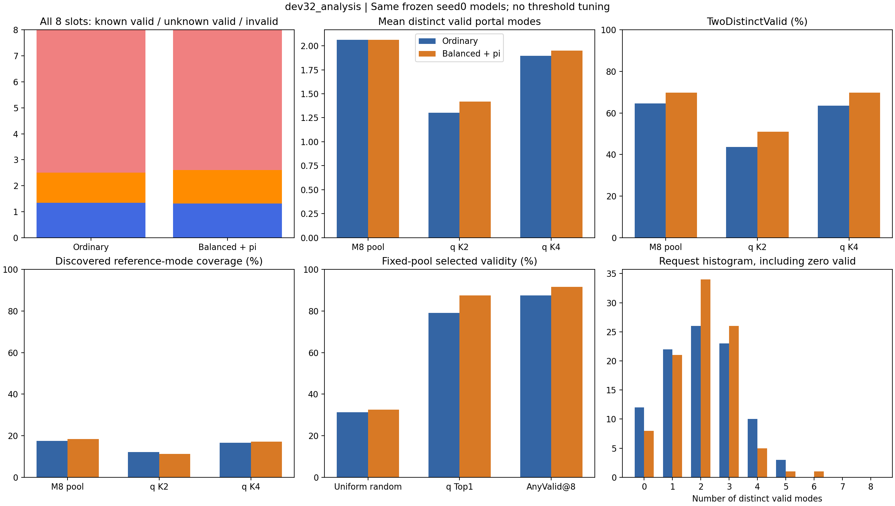
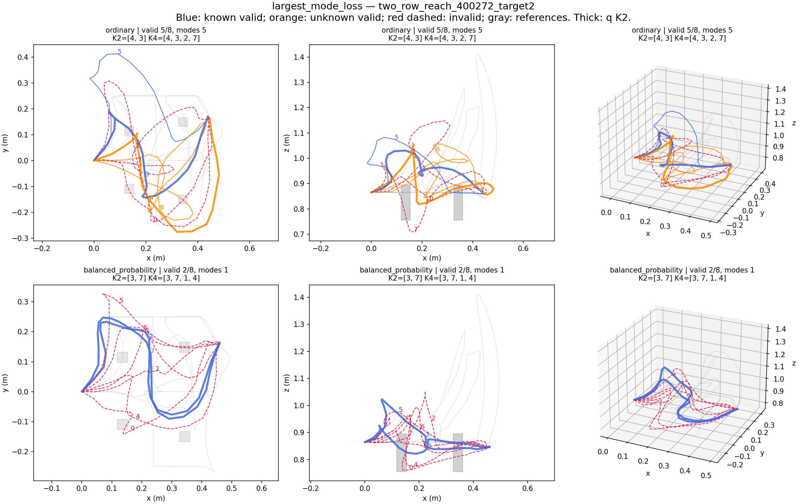
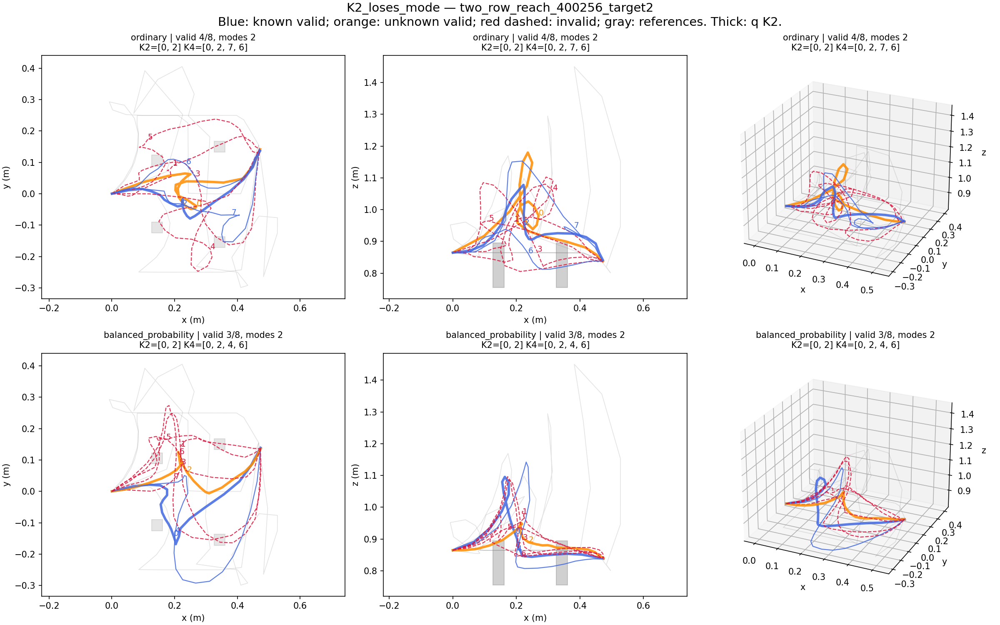

# M8真实多峰覆盖与冻结DEV32验证 — 2026-10-04

本轮实际完成旧候选分析和新DEV32一次评价。结论是：**模型已经能生成多种有效通道，旧分类器明显低估多样性；当前方法在新场景上的生成优势很弱，q排序效用仍能迁移。没有证据支持本轮启动“修复普遍单模态坍缩”的新结构。**

## 核心结果

两臂均固定已交付的expanded191 generator seed0、last3000，以及各自既有q seed0与温度；未重新选checkpoint、训练q、调阈值。内部M=8、H=24；K子集使用原q优先/4cm形状去重规则。旧DEV为12父/36条件，新DEV为32父/96条件。

| 指标 | 旧DEV 普通 | 旧DEV 当前 | 新DEV32 普通 | 新DEV32 当前 |
|---|---:|---:|---:|---:|
| Candidate Valid Rate | 30.21% | 39.93% | 31.25% | 32.55% |
| AnyValid@8 | 86.11% | 94.44% | 87.50% | 91.67% |
| ValidCount@8 | 2.417 | 3.194 | 2.500 | 2.604 |
| GeometricModeCount@8 | 1.972 | 2.528 | 2.063 | 2.063 |
| TwoDistinctValid@2 | 55.56% | 66.67% | 43.75% | 51.04% |
| TwoDistinctValid@4 | 66.67% | 86.11% | 63.54% | 69.79% |
| ReferenceModeCoverage@4 | 13.65% | 20.93% | 16.59% | 17.13% |
| q SelectedValid@1 | 83.33% | 91.67% | 79.17% | 87.50% |

所有“有效”沿用原检查器：目标3cm、起点5mm、原事件序列、完整折线与物理障碍的2cm间距。不是机械臂、IK或环境全部物体的执行证书。参考覆盖只针对**已经发现的有效参考走法**，不是完整真实多峰分布。

## 六个问题

1. **M8实际生成几种有效走法？** 当前模型在新DEV32平均2.06种、2.60条有效路线；67/96请求至少两种，21/96恰好一种，8/96全部无效。旧DEV seed0平均2.53种；复用旧三种生成种子后平均2.38种，普通模型2.12种，差值父场景bootstrap区间[-0.009,+0.556]，稳定优势尚未成立。8个查询不等于8个不同有效模式，也未由本轮证明跨场景查询语义固定。

2. **旧UniqueClassified是否低估？** 明显低估。当前模型旧DEV为1.08→2.53，新DEV为1.11→2.06。新DEV的124条有效unknown经合并，贡献87个“同条件仅unknown候选代表”的几何模式出现项，分布于63个请求；另有47个unknown涉及的模式出现项未见于该条件有限参考。旧DEV对应69条unknown、48个unknown-only模式项、27个参考未见项。以上是按条件计数，不能解释为全数据集独立新类别；未知标签不会自动增加模式数。

3. **生成还是选择问题？** 旧分类器遗漏首先解释了“看起来近乎单模态”。剩余问题包含生成有效性/参考覆盖不足和K2选择损失。新DEV M8的参考覆盖仅18.41%，K4为17.13%，主要缺口已经在生成池；518条无效候选中498条碰撞、63条目标错误（原因重叠）。K4保留了全部67个可返回两种有效模式的请求，模式总项198→187；K2则把18/67个请求的第二模式丢掉。**K4不是主要瓶颈，K2现有距离去重有明确不足。**

4. **旧优势能迁移吗？** 候选有效率方向保留，但只增加10/768条，即+1.30个百分点；32父配对bootstrap区间[-3.13,+5.99]个百分点。模式均值差为0，TwoDistinctValid@4增加6.25个百分点、区间[-3.13,+16.67]，参考覆盖增加0.54个百分点、区间[-2.91,+4.03]。不能宣称稳定复现生成/覆盖优势。q自身排序效用明确保留：当前模型随机选路期望32.55%，q Top1为87.50%，增益区间[+49.61,+60.03]个百分点。当前系统相对普通的Top1差为+8.33个百分点，但区间[-1.04,+17.71]，两臂差异仍不确定。

5. **Relation-conditioned query效果与代价？** 本轮未实施。先验门要求旧DEV多参考条件中至少一半且至少6例仅有一个有效M8模式，实际只有3/36；新DEV也仅21/96。零有效池单列，不能偷换成模式坍缩。没有触发新生成机制的条件，新增生成/q训练步数均为0，避免无依据的结构搜索。

6. **下一步最值得做的一件事？** 在冻结生成器与q的条件下，做一次**仅使用观测几何的K2通道去重验证**：最高q首条不变，后续在原q门限内优先不同通道。这个工程问题已有18个明确丢失案例；评价用真值通道绝不能直接用于推理。生成有效性和低参考覆盖仍是更长期问题，本轮不自动发明第二个机制。

## 固定几何定义与局限

源码`routeset/geometric_modes.py`和预注册`configs/geometric_modes_v1.json`在新DEV数据读取前冻结。遍历完整3D折线与两排障碍中心平面的所有有向交点，记录侧通道/中通道/障碍上方或下方及顺序；同一通道相邻正反穿越递归消去。同一个通道词归为一个模式，不依赖人工类别，不按终点距离聚类，也不按路线逐条命名。只有原checker有效的路线参与模式计数。物理几何仅用于离线评价，生成器、q和返回规则都不读取它。

这是一套有限、可解释的通道模式，不是严格同伦类证明；不会区分所有不跨排平面的额外绕行，也可能合并可连续变形的不同高度形状。旧205/205、新570/570条已接受参考的H24路线均复核有效；分别归为191/521个条件模式项。两套数据每个条件均至少两种已发现参考模式，覆盖宏平均分母为36/96。有效候选线段中点细分审计旧202条、新490条全保持通道词不变。新当前250条有效候选只有6条保留反向跨通道序列，结果主要不是回退噪声。

π辅助项保留：按原4cm完整链接参考簇均衡质量聚合到几何通道，预测质量为同簇候选π之和。当前新DEV平均65.46%质量在无效候选；带无效未解析桶的质量TV为.874，普通未训练均匀π为.871。不能据此称π准确、自然频率或q校准；没有相乘q与π。

## 失败案例与可视化

| 新DEV条件 | 实际失败/退步 |
|---|---|
| 400272_target2 | 普通5条有效/5模式，当前2条有效/1模式，是真实局部退步；不是只展示成功 |
| 400261_target0 | 两臂全部无效；当前最高q=.971仍失败，选中路线目标误差3.34cm，超过固定3cm阈值 |
| 400258_target1 | 当前最高q=.942但目标误差3.17cm；池中另有有效候选，排序仍会出错 |
| 400256_target2 | 当前K2选0/2，两条middle→middle；有效4号middle→negative_y到K4才被返回 |







新DEV全部96条件见`dev32_analysis/ALL_ROUTES_00..90.png`；旧DEV全部36条件见`old_dev_final/ALL_ROUTES_00..30.png`。蓝=已分类有效，橙=unknown有效，红虚线=无效，灰=参考/障碍。主结果图也显示全部失败与unknown。每个数据集另保留按确定规则选的最大改善、最大退步、首个全失败、K2丢失等案例与`CASE_SELECTION.json`。统计原件为各目录`RESULTS.json`、`*_rows.json`、`DIAGNOSTICS.json`、`CORE_TABLE.csv`。

## 数据、预算与交付

实际新角色为`DEV_MODEL`，父场景400256–400287；`DEV_SCORE32`（400096–400127）此前已经用于q checkpoint选择，未冒充新验证。原DEV32仅注册而未采集，经用户本轮明确授权，原不可变5c8采集器完成32父/864槽：570参考成功、294参考失败全部保留；96请求无缺失，32运行exit0。上海时间01:40:36–02:24:53，外层2657秒；父worker累计5287.785秒（两条单线程并行，不能与外层相加）。这是同一窄ID布局分布的新开发场景，不是OOD或最终测试；现在已经成为使用过的开发证据。TEST_LOCKED全程未读取。

后续测试/分析/缓存/推理9项服务器作业：8成功、1失败，累计115.035秒，包含最初NumPy JSON序列化失败的2.984秒，低于本轮3600秒分析评价上限。96次新Qwen编码、两臂共192请求/1536条完整候选，0训练步。Qwen峰值4,279,495,680字节，路径头55,295,488字节；GPU1/35%限制，采集CPU2/3、评价CPU0/1，最多4核。原环境、旧checkpoint、旧结果与`runs/main`保持不变。

实际服务器27 tests通过/0skip。新241个下载文件与456个部署源文件SHA核验通过；旧27个原始下载文件与455源文件也核验通过。原始新候选/RNG保存在服务器`runs/geometric_modes_v1/dev32_pools`及本地`F:/dpvlm/runs/geometric_modes_v1/dev32_pools`；旧候选不重新生成。清单包括`DEV32_LOCAL_VERIFICATION.json`、`OLD_ARTIFACT_INDEX.json`、`FINAL_AUDIT.json`与各job receipt。CLI失败保留在`jobs/old_modes`。

新增代码：`routeset/geometric_modes.py`、`scripts/analyze_geometric_modes.py`、`scripts/evaluate_frozen_dev32.py`、`scripts/geometric_modes_job.py`、`scripts/launch_geometric_modes.sh`、`scripts/plot_geometric_modes.py`、`tests/test_geometric_modes.py`；新增配置`configs/geometric_modes_v1.json`。更新`STATE.md`、`RESUME.md`、`RESEARCH_LOG.md`和`experiments/registry.jsonl`。没有修改生成器、q网络或原选择器源码。

冻结协议commit：`e9ecb9a`；旧池最终分析：`b8be6ef`；新DEV实际导出/缓存/推理/分析：`6a6339e52cb4d235d5760102a093caca1e32ba32`；原采集：`5c8f8e4f5cd478c793a0e0d9640005deaf700973`。最终报告归档commit与push核验见本轮最终回复。报告时已完成全部本轮采集与实验，无训练/评价在运行。

## 实际命令

下面root为服务器`/home/wzy/dpvlm/route_set_v1`，每项均经`ssh wzy3090`执行。完整绝对命令、cwd、起止时间、PID、源哈希及exit code见`jobs/*/receipt.json`与`collection_session/command`；不可将已完成的fresh输出命令原样重跑。

```bash
bash "$root/research_v2/releases/5c8f8e4f5cd478c793a0e0d9640005deaf700973/scripts/launch_two_row_extension288_v1.sh" 5c8f8e4f5cd478c793a0e0d9640005deaf700973 dev32 resume
```

新DEV四项使用release `6a6339e52cb4d235d5760102a093caca1e32ba32`中的`launch_geometric_modes.sh --id <job-id> -- <command>`：

```bash
# dev32_export
"$root/.venv/bin/python" -m scripts.evaluate_frozen_dev32 export
# dev32_qwen_cache
"$root/.venv-qwen/bin/python" -m scripts.observation_cache_qwen --model "$root/data/qwen3-vl-2b-instruct-89644892" --manifest "$root/data/geometric_modes_v1/DEV_MODEL/observations.jsonl" --output "$root/data/geometric_modes_v1/DEV_MODEL/qwen_cache" --device cuda --threads 2 --gpu-memory-fraction 0.35 --max-pixels 262144
# dev32_frozen_inference
"$root/.venv/bin/python" -m scripts.evaluate_frozen_dev32 infer
# dev32_mode_analysis
"$root/.venv/bin/python" -m scripts.analyze_geometric_modes --new-dev "$root/runs/geometric_modes_v1/dev32_pools" --output "$root/runs/geometric_modes_v1/dev32_analysis"
```

本地科学绘图命令：`python scripts/plot_geometric_modes.py reports/geometric_modes_v1/dev32_analysis`。绘图不调用模型；本地绘图墙钟未单独计时，不混入服务器计费统计。
