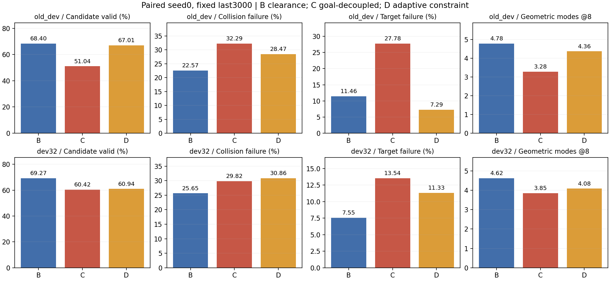
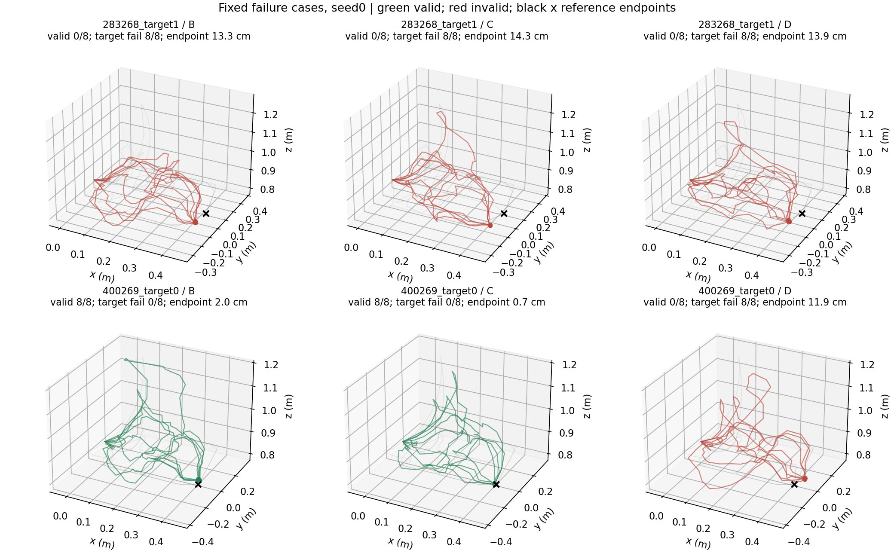

# Goal-preserving / adaptive constraint：两轮真实方法迭代结果

2026-10-04。**当前最强模型仍是 Ordinary M8 + segment clearance（B）。本轮完成两轮模型实现、训练和评价，但没有获得超过 B 的新方法。** C 的终点解耦和 D 的自适应约束均在 DEV32 seed0 明显退步，故没有机械补 seed1/2。Round3 的前提不成立，没有加入 relation-conditioned query。本轮不是三轮全部失败；是两轮失败后，第三轮的明确条件未满足。

## 核心结果：严格配对 seed0

各行均为 fixed last3000，191 TRAIN 父场景、573 条件、M8/H24、同一冻结 Qwen/RGB-D 输入及 Ordinary seed0 q、归一化、温度和选择器。候选预算和检查阈值保持不变。碰撞与目标失败允许重叠，均以全部候选为分母。

| DEV32 / seed0 | Candidate Valid | Collision Failure | Target Failure | AnyValid@8 | ModeCount@8 | TwoDistinct@4 | RefCoverage@8 | q SelectedValid@1 |
|---|---:|---:|---:|---:|---:|---:|---:|---:|
| A Ordinary | 31.25% | 65.49% | 11.07% | 87.50% | 2.062 | 63.54% | 17.58% | 79.17% |
| B + clearance | **69.27%** | **25.65%** | **7.55%** | **95.83%** | **4.625** | **94.79%** | **27.62%** | **92.71%** |
| C B + endpoint decoupling | 60.42% | 29.82% | 13.54% | 86.46% | 3.854 | 86.46% | 24.25% | 86.46% |
| D B + adaptive constraint | 60.94% | 30.86% | 11.33% | 91.67% | 4.083 | 88.54% | 25.19% | 87.50% |

| 旧DEV / seed0 | Candidate Valid | Collision Failure | Target Failure | AnyValid@8 | ModeCount@8 | TwoDistinct@4 | RefCoverage@8 | q SelectedValid@1 |
|---|---:|---:|---:|---:|---:|---:|---:|---:|
| A Ordinary | 30.21% | 66.32% | 10.07% | 86.11% | 1.972 | 66.67% | 15.31% | 83.33% |
| B + clearance | **68.40%** | **22.57%** | 11.46% | 88.89% | **4.778** | 88.89% | **26.25%** | 86.11% |
| C B + endpoint decoupling | 51.04% | 32.29% | 27.78% | 72.22% | 3.278 | 69.44% | 20.51% | 72.22% |
| D B + adaptive constraint | 67.01% | 28.47% | **7.29%** | **94.44%** | 4.361 | **91.67%** | 24.52% | **91.67%** |

D 在旧DEV部分指标有收益，但 DEV32 的全部主指标均弱于 B，旧DEV碰撞也反弹5.90个百分点，不能宣布正向机制或只展示旧DEV。

完整 A/B 三个种子、C/D 已运行种子和三种子均值见 [CORE_TABLE.md](CORE_TABLE.md)；原统计另包含 ReferenceModeCoverage@4 等已有指标，见 [RESULTS.json](RESULTS.json)。**没有 C/D 三种子结果，也没有把 seed0 与 B 三种子均值作为主配对。**

B 仍有历史三种子稳定证据：DEV32 的 A→B 均值为有效率33.29→67.49%、碰撞63.72→26.95%、目标失败8.94→8.16%、ModeCount2.215→4.326、TwoDistinct@4 70.49→93.06%、q Top1 83.68→91.67%。本轮没有重训 A/B 或覆盖旧结果。

## Round1：目标和路线形变分开

机制针对整池终点偏移：独立 goal branch 预测共同目标 g，路线 query 预测形变 r，输出 p=(1-u)s+ug+4u(1-u)r。起点和终点不受路线形变直接改变；没有增加逐query endpoint residual。目标分支读取观察语义/几何，从观测 anchor 加每轴5cm有界修正预测目标，推理没有真值目标输入。

独立 goal queries/blocks/readout 复制自共同原始12000父模型；路线输出的 interior 行在初始化除以 phi，保留原残差量级。因改变参数化并增加 goal branch，C 与 B **不是逐参数相同模型**；相同的是原始父模型、M8扩展规则、数据、抽样流和训练预算。目标监督是 TRAIN 有效参考轨迹终点均值的 xyz MSE，权重1，不是把真值目标传入推理。

具体梯度路径：原 route/set loss 可以作用于共享编码器、goal branch和路线branch；goal MSE只作用于goal branch与共享编码器；clearance对共享context和预测goal都detach，只作用于路线queries/blocks/output。为此训练重算一次数值相同的路线decoder；推理仍只产生一次8条候选。

实际 TRAIN batch autograd 范数：clearance→goal=0、→shared encoder=0、→route=0.00101608；goal MSE→goal=0.00544082、→encoder=0.149378、→route=0。正常前向和净空分支逐值相等；独立测试也验证一次clearance-only SGD更新改变interior但终点不变。记录见 [gradient_routes.json](training/C_seed0/gradient_routes.json)。这证明实现的梯度分离，不证明预测目标正确。

C seed0完成3000步后，DEV32有效率下降8.85个百分点，目标失败上升5.99个百分点；旧DEV目标失败上升16.32个百分点。没有正信号，因此停止C种子复制。

机制分析：统一终点能固定所有路线相对于预测g的终点，但g错误会让全部候选一起失败。当前共享观测编码器仍受route/set监督影响，goal branch又保留了观测anchor加局部修正的限制；仅阻断clearance的直接梯度没有解决观察目标定位。这些是结构上的剩余通路与限制，尚未通过进一步消融证明哪个是主要因果来源；不能把本轮结果推广成所有endpoint-decoupled架构无效。

## Round2：按约束违反更新dual

C退步后，以更强的B作为D的基座；D不包含C，不从C的失败checkpoint续训。D与B的初始模型和整个96000次抽样流一致，仍从原始12000父模型训练3000步。

设 g=0.02-d，采用 L=Lbase+mean(lambda*relu(g)+160*relu(g)^2)。lambda按TRAIN请求/query/segment存储，初值0；每次采样后按投影规则 lambda←clip(lambda+eta*g,0,cap) 更新，同batch重复请求先平均违反程度。eta=320/(3000*32/573)=1.91，cap=320*(TRAIN最大物理盒半尺寸+0.02)=28.8。参数在训练前由既有尺度/曝光次数固定，没有DEV sweep。

已有B的平方hinge对安全段本来就没有直接梯度；D增加的是持续违反约束的历史压力。安全段仍为零梯度，安全余量会降低其dual。dual权重是纯训练状态，完整保存到checkpoint；推理不读取它，也不读取物理真值盒。原B/C/D的四盒真值都只作为TRAIN损失监督，原评价在生成并保存候选后执行。

实际两项测试检查安全段零梯度、违规权重增长、重复请求聚合、投影上限和dual状态恢复。训练末尾dual平均0.00013737、最大0.238783，远未碰到28.8上限；损失与权重均有限，没有数值发散。最终DEV32有效率下降8.33个百分点、碰撞上升5.21个百分点、目标失败上升3.78个百分点，不复制D的seed1/2。

没有以DEV调大学习率、cap、lambda或多次重启。C+adaptive组合E的代码入口已准备，但没有实际训练或结果；基础两机制均未获得正向开发证据，未继续堆叠。

## 整池endpoint drift没有解决

| seed0请求 | B | C | D |
|---|---|---|---|
| 旧DEV 283268_target1 | 目标失败8/8，终点13.31cm | 目标失败8/8，终点14.34cm | 目标失败8/8，终点13.88cm |
| DEV32 400269_target0 | 有效8/8，终点1.97cm | 有效8/8，终点0.75cm | 有效0/8、目标失败8/8，终点11.87cm |

旧DEV整池目标失败请求数：B4、C10、D2；DEV32：B4、C13、D8。D在旧DEV减少整池失败，但在DEV32增加，并制造了与用户指出问题相同形式的失败。上述400269对比全是seed0；用户原始B的严重失败来自seed2，本轮没有C/D seed2，不能声称已修复该seed2失败。

图中黑叉是参考轨迹终点，不充当模型输入；误差数字来自原checker对真实任务目标的评价。完整实际候选、失败及unknown没有过滤。

## 停止决定和论文判断

两轮均已实现、真实训练、真实评价并据结果作出决定。Round3只在前两轮改善有效性、目标与碰撞且覆盖成为主要瓶颈时允许启动；这个前提未成立，所以没有relation-conditioned query，没有为了凑三轮改成另一个未约定模块。也没有新增评价体系、数据采集、q训练/校准、选择器研究、LoRA、扩散或底层控制。

**本轮的新方法尚不具备作为论文核心的实验资格。** 目前成立的是B的几何监督强基线和C/D的负向开发证据，没有稳定同时满足semantic target fidelity、geometric feasibility和multimodal diversity的新机制，也没有证明新颖性。

下一步不能只补一组评价就宣布论文方法完成。最值得重设计的是目标grounding本身，以及interior route/set监督进入目标表示的路径：分别检验独立目标定位监督、interior回归到goal的梯度隔离和anchor局部修正限制，保持同一B对照。应先得到一个seed0在两套开发集均成立的目标保持机制，再补seed1/2与目标解耦×自适应约束的受控消融；通过后再开展既定泛化验证。当前既有材料足以写研究框架、数据、强基线与负结果部分，不能将其写成已验证的新方法优势。TEST_LOCKED仍须封存，任何以后最终测试都需另有冻结协议和授权。

## 实际执行与复现

八个服务器作业全部exit0：两次针对性测试、两次训练、四次固定池评价；测试共8项通过/0跳过。累计服务器作业889.362秒，包含数据加载、测试、训练和评价；预算上限10800秒，未因预算耗尽停止。C/D训练循环分别259.233/216.229秒，B seed0历史循环186.634秒；这些含定期评价/保存，不能当成纯算子延迟。C/D峰值分配约1.132/1.011GB。GPU1 UUID、35%上限和四CPU限制保持。

两次训练共6000更新、192000次请求抽样、1536000组已计候选路径状态；C净空分支另外进行了768000条数值相同路径的decoder重算，属于训练开销。正式最终评价264请求/2112路径，定期旧DEV评价432请求/3456路径。没有新增Qwen编码、q更新或推理候选。

训练源C=`5bd15cd8fa136a9567bf4803cf82c5d6d5516592`，D=`d8af10e183e6e87829d8ff93735090feab53218e`，均来自本地提交的不可变git archive。实际源哈希在jobs/*/receipt.json；新模块、训练、评价、原检查器等15项关键源文件与实际archive相符。Windows git archive中的Python/config为CRLF，Git blob为LF，最初本地逐字节比对断言失败；更正为实际archive字节核验及LF规范化blob一致后通过，没有更改服务器源码或重跑实验。

两份本地last checkpoint、四个最终候选池SHA匹配。last/recovery中保存模型、AdamW、完整RNG、配置、种子和D的dual状态；历史best也保留于服务器，但未选作主结果。运行原件在服务器及本地runs/goal_preserving_v1，摘要在training/，池在evaluation/。复现命令、成本、失败说明和SHA见 [FINAL_RECORD.json](FINAL_RECORD.json)，逐作业stdout和receipt在jobs/。归档时本项目无活动进程、无active.lock。旧代码/数据/runs/main及历史d0d97eb未修改。
