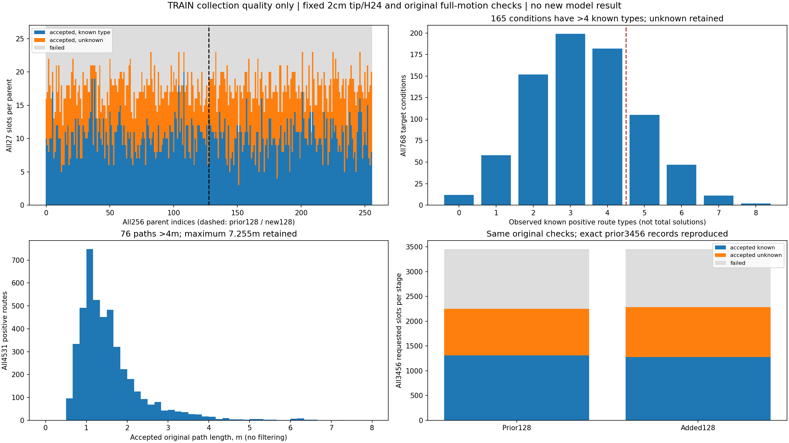

# TRAIN256 collection and unchanged quality checks

The original collector and checker completed all 256 registered TRAIN parents. All 6,912 requested slots were attempted, with exact initial-state restoration passing for every slot. There are 4,531 accepted positive references and 2,381 failed attempts. This is collection quality evidence, not a model result or a complete robot-execution certificate.

The original 128 parents were not recollected. All 3,456 prior slot records compare exactly with their earlier JSON records; all 512 prior RGB/target plots are byte-identical. The 32 new DEV parents remain sealed. The current model experiment still uses the original 95-parent/285-input training population; none of this larger corpus has silently entered the three-arm comparison.

| Population | Parents / target conditions | Requested slots | Accepted | Failed | Accepted with unknown type | Conditions with >4 known types |
|---|---:|---:|---:|---:|---:|---:|
| Prior128 | 128 / 384 | 3,456 | 2,248 | 1,208 | 938 | 86 |
| Added128 | 128 / 384 | 3,456 | 2,283 | 1,173 | 1,005 | 79 |
| All256 | 256 / 768 | 6,912 | 4,531 | 2,381 | 1,943 | 165 |

All 1,943 unknown-type accepted routes remain positive references. Unknown is not a newly identified route class, an invalid route, or evidence of zero coverage. Known-reference type support is incomplete: 12 conditions have no classified reference, and the largest observed known support is eight. Demonstration counts do not supervise a total number of solutions. The one previously recorded known-type duplicate remains; there are no new known-type duplicates in the added128.

## Failures and long routes remain visible

The original error categories are 2,048 endpoint/raw/H24 clearance-or-type acceptance failures and 333 recorded robot collisions during simulated motion. Diagnostic predicates overlap: 1,400 raw-tip failures, 1,361 H24-tip failures, and 708 raw-to-H24 type changes. These counts must not be summed as disjoint failures. No stricter-state-restore failure or missing observation was hidden or replaced.

Accepted path lengths have median1.364m, mean1.553m, p95 3.131m and maximum7.255m. All 857 accepted paths longer than2m and all76 longer than4m remain in the corpus. The new128 contribute32 paths longer than4m. These long positive paths can be inefficient and may be difficult learning targets; passing the original checks does not establish that every reference is a desirable short route. Length must remain a separately reported quality/cost dimension.

Root inspected the RGB image and complete nine-slot XY/XZ plot for `two_row_reach_400250_target1`, including the longest accepted path at slot1: two conspicuous large loops are visible. No loop was cropped, simplified, rejected or relabelled after inspection. The valid label is the unchanged original checker result, not a claim that this is a preferred plan.

## Visual QA status

The prior128 images reuse their earlier actual visual review because their bytes are exactly equal. The two review blocks, indices128–191 and192–255, have now actually viewed all128 new RGB images and all384 complete nine-slot target figures (3,456 slots). Their separate view logs, source-image hashes and receipts are under `manual_qa/`. Both found no missing, blank or visibly corrupt images; plot text overlaps at some extreme trajectories are disclosed. Complete extents were retained and 2D overlap was not treated as a new safety judgment. Rendering a plot is not counted as viewing it. Root additionally inspected the full-population figure and the longest-route example described above.

## Provenance and cost

Collector source: `5c8f8e4f5cd478c793a0e0d9640005deaf700973`. Original quality source: `1a3eef1fb12d55e98d4d188a091ea40ea62c0a02`; analyzer SHA `758235704e344b0f34cce414b0bacb8f28027ef6b1eaef6f96e21279838bfcba`. The checker, data split, thresholds and reference inclusion rule were unchanged.

CPU1 quality execution ran from `2026-10-03T06:38:54.555292+00:00` to `07:09:09.409857+00:00`, completed/exit0: outer1,814.854565s, inner1,811.136765s. The inner time is included in the outer time, not added. Across the256 parent workers the archived collection summaries report42,307.259427s, with no unknown worker costs; planning5,127.338980s and simulation10,757.382638s are nested components. Worker sums across parallel collection processes are not wall elapsed time. This quality analysis made zero Qwen/model requests.

The synchronized archive contains4,418 original files/278,108,460 bytes; all server SHA256 values were verified. The compressed transfer SHA is `31233efbaaeed5638212aa4deacc8676f9be8ff5a5e5a2a0df5ccfe83e5a8a37`. Complete slot JSON is locally retained under an exact Git ignore; original trajectories stay at their indexed server paths. Sources are archived as `.py.txt`; raw parents, job statuses/logs, registries and failures remain available. `increment_analysis/INCREMENT_ANALYSIS.json` is a read-only arithmetic derivation with input hashes, zero new geometry checks and zero reserved-data reads.

The remaining decision is whether the quality-verified expanded TRAIN population should enter a separately registered scaling experiment after the current same-data mechanism comparison. No claim of method advantage, independent-setting confirmation, calibration or paper readiness follows from collecting these routes.
