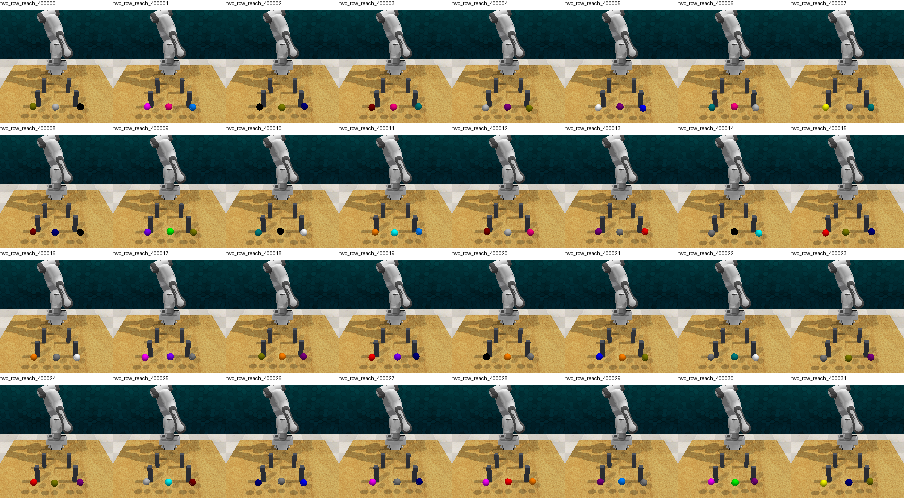
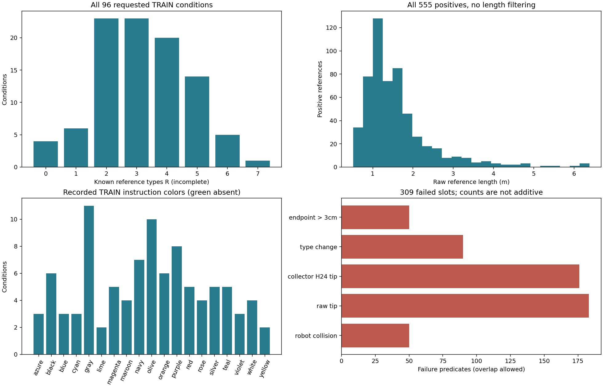

# Extension288 首32 TRAIN：实际采集质量与全图核查

32 个预注册父场景均闭合，96 个同图不同目标条件均有输入和正参考。864 个路线提案中 **555 个通过、309 个失败**，未尝试、中断和不确定尾槽均为 0。全96条件图及32初始图已按父编号顺序检查，没有发现恢复错位、漏槽、错目标或明显渲染异常。本结果支持在原协议下继续预注册的数据采集，不是模型或方法优势。

所有 555 条正参考原样保留，包括 247 条 unknown 与长弧。不得将 unknown 当作无效、将未采到的类型当作不存在，或按此次成功率/颜色覆盖重抽父场景。新32 DEV与旧reserved原始数据均未读取。

## 真实来源、预算与闭合

| 项目 | 真实记录 |
|---|---|
| 请求集合 | TRAIN index0..31；seed400000..400031；32父 × 3目标 × 9提案 = 864槽 |
| 固定数据设计 | 原canonical关节初态；两排低柱高0.14m；原窄±5mm几何随机范围；不是OOD |
| Collector source | `5c8f8e4f5cd478c793a0e0d9640005deaf700973` |
| Registration SHA256 | `574167e8a818dc6ee3d6ac197c6436e8031489306b2f8514466bd764f0cac70e` |
| 双shard外层 | 2026-10-02 23:18:13 → 2026-10-03 00:02:21 UTC；2648s（44m08s）；两个shard exit0 |
| 完整分析 source | `1a3eef1fb12d55e98d4d188a091ea40ea62c0a02` |
| 分析job | PID644644 / child644645；00:03:37.209228 → 00:07:08.732818 UTC；exit0 |
| 分析body / job墙钟 | 210.794120s / 211.523590s |
| 本次归档/补充统计 | 已存分析与图像的只读整理；0新模型forward、0搜索、0模拟 |

实际原始命令、冻结launcher、单父32个job的PID/日志/退出码和source字节均已保存。数据文件保留在服务器；[原始逐槽分析](analysis_run/train32/all_requested_slots.json)、[原始分析报告](analysis_run/train32/analysis.json)、各父 `artifact_hashes.json` 及报告内的 `source_files_sha256` 绑定原始路径与哈希，不复制大NPZ或native场景文件。

32个父初态均通过完整world/inventory/RGB/depth/camera/current严格门禁，864/864提案的恢复检查通过。实际几何1mm哈希32个不同，注册/实际几何一致，无机械重复组或model-use blocker。每父同一张初始图对应三条不同目标指令；32张front字节互异。哈希差异是保守去重证据，不等同于广泛几何泛化。

## 完整请求分母与已知解支持

| 项目 | 数量 |
|---|---:|
| 实际输入 / 缺失输入 / 零正参考条件 | 96 / 0 / 0 |
| accepted / failed | 555 / 309 |
| accepted / 全请求槽 | 64.2361% |
| 已知类型正参考 / unknown正参考 | 308 / 247（正参考的44.5045%） |
| 已知类型中纯lateral / 含over | 290 / 18 |
| 已知类型重复条数 | 0；unknown不强行分型或计为不同类型 |
| 每条件正参考数 | 最少2，最多9 |
| 已知R > K4 的条件 | 20 / 96（20.8333%） |

已知参考类型数R的完整直方图如下。R是已知正参考支持，不是全部真实解数。

| R | 0 | 1 | 2 | 3 | 4 | 5 | 6 | 7 |
|---|---:|---:|---:|---:|---:|---:|---:|---:|
| 条件数 | 4 | 6 | 23 | 23 | 20 | 14 | 5 | 1 |

R=0的4个条件是 `400006_target2`（2正例）、`400012_target2`（5）、`400018_target2`（5）、`400027_target2`（5）。它们都有有效但未知类型的正例，不能当作无解。247条unknown中242条在已存穿越记录里至少一排被穿越多次；余5条都是第一排 `ambiguous_height`，保持原分类规则，不改成guide编号。

## 失败与长弧：不删除、不升级

309个失败的原始异常分组是259个endpoint/raw/H24/type验收失败、50个真实模拟运动中的机器人碰撞。以下是**非互斥**逐槽字段，不得相加作为失败总数：

| 失败谓词 | 槽数 |
|---|---:|
| 记录的机器人离散模拟步碰撞 | 50 |
| raw完整tip折线净距失败 | 183 |
| collector H24 tip净距失败 | 176 |
| raw/H24类型变化 | 90 |
| 已存末端距目标超过原3cm阈值 | 50 |
| 规划阶段异常 / 严格恢复失败 | 0 / 0 |
| 机器人失败但tip/endpoint/H24代理全通过 | 0 |

555/555正例通过冻结分析器的原raw/collector-H24/端点/类型复核。真实机器人只在模拟步检查碰撞；tip折线通过不构成连续全身碰撞证书。图中XY投影与柱重叠也不自动等于3D碰撞，应结合XZ与原检查记录。

正例raw路径长度中位数1.38224m、P90 2.65534m、P95 3.29909m、均值1.60131m、最大6.38341m；109条超过2m，15条超过4m。最长是 `two_row_reach_400014_target0 / attempt7`，索引和SHA见[补充统计](TRAIN32_SUPPLEMENT.json)。这类长弧是保存的规划运动，未截断为短路或按长度过滤。正例端点误差中位数1.276mm、最大2.554mm。864槽gripper事件变化均为0，符合本批自由reach任务，不能借此声称掌握抓放事件。

**本报告未替代训练表示容量审计。** Collector H24与模型的 `resample_event_segments(...,24)` 需分别核查；composite普通头训练前仍须按原协议对全部实际TRAIN正参考检查模型H24、事件、2cm tip以及末端到stride2观测点的支持和±5cm容量。不能因为已有collector检查通过就自动声明模型表示足够，也不能为通过容量而删除unknown或长弧。

## 全图与颜色审查

全部96个条件原PNG位于 `analysis_run/train32/two_row_reach_400000..400031/target{0,1,2}_all9.png`，均保留9个槽及XY/XZ投影。按父顺序逐条件显示核查，另对32张front以原224×224像素拼排核查。完整逐条件统计、颜色、原PNG SHA与QA记录见 [condition_quality_and_visual_qa.json](condition_quality_and_visual_qa.json)；[CSV](condition_quality.csv)便于核对，不新增训练或评价。

图中可见长弧、上绕、多次穿越以及碰撞后提前结束的失败轨迹，与原记录一致。没有发现缺少槽位或把失败画成正例。源绘图的部分横轴标签与下一行小标题有重叠，且极长弧会扩大公共坐标范围，压缩短路视觉尺度；本归档保留原像素，没有改图掩盖。`qa_views`是显示用拼排副本，原图/元数据是证据。图像核查不替代数值碰撞验收。

实际96条TRAIN指令覆盖19种颜色，green为0。各色条件数：azure3、black6、blue3、cyan3、gray11、lime2、magenta5、maroon4、navy7、olive10、orange6、purple8、red5、rose4、silver5、teal5、violet3、white4、yellow2。该分布来自此次已记录TRAIN指令；不读取新DEV颜色补样本，也不因稀有色重排后续注册集合。

## 成本及接续边界

32个worker墙钟之和5263.646s；外层双worker墙钟2648s。显式 `get_path` 调用7420次，规划635.738s，模拟步1332.151s。每槽最多9段规划，遇碰撞会提前退出；内部IK/OMPL配置搜索是这些调用的内部工作，不计成额外路线槽或伪装为一次简单算子。规划/模拟秒已包含在worker墙钟中，不能重复相加。完整原始规划API统计仍在逐父summary。CPU时间利用率未单独采样，worker墙钟不能冒充精确CPU计算秒。

这批数据可以支持预注册的旧64请求TRAIN + 新32TRAIN + 原12个重复使用DEV的数据规模对照；任何收益均先归于更多同分布训练数据。新DEV32继续封存，旧12DEV仍是反复开发使用的集合，不能重新命名为最终测试。此次质量结论不自动启动训练、下一采集阶段或新机制。

## 归档入口

- [服务器原文件索引](SERVER_ARCHIVE_INDEX.json)：530项逐字节匹配；31,981,524 bytes。
- [32单父job补充索引](PARENT_JOB_ARCHIVE_INDEX.json)：64项逐字节匹配；3,675,322 bytes。
- [本地完整索引](LOCAL_ARTIFACT_INDEX.json)：原始证据、报告、图表和补充统计的SHA256。
- [分析job状态](analysis_run/train32.status.json)、[原始log](analysis_run/train32.log)、[执行launcher](source/extension32_quality_1a3eef1.sh)。
