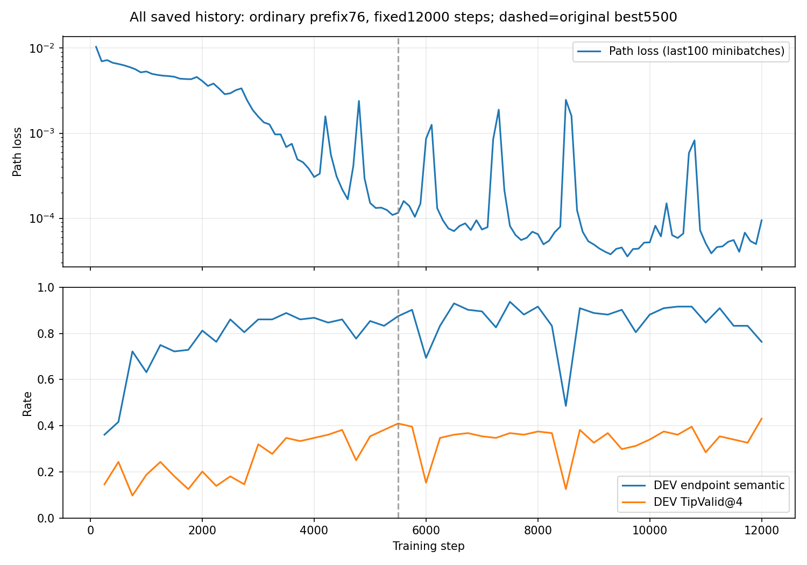
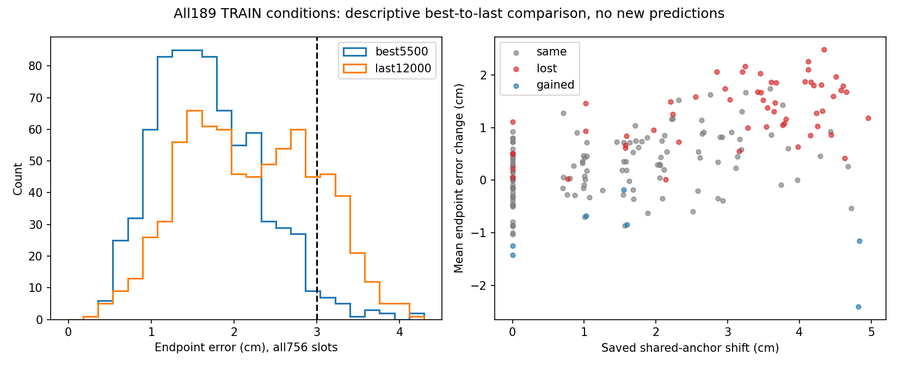

# prefix76普通基线：固定12000步控制已完成

固定源码 `1417cdc802674a00e70d4ced3181c6a6ede2a99e`，98项真实服务器测试通过后，独立stage1500与finish均实际退出0。新1500状态与原prefix76 last1500的12项训练状态/身份检查全部严格一致，零容差。此后只按预登记继续到12000，没有换seed、选择新的停止点或追加训练。

同一64请求TRAIN父中63父可观测，共189输入/1108已知正参考；原缺失父283220不替换。旧36DEV输入及真实冻结Qwen缓存、K4/H24、架构、损失和阈值不变。这里的TipValid仅为既定语义端点、起点、事件与2cm箱体线段检查，不能替代机器人全身执行有效性。已知参考类型不完整；unknown有效路线与所有失败均保留。

## 实测结果

| 池 | TipValid@4 | AnyTipValid@4 | 语义端点正确 | 已分类不同有效数 | 有效unknown数 | 已分类重复数 | 已知类型覆盖 | 候选→最近正参考ADE |
|---|---:|---:|---:|---:|---:|---:|---:|---:|
| best5500 TRAIN，189输入 | 646/756=85.45% | 98.94% | 97.09% | 1.7460 | 1.6349 | .0370 | .4939 | 2.370cm |
| last12000 TRAIN，189输入 | 575/756=76.06% | 93.65% | 81.75% | .9365 | 2.0952 | .0106 | .2341 | 2.791cm |
| best5500 DEV，36输入 | 59/144=40.97% | 30/36=83.33% | 87.50% | .8333 | .7500 | .0556 | .0588 | 10.775cm |
| last12000 DEV，36输入 | 62/144=43.06% | 28/36=77.78% | 76.39% | .6389 | 1.0833 | 0 | .0449 | 10.704cm |

best由原开发选择规则选在5500，没有在归档时重选。表中ADE沿实际 `candidate_matched_ADE_m` 定义，是每候选至最近已知正参考的H24逐点欧氏距离均值，再对候选/输入平均；不是Hungarian/saturation匹配残差、DTW或参考到候选覆盖误差。

原prefix76/1500固定last TRAIN TipValid20.11%、DEV18.06%，本次分别76.06%、43.06%；原best500 DEV24.31%，本次best40.97%。更充分训练明显改善普通基线，但本次优化预算为原来的8倍、DEV选择48次对6次，不能解释为方法收益。与prefix44/6000比较，本次每实际TRAIN输入抽样2031.75次，前者2064.52次（比例62/63），约对齐；总预算为2倍、选择48次对24次、抽样序列不同。DEV提高同时TRAIN末步未达到prefix44/6000的97.04%，仍不能宣称新数据规模下稳定充分拟合。

## 末步TRAIN语义为何下降：观察与未证明的原因

从best5500到last12000，TRAIN净空候选由665增至690/756，语义端点正确却由734降至618；目标正确但碰撞由88降至43，目标不正确但净空由19增至115。因此Tip646降至575的直接指标构成是末端定位下降，而不是碰撞全面恶化。起点/事件均无失败。

语义统计沿原3cm端点阈值。末步138个失败中133个误差在3–4cm、5个在4–4.29cm，最大4.288cm；不能据此直接声称目标身份识别错误。全部756端点平均检查误差由1.682cm变2.195cm。三个目标位置均退化：target0正确252→212/252，target1为236→193，target2为246→213，不能归为单一目标问题。

完整189条件对照中，57条件正确候选数减少、7增加、125不变。减少组的已存共享anchor位移中位3.54cm，不变组1.26cm；9条件从4/4正确变0/4，anchor移3.67–4.95cm。这支持“共享观测定位与末端偏移在训练后段变化”的候选解释。它只是已存预测的关联，不能证明是attention argmax、残差头、梯度冲突或学习率造成；没有读取中间隐藏状态、追加forward或换checkpoint。

完整48次DEV历史与120条最近100 minibatch损失均保存在 `TRAINING_DRIFT_ANALYSIS.json`。已见短暂退化再恢复：5750→6000时DEV语义90.28%→69.44%，8250→8500为83.33%→48.61%，随后6250/8750恢复83.33%/90.97%。相关path loss峰值保留在图中。恒定lr3e-4可能与波动有关，但当前没有学习率配对对照，不能作因果结论。

5500日志最近100batch的path loss为0.000115800，末12000为0.000094610；总loss分别.0743486和.0741755。多数总loss来自.02加权grounding项。平均训练loss略降并不保证固定末步对每个目标的阈值指标改善；这些日志也不是完整TRAIN重算损失或最后单batch损失。只有best与last保存了TRAIN预测，不能将其间DEV历史当TRAIN历史。不会因末步指标下降自动延长或事后选新checkpoint。

## DEV失败及覆盖边界

best DEV有18语义失败、79碰撞、12二者同时；67候选是目标正确但碰撞。last分别34、67、19，目标正确但碰撞48。best59条TipValid中32已分类、27unknown，含2条已分类重复；last62条TipValid中23已分类、39unknown，无已分类重复。不能仅用重复少宣称覆盖充分，尤其unknown与参考不完整使已知覆盖只能作下界性质的描述。当前主要差距仍包含路径泛化与稳定端点定位，不能据单种子扩训练建立创新贡献。

## 完整成本、来源与恢复证据

- stage1500：PID568436/子568443，21:14:07.197–21:15:19.524 UTC，外层72.327116秒，exit0。原last SHA `38df15db97342ca37fdd7e8bd5bc8cf5a6d4e5af5f66e6e453bf72552e667721`；新复现last SHA `a4c0154951bf09334b757d495f4c0ac509526e4a49bffb47cf9b33e5bbfd5319`。
- finish：PID570891/子570902，21:16:46.852–21:24:53.906 UTC，外层487.054355秒，exit0。两阶段外层合计559.381471秒、.155384 GPU预留小时；base嵌套计时536.404626秒/.149001小时、driver嵌套552.924369秒，三者不能相加。显存峰值955.51MiB，保持原GPU1/35%范围。
- 训练累计12000步、384000抽样、1536000路径状态；1500复现含192000状态，10500续训含1344000。初始化SHA仍 `7f81eba70dfcef2a3df19ebd5661ace3881abd552a1f2d4614cf490bf153bc13`。
- base评价为48×36开发选择、末端两组36DEV、189best TRAIN，共1989请求/7956路径状态；另外24次单请求计时/96状态。固定last TRAIN另外189请求/756状态，CPU6.526911秒，Qwen/DEV/优化新增均0。此CPU诊断已包含在外层finish占用内，不能再加一份GPU计时。
- 本次复用真实Qwen缓存，新增Qwen编码0。cached-head中位3.531ms，RGB-D读取处理加head7.621ms，均排除Qwen、检查和评分；**没有12000权重的真实Qwen在线端到端时延实测**。
- best5500 SHA `6b99a2171d5f241d879797371b5a9a406228e48c009db7554e7bc186d69b926d`；last12000 SHA `d6d150a93f739fe1087732d25d5c9c2a891c86184888582c9788af4ac97593f6`。模型留服务器，四checkpoint大小/SHA/绝对路径见 `REMOTE_ARTIFACT_INDEX.json`。
- 42原始日志、配置、状态、逐场景指标及预测二进制均原样归档并核验SHA，源manifest列全部实际依赖/数据身份。原始传输tar4823040字节，SHA `1b807125c6cb83d1005256ebbdf270abbf9f43e1bd9866987a301f3c5f25f148`；原始索引SHA `a11d32ed9a4a370394e82460907806cf94da402f4b2b2233ae849a53b156ab8f`。
- 冻结driver/配置/launcher实际字节另见同级 `../observed_two_row_bound_controls_validation_v1/source/`。`analyze_saved_evidence.py`及 `analyze_saved_training_drift.py`仅消费已存池和日志，没有新预测或locked原始数据读取。两个本地统计图已逐图核验，无候选筛选。

全部阶段已完成，不应再次启动原fresh或finish命令。旧1500和6000实验原字节保持不变；下一实验由root依据本结果另行决定。
