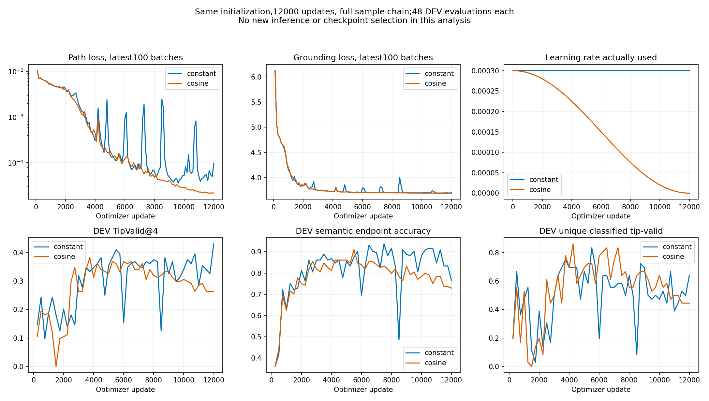

# prefix76：单次 cosine 普通优化控制已完成

同数据、同初始化、完整抽样链、12000 更新与 48 次 DEV 选择的配对支持 **cosine 改善末步 TRAIN 拟合，但不改善本次 DEV 泛化**。固定末步 TRAIN TipValid 从 575/756=76.06% 升至 717/756=94.84%，DEV 从 62/144=43.06% 降至 38/144=26.39%。停止这一 schedule 方向，不追加步数、floor、warmup、restart 或 seed 扫描；保留 constant 作为当前有效率更强的普通控制。此为优化对照，未形成新集合机制贡献。

固定源码 `71e34850481b79bdbc828d1c1944f0de00329960`，91 项实际服务器测试全部通过、0 skip 后，由 root 独立启动一次 fresh 训练。run 为 `runs/observed_two_row_prefix76_cosine_v1`，PID593217/child593221，2026-10-02 22:12:19.387085–22:21:21.678075 UTC，exit0。原 constant12000 source1417cdc、全部权重与原始归档不变。

## 配对身份和实际预算

仍是注册64个TRAIN父中的63个可观测父、189输入、1108已知正参考，原缺失父283220/3输入不替换；固定12个DEV父、36输入不变。两臂使用相同真实冻结Qwen缓存、RGB-D、当前状态、K4/H24、普通集合头、saturation正例损失及原阈值。几何/目标答案仅评价使用。每条路径是tip层评估，不是全身执行有效性；已知类型参考不完整，unknown与未匹配有效预测不能自动标负。

`paired_stream_receipt.json` 和 `cosine_result_receipt.json` 均 passed：

- 初始模型SHA `7f81eba70dfcef2a3df19ebd5661ace3881abd552a1f2d4614cf490bf153bc13` 相同。
- 12000批、384000实际抽样的完整index chain SHA `40c280ca213bfdd89502108ac4e82917cfa4d68fea7f961ad7f2d1de5c84b567` 相同；最终RNG、sampler严格相同。
- 每臂1536000训练路径状态、48次原选择机会。不是从constant权重或优化器续训。
- 第k次optimizer实际使用 `3e-4 × (1 + cos(pi × (k−1)/12000))/2`；12000项实测trace逐项核公式，最大容差1e-18。首步.0003，最后实际使用5.140418923854639e-12，下一未使用LR=0。
- 除LR日程外训练配方固定。一个seed的严格配对只支持本次优化差异，不是多种子泛化结论。

## 全部保存池结果

| 方法/池 | TipValid@4 | AnyTipValid@4 | 语义端点 | 净空 | 已分类不同有效数 | 有效unknown数 | 已分类重复数 | 已知类型覆盖 | 候选→最近正参考ADE |
|---|---:|---:|---:|---:|---:|---:|---:|---:|---:|
| constant best5500 TRAIN | 646/756=85.45% | 187/189 | 97.09% | 87.96% | 1.7460 | 1.6349 | .0370 | .4939 | 2.370cm |
| cosine best4250 TRAIN | 604/756=79.89% | 189/189 | 97.49% | 81.88% | 1.4868 | 1.6772 | .0317 | .3812 | 2.728cm |
| constant last12000 TRAIN | 575/756=76.06% | 177/189 | 81.75% | 91.27% | .9365 | 2.0952 | .0106 | .2341 | 2.791cm |
| cosine last12000 TRAIN | 717/756=94.84% | 188/189 | 98.68% | 96.16% | 2.2275 | 1.5185 | .0476 | .6570 | .785cm |
| constant best5500 DEV | 59/144=40.97% | 30/36 | 87.50% | 45.14% | .8333 | .7500 | .0556 | .0588 | 10.775cm |
| cosine best4250 DEV | 52/144=36.11% | 27/36 | 86.11% | 39.58% | .8611 | .5833 | 0 | .0875 | 11.196cm |
| constant last12000 DEV | 62/144=43.06% | 28/36 | 76.39% | 53.47% | .6389 | 1.0833 | 0 | .0449 | 10.704cm |
| cosine last12000 DEV | 38/144=26.39% | 22/36 | 72.92% | 36.81% | .4444 | .6111 | 0 | .0343 | 11.424cm |

best沿已注册 `UniqueClassifiedTipValidAtK + .05 × TipValidAtK` 规则，分别5500/4250，不在本次归档重选。cosine best比constant多1个跨条件求和的已分类有效类型（31对30），但少7有效槽、少3个Any成功条件；保留这一取舍，不将其概括为全面更差或方法优势。固定last是预先指定的12000步，两臂均有完整TRAIN189和DEV36池。

ADE沿保存字段 `candidate_matched_ADE_m`，实际是每候选到最近已知正参考的H24逐点欧氏距离均值，再对候选/条件平均；不是Hungarian/saturation匹配损失、DTW或参考到候选覆盖误差。类型覆盖仅相对当前不完整正参考集。已分类重复为0不等于覆盖充分；不把unknown解释成全部同类，也不强行解释成独特新类型。

## TRAIN改善与DEV退化分别来自哪里

固定last的189 TRAIN条件中，cosine Tip候选数比constant增加80、相同92、减少17；语义正确数增加59、相同126、减少4；已分类不同有效数增加147、相同24、减少18。三个目标位置的Tip均改善：target0 80.56→94.84%、target1 71.43→94.44%、target2 76.19→95.24%。不是仅改善少数可视化样例。

cosine末步TRAIN只有10个端点阈值失败，误差3.095–3.498cm；均不能直接称为选错目标身份。另29个目标正确但tip线段碰撞，没有端点与碰撞同时失败。相较constant的138个端点失败、66碰撞，既有末端定位偏差减小，也有路径净空改善。

DEV完整36条件的固定last对照，Tip增加7、相同9、减少20；净空增加5、相同12、减少19。三个目标位置Tip均下降：target0 50.00→27.08%、target1 35.42→18.75%、target2 43.75→33.33%。target2语义仍从75.00%升至87.50%，但净空52.08%降至35.42%，说明DEV退化不能只归为语义端点；该目标的路径泛化同样是缺口。

| DEV池 | 端点失败 | tip碰撞 | 两者同时失败 | 端点失败但净空 | 端点正确但碰撞 | Tip有效中已分类/unknown |
|---|---:|---:|---:|---:|---:|---:|
| constant best | 18 | 79 | 12 | 6 | 67 | 32 / 27 |
| cosine best | 20 | 87 | 15 | 5 | 72 | 31 / 21 |
| constant last | 34 | 67 | 19 | 15 | 48 | 23 / 39 |
| cosine last | 39 | 91 | 24 | 15 | 67 | 16 / 22 |

前两列非互斥，不能相加作为失败总数。起点/事件在全部八个保存池中均无失败。cosine last的39个DEV端点失败中21在3–4cm，2在4–6cm，16超过6cm；最远17.91cm。最佳池20个端点失败中16超过6cm。标量均值可能被少数大偏差影响，完整逐条件/逐候选记录保留。

## 完整历史支持的判断

双方48次DEV历史与各120条最近100优化batch平均损失均保留在 `TRAINING_HISTORY_COMPARISON.json`。末12000的path loss为constant .0000946104、cosine .0000216552；总loss .0741755/.0739146，grounding loss 3.70405/3.69465。总损失主要来自.02加权grounding项，不能只看其小幅下降。日志损失不是完整TRAIN重算损失或最后单batch损失。

cosine后段优化曲线较平稳、TRAIN末步拟合更好；其最后3000步的12次DEV Tip在26.39–31.25%，constant为28.47–43.06%。因此不只是cosine最后一次评价偶发失败。双方best与last之外没有完整TRAIN池，不能把DEV历史当TRAIN过程。此单次配对支持LR调度能改变优化与末步拟合；不支持“改善拟合即可消除泛化缺口”，也没有把共享anchor、查询语义、路径均值或新的集合机制确定为因果原因。按预登记停止schedule扩展。

## 成本、权重和重现

- 训练base嵌套计时528.534218秒/.146815 GPU预留小时；driver540.011226秒；最外层542.290990秒/.150636小时。原constant两阶段最外层559.381471秒，base536.404626秒。嵌套计时不能相加，也不凭单次差异声称算法加速。峰值CUDA显存951.368MiB，保持GPU1/35%。
- base48×36次选择、末端两组36DEV及189best TRAIN，共1989请求/7956路径状态；另24个单请求计时/96状态。固定last TRAIN额外189请求/756状态，CPU6.415098秒，已包含在外层训练job占用中。新增Qwen编码0；本地配对与绘图新增forward/优化/规划均0。
- 没有重测此12000模型的真实Qwen端到端在线时延；缓存head计时不能代替它，更不能复制旧1500结果。
- best4250 SHA `61fffb9aba3248ade07b36912ed8a8f1f41f76e416c23ef0c407ae19e3042a1c`；last12000 SHA `cd1af0b572b80f9e7002ce866b7f3f062fed5afd6ab45ac16290db0c8b67c880`。服务器 `runs/observed_two_row_prefix76_cosine_v1/peak_seed0/{best,last}.pt`；权重仅保留来源/hash索引，未写普通Git。
- `REMOTE_ARTIFACT_INDEX.json` 校验34份原始文件；`LOCAL_ARTIFACT_INDEX.json` 索引追加报告、分析源码、全部图。91服务器测试/执行source/wrapper原字节证据见 [validation](../observed_two_row_cosine_validation_v1/VALIDATION_RESULTS.md)。原constant归档未改。
- 本地0forward复核命令：`python reports/observed_two_row_prefix76_cosine_v1/analyze_saved_pair.py`（`figures/`必须fresh，避免覆盖既有图）；`python reports/observed_two_row_prefix76_cosine_v1/analyze_training_history.py`。依赖已封存预测池、原constant池及已归档12个DEV可视化几何标签。首脚本不会打开保留角色或新TRAIN原始数据。

全部12父、36指令、4候选、4个模型池的图及QA见 [DIAGNOSIS_AND_VISUAL_QA.md](DIAGNOSIS_AND_VISUAL_QA.md)。没有筛例、私有修复或追加候选。当前仍欠清楚有效的核心方法、独立多种子及未参与方法选择的最终确认；本轮不声称已达到论文初版标准。
