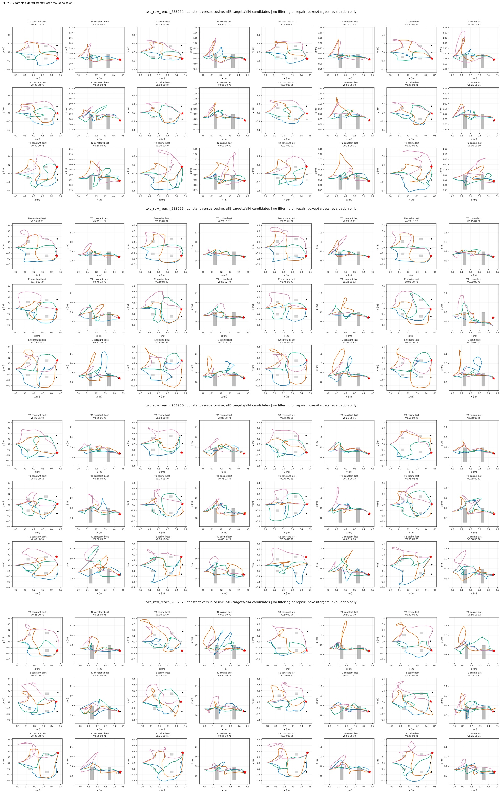
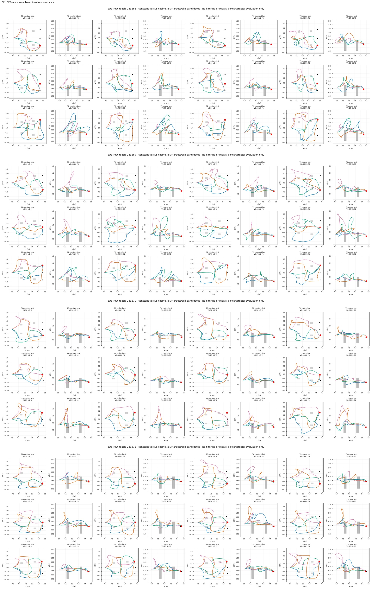
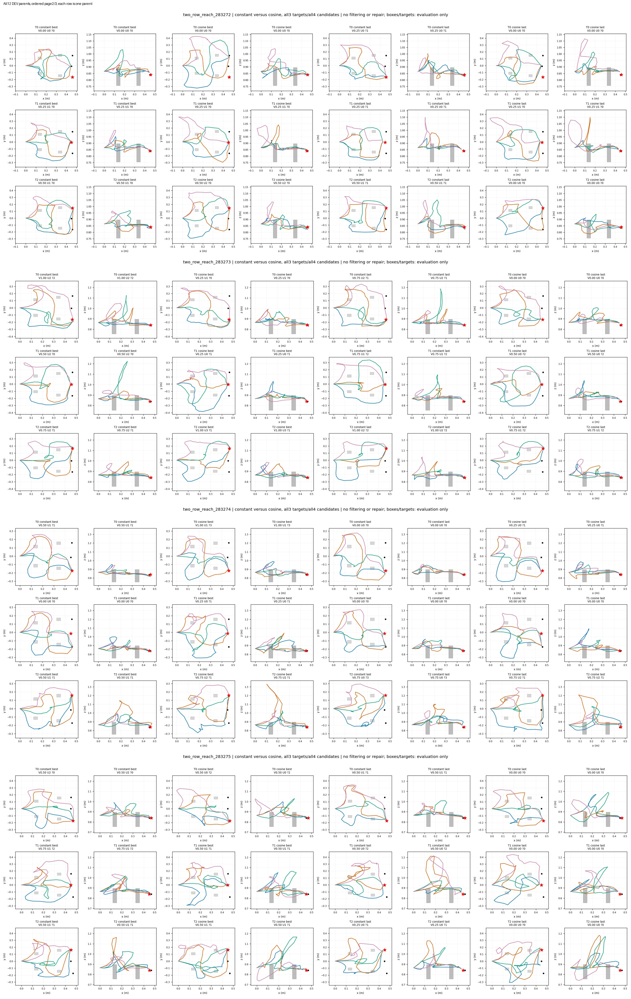

# 全部DEV保存池图及检查记录

已逐图查看12张3120×1224原图（父283264–283275全部），并核对36条件与每条件4候选在constant/cosine的best/last四个池中均完整。图内每行一个目标，每对列为同一模型池的xy/xz投影；四种曲线颜色只表示该池的候选槽，不暗示跨checkpoint轨迹配对。每父各模型使用共同坐标范围，保留长弧、回折、高度变化、错误终点与失败。没有裁掉不利候选或只画有效结果。

阴影是实际箱体的二维投影、红星是当前目标，仅用于离线解释；二维重叠不能独立确定三维碰撞，是否碰撞仍以保存的原3D线段checker为准。该图不证明全身机器人安全。没有叠画参考曲线，避免把不完整参考集合画成全部可行解。所有几何标签来源SHA在FIGURE_MANIFEST中，限于先前已授权归档的12个DEV父；未读取reserved raw。

QA检查：文字/坐标无明显截断，四模型次序一致，全部三目标齐全；各父长弧均落在共享范围内。局部路径交叉较密，需使用原PNG放大核查，contact sheets只作全量目录。标题V是TipValid比例，U是已分类不同有效数，?是有效unknown数量；unknown不改为失败。

| 父 | constant best有效槽/12 | cosine best | constant last | cosine last | 全图 |
|---|---:|---:|---:|---:|---|
| two_row_reach_283264 | 5 | 1 | 4 | 3 | [PNG](figures/two_row_reach_283264.png) |
| two_row_reach_283265 | 8 | 8 | 10 | 5 | [PNG](figures/two_row_reach_283265.png) |
| two_row_reach_283266 | 3 | 3 | 4 | 5 | [PNG](figures/two_row_reach_283266.png) |
| two_row_reach_283267 | 3 | 2 | 4 | 4 | [PNG](figures/two_row_reach_283267.png) |
| two_row_reach_283268 | 5 | 4 | 4 | 2 | [PNG](figures/two_row_reach_283268.png) |
| two_row_reach_283269 | 5 | 4 | 6 | 5 | [PNG](figures/two_row_reach_283269.png) |
| two_row_reach_283270 | 4 | 2 | 3 | 2 | [PNG](figures/two_row_reach_283270.png) |
| two_row_reach_283271 | 3 | 5 | 5 | 2 | [PNG](figures/two_row_reach_283271.png) |
| two_row_reach_283272 | 3 | 3 | 4 | 1 | [PNG](figures/two_row_reach_283272.png) |
| two_row_reach_283273 | 9 | 6 | 10 | 5 | [PNG](figures/two_row_reach_283273.png) |
| two_row_reach_283274 | 4 | 8 | 3 | 4 | [PNG](figures/two_row_reach_283274.png) |
| two_row_reach_283275 | 7 | 6 | 5 | 0 | [PNG](figures/two_row_reach_283275.png) |

可见现象与量化结果一致：283265的cosine末步target1有明显高度终点偏差且0/4有效；283273的target0与283275的target0/1末步cosine均0/4。反例同样保留，283266的target0和283269的target2末步cosine有效槽增加。图只辅助定位，不从这些例子改变阈值、训练目标或选择规则。全36条件的Tip改善/相同/下降为7/9/20，完整逐条件数值在SAVED_POOL_COMPARISON。

另逐图检查training_history.png：120个训练区间、48个DEV评价点与12000实测LR均完整；path loss对数轴保留constant后段尖峰，DEV曲线不平滑、不截取有利区间。读取损失时只使用已保存log，没有新模型forward。

复核程序已把所有保存池逐条件tip/语义/净空/unique/unknown/duplicate重聚合回原metrics（1e-12容差），核对scene/parent ID和N×4×24×3形状；12个DEV父严格限定283264–283275。34个原始文件在分析前后均与远端SHA索引一致。
