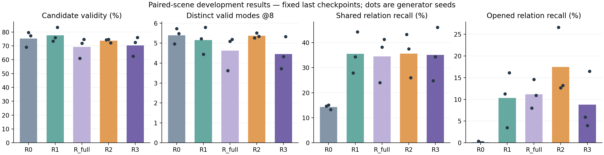
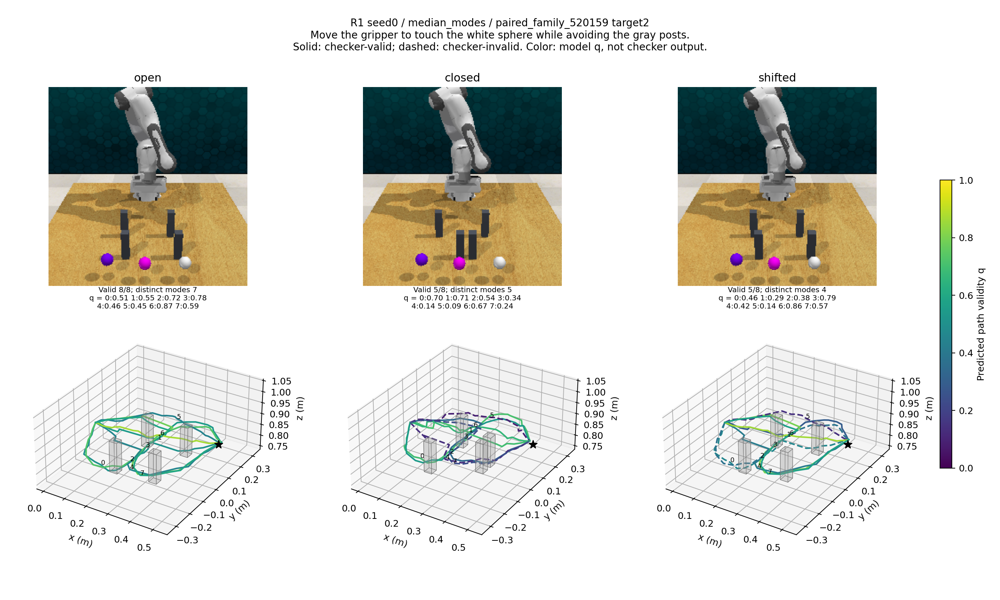
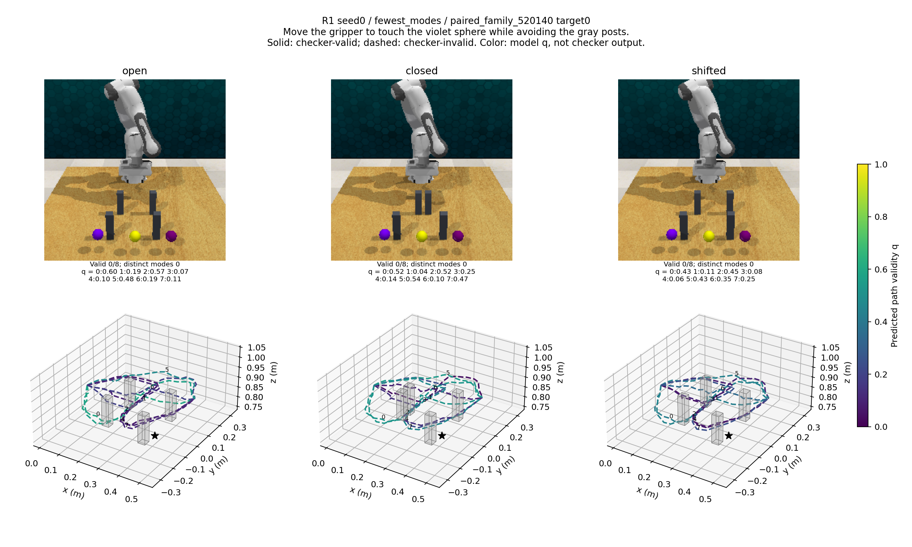

# 多种合理走法与逐路线可靠性：最终研究结果

2026-10-05。**可运行、可恢复、可复现的研究雏形已经交付；尚未得到足以支撑顶会投稿的稳定新方法贡献。** 本轮完成五种生成方法各三个种子、九套独立评分与校准、模型打包及独立命令行验证。综合候选有效率、参考覆盖和评分表现，默认使用 R1＋q。原创新候选 R2 和诊断后的修正 R3 均未稳定超过 R1，不能作为已经成立的论文核心。

所有数字均为开发证据，TEST_LOCKED 未用于本轮方法选择、训练或评价。“有效”指明确的上层路径检查事件，不是机器人执行成功。

## 可运行系统

输入为 RGB-D、语言、相机参数及当前状态。真实冻结 Qwen3-VL-2B 提供语义特征，观测几何编码与集合路线头输出八条 H24 三维路径及夹爪事件，独立评分器为每条实际路线给出 q。推理不读取目标坐标、障碍真值框或参考轨迹。

默认演示模型为 R1 seed0，不是挑选的最佳种子。正文结论使用全部三个种子。模型、格式及完整命令见 [DEPLOYMENT.md](DEPLOYMENT.md)。本地模型：`F:/dpvlm/runs/paired_modes_v1/reliability/R1_seed0/deployment_seed0/planner.pt`，SHA256：`5718fd973d1908307987cdac06c2886f4670fba7ed06cc1ababe9fe76323d4ca`。

训练恢复包含 model、optimizer、scheduler、RNG、采样/数据顺序与 config。连续100步与50＋50步恢复的实际服务器比较完全一致。九个部署包重载后与保存的路线、事件和评分逐元素一致；R1/R2 seed0另通过独立CLI验证。R1 CLI用时2.886秒，含进程与路线模型加载，复用真实Qwen缓存，不是完整在线VLM延迟。

## 数据与比较设置

新增160个独立布局族，128 TRAIN、32 DEV_MODEL。每族包含开通、关闭、平移三种观测，每观测三个目标指令，共480个场景、1,440个请求。12,960个登记教师槽位产生11,760条接受折线；其余1,200个槽位对应关闭的低通道。RGB-D来自实际RLBench渲染，新增参考为**几何教师上层折线**，不是机器人执行轨迹或真机数据。

160/160布局族的机器人、相机、目标身份一致性检查通过。新增数据约3.63GB，原始参考与失败记录保留。训练H24检查排除22条无效参考，涉及20个请求，无请求变为空；原始数据未删除。真实冻结Qwen编码1,440/1,440请求，固定版本 `89644892e4d85e24eaac8bacfd4f463576704203`，可训练参数0。

各方法每种子3,000次更新、批量32、96,000次实际曝光，每批16历史输入和16新增输入。种子内初始权重及输入顺序一致。内部M=8，报告最终生成器checkpoint，不以DEV挑选生成器。新增损失系数由四个固定TRAIN批次的初始梯度范数确定后固定复用。相同曝光不等于相同算力或时间，实际命令预算单独保留。

## 生成方法结果

配对DEV为32个独立布局族、288请求、每模型2,304候选。下表是三种子均值；逐种子、历史开发集、父布局区间和输入一致性证据见 [完整表](final_generator_analysis/TABLE.md) 和 [原始分析](final_generator_analysis/RESULTS.json)。

| 方法 | 候选有效率 | 不同有效走法数@8 | 有限参考覆盖 | 共享关系联合召回 |
|---|---:|---:|---:|---:|
| R0：普通集合回归 | 75.35% | 5.389 | 64.04% | 14.30% |
| R1：单场景关系均衡覆盖 | **77.59%** | 5.152 | **66.61%** | 35.53% |
| R_full：R1＋整集合一致性 | 69.23% | 4.631 | 60.23% | 34.49% |
| R2：R1＋共享关系部分对应 | 73.78% | 5.374 | 64.41% | 35.62% |
| R3：预测两侧关系均存在时才对应 | 70.40% | 4.458 | 56.59% | 35.09% |

不同走法按有效路线的几何通道编码去重；有限参考覆盖与共享关系召回是另外两个指标。R0、R2的原始不同有效走法数略高于R1，不能声称R1在所有指标最优。

R2−R1：有效率−3.805个百分点，父布局bootstrap 95%区间[-6.221,-1.331]个百分点；不同有效走法＋0.222，区间[0.042,0.394]；参考覆盖−2.198个百分点，区间[-4.218,-0.152]；共享关系召回仅＋0.083个百分点，区间[-2.265,2.497]。区间先在每布局内汇总种子，条件于这三个训练模型，不覆盖所有随机初始化的不确定性。

R2 seed0曾通过预先规定的继续门槛，三种子却未复现稳定优势。超过较弱的R_full不能替代与R1比较。粗通道共享召回诊断中R2也低于R1；高度分类带敏感性分析单独保留，未重写原始标签或主指标。

## 逐路线评分与返回的多路线

R0/R1/R2各三个生成器分别完成评分和校准。SCORE_TRAIN的64父场景用于拟合，DEV_SCORE的32父场景选择评分checkpoint，CALIBRATION的32父场景拟合温度。新配对DEV未用于拟合q或温度，这里测量跨布局迁移。

| 方法＋校准q | q选中单条有效率 | Brier↓ | NLL↓ | 全候选ECE↓ | 所选单条ECE↓ |
|---|---:|---:|---:|---:|---:|
| R0 | 88.66% | 0.1751 | 0.5364 | 16.84% | 8.85% |
| R1 | **93.98%** | **0.1317** | **0.4184** | **11.71%** | **4.94%** |
| R2 | 93.17% | 0.1534 | 0.4696 | 13.55% | 8.06% |

完整逐种子和冻结/重训/校准对照见 [评分分析](final_reliability_analysis/RESULTS.json)。校准并非总有收益：R1 seed0校准后全候选ECE高于未校准版本。R2 seed2的ECE为26.24%，Brier为0.2190，劣于SCORE_TRAIN有效率常数预测的0.2009。不能只展示较好的seed0。

公开选择器先取最高q，再优先保留q≥0.5且平均路径距离≥4cm的候选，不足按q补齐。总是先生成八条，再返回K条。**R1固定返回K=4的三种子均值**：

- 返回候选有效率91.38%，至少一条有效的请求占95.37%。
- 四条全部有效的请求占82.29%。
- 平均3.461种有效走法，至少两种有效走法的请求占94.44%。

统计包含全部请求与失败。固定选择器精确复现九个保存公开示例的索引，见 [选择分析](final_selection_analysis/RESULTS.json)。q不要求和为1；路线错误可能相关，不能将q相乘推算集合成功概率。

## 改进、验证与诊断闭环

1. R2通过seed0门槛后按计划完成三种子，完整结果否定稳定收益。
2. 同四个TRAIN批次诊断发现，共享参考关系经常尚未在预测两侧同时出现。仅改变对应资格形成R3，其余预算与监督不变。
3. R3按事先约定完成三种子，最终六项继续条件全部失败，包括每个种子的有效率下降限制，见 [revision1_gate.json](revision1_gate.json)。没有为失败R3继续拟合q。
4. 最后用九个R1/R2/R3模型、同四个TRAIN批次诊断对应项与目标/语义监督的梯度关系，不更新参数。方向正负混合，明显失败的R2 seed2也多为同向，不支持通用“梯度冲突修复”。因此没有凭猜测启动第二轮机制修改，见 [TRAIN诊断](train_semantic_gradient_diagnosis/RESULTS.json)。

本轮否定的是当前对应机制的稳定增益，不是否定“多种合理走法＋逐路线可靠性”的研究目标。

## 实际案例与限制

R1 seed0按固定规则选择的中位案例，开通/关闭/平移分别得到7/5/4种有效走法；图中包含全部八条路线和q。

最少有效走法案例 `paired_family_520140_target0` 的三个变体全部零有效，路线共同选错目标。同场景包含violet与purple两类名称，可能涉及颜色指代歧义，但尚未证实因果，也未删去此例。R1此例最高q约0.60；R2同例部分q仍约0.96，说明多路线不能自动修复共同语义错误。

有效性只涉及目标误差≤3cm、起点误差≤5mm、连续路径柱体余量2cm、最低高度0.775m及事件要求，不涉及整臂碰撞、控制误差或任意未知障碍。新场景只含受控触达和有限布局变化。未完成与官方3D HAMSTER/RoboTracer同设置的全面benchmark；多查询、WTA、温度校准本身不是新贡献。

## 验证、资源与产物

所有实验队列已结束，本run family无活动任务或活动锁。仅使用授权GPU1（UUID `GPU-7506746b-d0ba-f6fe-44ce-8a1f97dde2ab`）、35%显存限制、最多四CPU计算线程，复用现有环境和独立run family。未使用sudo、未修改共享环境或其他用户进程，历史数据、模型和结果保留。

共155份启动器作业收据：154完成、1失败。失败是R_full新单元测试的列表索引错误，修复并重测13项通过后才训练；R3相关服务器测试15项通过、0跳过。失败记录保留，不将有重叠的测试数相加。训练恢复、真实模型更新、打包重载和CLI均有实际证据。

启动器命令累计墙钟10,135.865秒，约2.82小时，含CPU检查、绘图和失败尝试，不是GPU利用小时，不含单独数据采集工时。协调器等待相互重叠，不能另相加。实际命令、不可变源提交及收据哈希见 [FINAL_BUDGET.json](FINAL_BUDGET.json)。

最后核对120项必要产物的本地/服务器SHA一致：15个生成器最终恢复点及摘要、45个开发候选池、27个评分角色候选池、9个最佳评分器、9个部署包；另验证九套生成器—评分器—校准—部署包绑定，见 [FINAL_ARTIFACTS.json](FINAL_ARTIFACTS.json)。权重保留在本地与服务器 `runs/paired_modes_v1`，新增原始数据保留服务器；代码推送不代表大型权重和原始数据已上传Git。

## 投稿判断

**功能雏形成立，但目标中的“能够投稿的完整工作”尚未完成。** 可复用资产包括真实观测数据、强R1基线、逐路线q、完整对照、负结果和论文结构。稳定的新贡献、更多任务与布局、直接强基线及冻结方法后的独立最终评估仍缺失；跨布局评分可靠性也未解决。

后续最值得集中的问题是：多路线共同选错目标时如何识别并降低置信度，同时保留正确目标下的多种有效走法。应从冻结R1开始，以训练证据决定具体改动，再用同预算验证。这是失败分析导出的方向，不是本轮已实现或已证实的新方法。方法与论文框架见 [METHOD.md](METHOD.md)、[PAPER_OUTLINE.md](PAPER_OUTLINE.md)。
