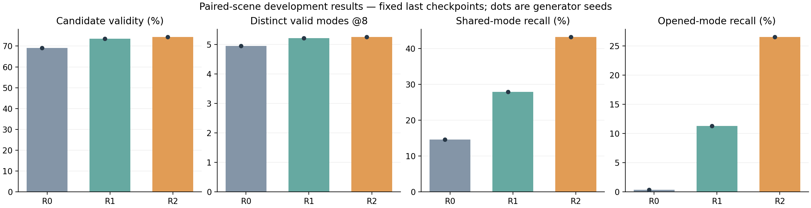
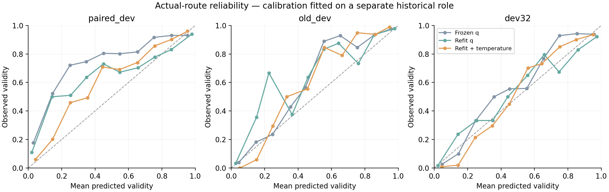
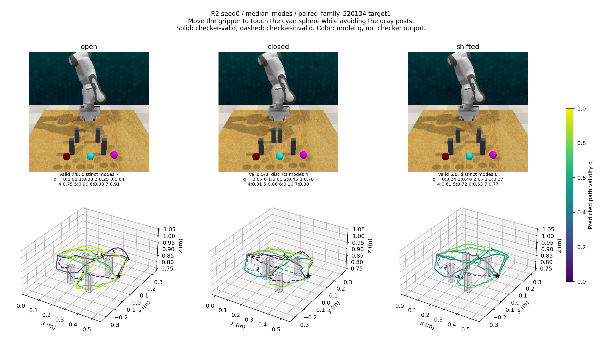
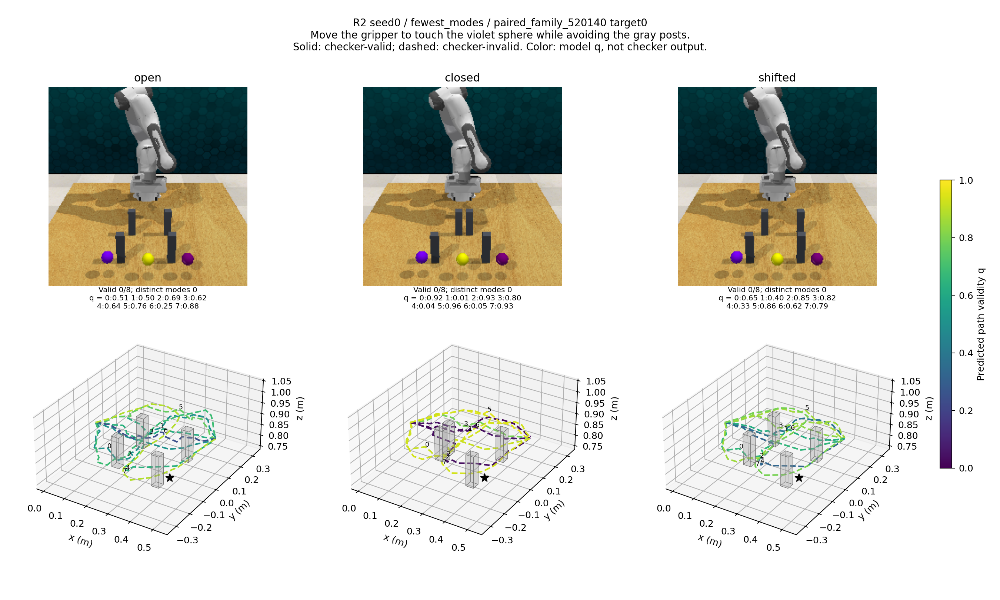

# 多路线与逐路线可靠性：实验雏形

本报告目前是 seed0 完成后的中间快照。R0/R1/R2 的另外两个种子正在复现，普通整集合一致性对照尚未完成；最终结论必须在这些结果补齐后更新。

已经实现并运行了一个观测驱动的上层规划原型：真实加载的冻结 Qwen3-VL-2B 提取 RGB＋语言特征，结合 RGB-D、相机和当前状态，一次生成八条三维 H24 路径，并为每条实际路径给出独立有效性概率 q。已有模型、评分器、独立温度校准、可重载的组合模型和完整预测记录。没有把几何真值传给推理模型，也没有用执行器修正输出。

## 本轮研究主线

局部障碍变化会使可行路线集合部分改变。方法只对两个场景都有正参考证据的走法建立对应，允许消失和新增走法单独学习；以通道边界为基准比较路线描述，允许共享走法随几何变化而变形。公式、置换不变性及适用限制见 [METHOD.md](METHOD.md)。

R0 是同数据的普通集合回归＋连续段 clearance；R1 换用新数据上的走法均衡回归并加入单场景关系监督；R2 只在 R1 上增加部分对应项。三个模型具有相同结构、初始化和实际训练输入顺序，均训练 3,000 步并评价最终模型。R2−R1 隔离跨场景项，R1−R0 同时包含两项训练目标变化，不能分别归因。

## 已完成的数据

新增 160 个独立父布局，128 TRAIN、32 DEV_MODEL；每个布局有开通、关闭、平移三种变体，每个变体有三个目标指令，共 480 个场景、1,440 个请求。所有场景完成采集，160 个布局的三个变体均通过当前状态、相机及目标身份一致性检查。

新增参考是 **RLBench 渲染观测配合几何教师折线**，不是真机数据，也不是机器人执行成功轨迹。12,960 个预定槽位得到 11,760 条通过几何检查的参考，其中 TRAIN 9,408 条、DEV 2,352 条；其余槽位对应关闭的低通道。没有以未采集到路线作为不可行证据。新原始数据约 3.63 GB，保留全部原始记录。

三个模型同等复用原有 191 个训练父场景，每步使用 16 个历史请求与 16 个新配对请求，共 96,000 次实际输入曝光。统一加入最低工作空间高度约束；22 条违反该约束的历史 H24 训练参考不参与正样本损失，原始文件保留。未读取 TEST_LOCKED 内容或指标。

## Seed0 结果：有正向证据，也有重要限制

新 DEV_MODEL 包含 32 个独立布局、288 个请求、每模型 2,304 条预测。所有指标都评价原始八条输出，不做几何修复或真值筛选。

| 方法 | 候选有效率 | 不同有效通道模式 @8 | 共享参考关系联合召回 | 开通低通道关系召回 | 有限参考通道覆盖 |
|---|---:|---:|---:|---:|---:|
| R0 | 69.05% | 4.958 | 14.61% | 0.35% | 60.68% |
| R1 | 73.48% | 5.219 | 27.93% | 11.28% | 67.12% |
| R2 | 74.44% | 5.264 | 43.28% | 26.56% | 67.23% |

R2 达到预先规定的 seed0 继续门槛，因此复现另外两个种子。这只是开发决策，不是统计显著性结论。

以父布局为单位的 bootstrap：R2−R1 的共享参考关系召回增量为 15.35 个百分点，95% 区间 [11.01, 19.57]；相对“直接把开通场景的路径复制到关闭场景”的有效率适应增益增加 7.68 个百分点，区间 [2.08, 13.54]。但不同有效通道模式只增加 0.045，区间 [-0.240, 0.309]；候选有效率增量区间也包含零。

这里必须区分两种划分：参考关系包括低位通道/越障的高度条件，通道模式使用评价专用的几何 portal word。新增的粗通道共享召回诊断为 R1 56.94%、R2 56.91%，几乎相同。这是看过 seed0 后增加的探索性诊断，不能隐去它，也不能把参考关系的明显提升解释成整体路线多样性已经全面改善。

旧 DEV32 也存在退步：R1/R2 候选有效率为 64.45%/61.85%，碰撞或工作空间违规率为 25.00%/34.24%，目标错误率则从 14.45% 降到 6.25%。这是目标定位改善与几何安全性退步并存的结果。

完整逐场景负例、区间及训练输入顺序：[seed0_extended/RESULTS.json](seed0_extended/RESULTS.json)。历史 B 的直接迁移为 59.20% 有效率、3.899 个模式；它没有本轮额外数据和 3,000 步训练，只能作为迁移参考，不能作为同训练预算的新机制对照。

## 逐路线可靠性

先固定生成器，再用 SCORE_TRAIN 的实际生成路径训练 q，使用 DEV_SCORE 选检查点，最后只用 CALIBRATION 拟合温度。以上数据角色均不用于生成器学习，新配对 DEV 没有用于评分器拟合或温度拟合。q 不做候选间 softmax，也不表示示范频率。

R2 seed0 在新配对 DEV 上：

| 评分器 | 所选路线有效率 | 全候选 Brier ↓ | NLL ↓ | 全候选 ECE ↓ | 所选路线 ECE ↓ |
|---|---:|---:|---:|---:|---:|
| 历史冻结 q 迁移 | 93.40% | 0.1449 | 0.4675 | 13.90% | 3.75% |
| 对当前生成器重新训练 q | 93.40% | 0.1118 | 0.3994 | 7.49% | 5.56% |
| 重新训练＋独立温度校准 | 93.40% | 0.1074 | 0.3516 | 5.67% | 2.04% |

校准后相对历史 q 的 Brier 改变为 -0.0374，父布局区间 [-0.0479, -0.0272]。所选路线有效率没有提高，收益主要是概率值质量。至少有一条有效候选的请求占 94.10%，因此该模型大部分选路失败来自候选池本身没有有效路线。

采用原评分脚本中固定的 q≥0.8 阈值，R2 seed0 每个请求平均保留4.35条路线；这些候选的实际有效率为94.33%，平均有3.60种不同有效通道模式，84.03%的请求仍保留至少两种。这描述了原型同时提供多条路线与置信度的功能，不能替代与强基线的机制比较，也不能解释为每个场景都有保证。

温度校准不是在所有分布上都改善所有指标：R2 旧 DEV 的 Brier 从未校准的 0.0765 变为 0.0823，旧 DEV32 从 0.1037 变为 0.1063。所有对照均保留，不能挑选每个开发集上最好的校准版本。R0 也完成了相同独立评分流程，完整结果见 [可靠性表](reliability_seed0_analysis/TABLE.md)。

q 的事件仅为：目标误差≤3cm、起点误差≤5mm、连续路径段与柱体至少2cm余量、统一最低高度满足要求，以及触达任务的夹爪状态正确。它不是完整机械臂或底层控制器的执行成功概率。

## 可检查的演示和失败

下面按三个变体平均模式数，固定选取中位案例与最少模式案例，不按好坏手动筛选。图中展示全部八条预测及 q；实线/虚线是事后检查器标注，不是推理输入。

失败案例 family520140/target0 在三个变体中全部选错目标：24 条路线末端都最接近 target2，而不是指令对应的 target0，目标误差约33–34cm。部分路线 q 仍然很高。平均校准改善不意味着模型能识别所有语义错误；该案例没有因颜色接近而从分母中删除。

组合模型保存在本地 `runs/paired_modes_v1/reliability/R2_seed0/deployment_seed0/planner.pt`。模型重载后，路径、事件、q、选择索引与保存结果完全一致。单独 CLI 进程验证仍在后续队列中；不能把已完成的组合模型重载检验等同于尚未运行的 CLI 检验。

输入格式、输出字段和可复用环境的运行命令见 [DEPLOYMENT.md](DEPLOYMENT.md)。

## 论文雏形应当提出什么

目前可以写成可证伪的问题：在部分路线可行性随场景变化时，对有正证据的共享走法做部分对应，是否比同场景监督及普通整集合一致性更有利于保留合理走法？评分器则回答实际输出的每条路线是否满足明确的上层有效性事件。

不能把“多查询＋评分”“一致性损失”“几何分类”本身作为新颖性，也不能声称已经证明全面多样性提升或通用操作能力。相关工作、公式和具体差异已整理到 [METHOD.md](METHOD.md)。普通整集合一致性 R_full 对照已按 [PROTOCOL.md](PROTOCOL.md) 固定，但还没有结果；它是判断部分对应机制是否必要的关键比较。

这份受控触达原型已经具备真实模型、数据、训练、评分和复现实验接口，但仍不等于可直接提交顶会的完整论文。需要先完成本轮多种子和机制对照，再据结果决定是否保留这一核心；更广场景/任务、同输入条件下的直接强基线，以及独立最终评估仍是投稿证据缺口。

## 资源和复现

只使用 `ssh wzy3090` 的授权 GPU1、35% 显存上限和最多四 CPU 线程；没有使用 sudo、修改共享环境或干预其他任务。新实验独立位于 `runs/paired_modes_v1`。源代码来自不可变 Git 导出；初轮训练源 a45818f，后续三种子复现和首轮 q 源7a47f96，新机制对照准备源c25f18e。运行中的源和脚本未被覆盖。

Qwen 的1,440次真实编码总用时127.47秒（包括30.91秒模型加载），峰值分配显存约3.99GiB。seed0 三组实际训练内循环分别393.77、518.95、607.78秒；头部峰值分配显存约953MiB。编码批次耗时不是在线单请求延迟。

每1,000步保留滚动恢复点和最终模型，包含 model、optimizer、scheduler、全部 RNG、数据采样状态/顺序摘要及配置。R2 的真实连续100步与50＋50步恢复验证，对模型、优化器、调度器、随机状态和输入顺序均得到精确一致结果。具体证据见 [data_evidence](data_evidence)，实际命令、预算、失败和来源哈希保留在服务器 run family 的 jobs 目录。
