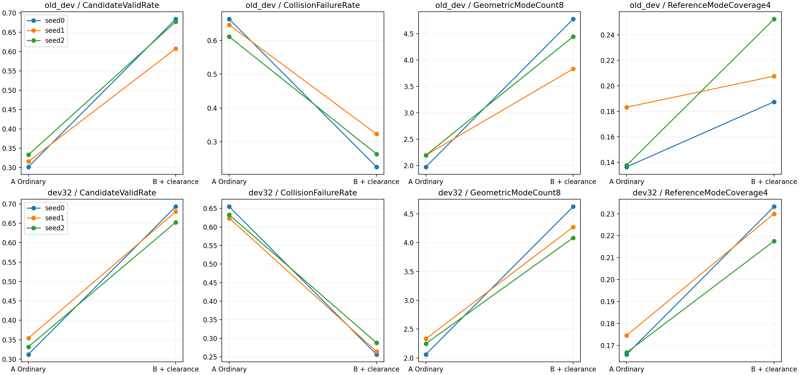
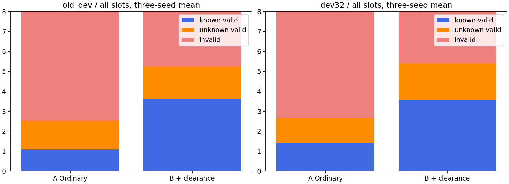
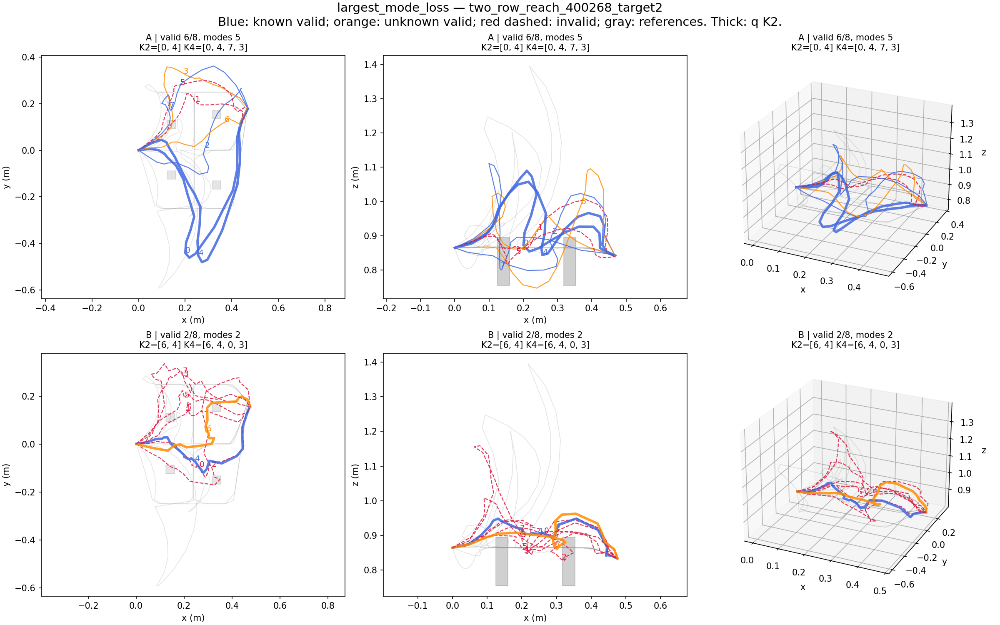
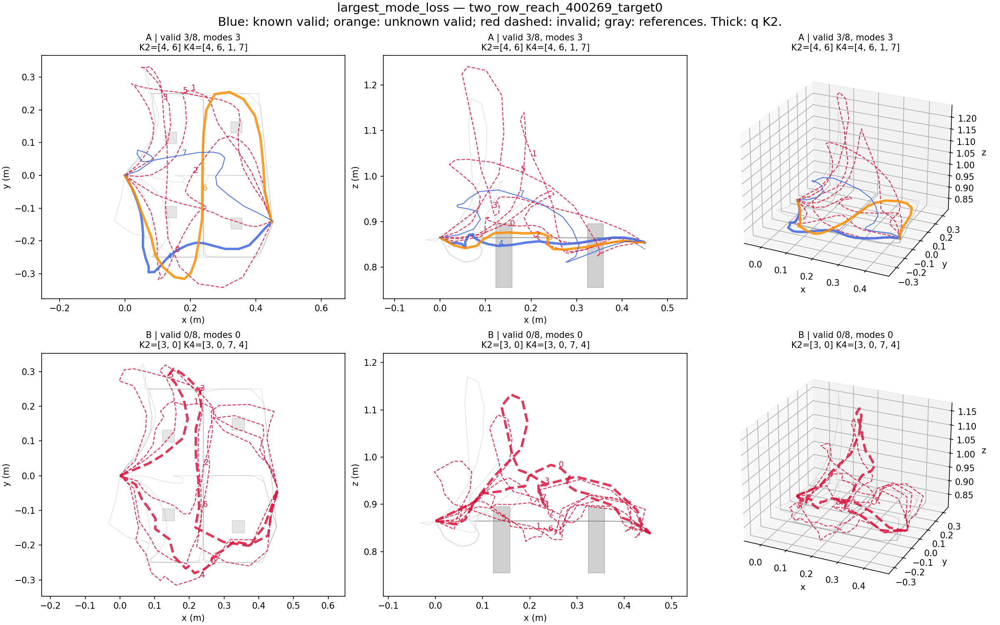

# 训练期整段路径净空监督：实际两臂三种子结果

2026-10-04。本轮结论：**明确的训练期物理净空监督大幅减少碰撞，并增加不同有效通道，不只是制造更多重复路线。三种子在旧DEV和DEV32方向一致；但局部目标定位退步和剩余碰撞仍然存在。** 这是普通碰撞损失的机制验证，不直接作为论文创新。

A=原Ordinary M8；B=A+线段净空损失。历史A三种子均通过严格配对检查并复用，本轮只新训三个B，各3000更新。没有改网络、输入、指派、事件目标、π、q、选择器、学习率、训练数据或终点参数化。均报告last3000。balanced+π未新训，旧结果仍保留在上一轮报告。

## 核心配对结果

下面为三个生成种子均值。旧DEV12父/36条件，DEV32为已使用过的32父/96条件；两者都是开发证据。失败率分母是全部候选，碰撞与目标错误允许重叠。

| 指标 | 旧DEV A | 旧DEV B | DEV32 A | DEV32 B |
|---|---:|---:|---:|---:|
| Candidate Valid Rate | 31.71% | 65.62% | 33.29% | 67.49% |
| 碰撞失败率 | 64.00% | 27.08% | 63.72% | 26.95% |
| 目标失败率 | 11.11% | 11.69% | 8.94% | 8.16% |
| AnyValid@8 | 87.96% | 90.74% | 90.28% | 93.75% |
| ValidCount@8 | 2.537 | 5.250 | 2.663 | 5.399 |
| GeometricModeCount@8 | 2.120 | 4.352 | 2.215 | 4.326 |
| TwoDistinctValid@4 | 73.15% | 87.96% | 70.49% | 93.06% |
| ReferenceModeCoverage@8 | 16.98% | 27.14% | 17.99% | 27.36% |
| ReferenceModeCoverage@4 | 15.25% | 21.59% | 16.90% | 22.69% |
| 固定q SelectedValid@1 | 80.56% | 89.81% | 83.68% | 91.67% |
| 固定q TwoDistinctValid@2 | 55.56% | 74.07% | 57.64% | 79.51% |
| 起点/事件失败率 | 0% / 0% | 0% / 0% | 0% / 0% | 0% / 0% |

完整逐种子所有指标在[CORE_TABLE.md](CORE_TABLE.md)，原统计在[RESULTS.json](RESULTS.json)。这里没有将三个种子当成独立父场景：先合并同父三个条件及三个种子，再做10000次父场景配对bootstrap。

## 五个问题

**1. 是否减少碰撞？** 是。DEV32三个种子碰撞率分别65.49→25.65%、62.37→26.43%、63.28→28.78%；有效率31.25→69.27%、35.42→67.97%、33.20→65.23%。旧DEV三个种子碰撞率66.32→22.57%、64.58→32.29%、61.11→26.39%。DEV32平均碰撞下降36.76个百分点，95%父配对区间[-39.54,-34.03]；有效率增加34.20个百分点，区间[30.90,37.54]。这说明原系统的一个主要瓶颈确实可以由明确几何训练信号缓解，不必先换生成架构。

**2. 是否增加不同有效走法？** 是，按上一轮冻结通道规则，DEV32平均新增2.111种有效模式，区间[1.872,2.347]；TwoDistinctValid@4增加22.57个百分点，区间[17.71,27.43]。每请求有效路线增加2.736条，其中模式数增加2.111、同模式重复计数增加0.625。因此既有重复增加，也有更大的真实通道计数增加。三种子合计288个条件评估中231个模式数增加、20个减少；238个有效路线数增加的条件中15个没有模式数增加。对条件内有效模式集合比较，出现923个新模式项、丢失315个旧模式项（不是923个全局类别）。DEV32有效路径767→1555条，其中保留反向通道经过词的路径均为20条，收益并非主要由回退序列增加造成。参考覆盖也增加，支持收益不只是路线距离变大；但固定通道规则不是严格同伦证明。

**3. 是否损害目标、事件或参考覆盖？** 平均目标错误未显示明确系统性改变：旧DEV增加0.58个百分点、区间[-2.08,3.24]，DEV32减少0.78个百分点、区间[-2.82,1.13]；DEV32 seed1/2分别略恶化0.26/0.91个百分点，不能只展示seed0的改善。平均终点误差旧DEV3.913→3.939cm、新DEV2.865→2.873cm，均值包含严重偏离目标的尾部。起点和事件失败均为0；每个种子的参考覆盖@8/@4都提高。DEV32覆盖@4增加5.79个百分点、区间[3.91,7.66]，但绝对值仍仅22.69%，只覆盖**已发现的参考走法**，不是完整真实分布。平均路径长度增加约3.35cm（1.090→1.124m），并非免费改善。

局部目标退步很严重：旧DEV seed0的283268_target1从八条均满足目标变成八条全部目标失败，误差1.20–2.00cm→12.84–13.85cm；同时碰撞8→1。DEV32 seed2的400269_target0从3条有效/3模式变为全无效，终点1.53–2.06cm→10.75–11.64cm。这些支持下一步检查目标定位与避障训练之间的冲突，不能解释为放宽容差即可解决。

**4. 额外成本与推理是否改变？** 历史A三个训练循环共518.634秒，B共607.371秒，增加88.737秒（17.11%）；逐种子163.15→186.63、176.56→210.48、178.92→210.27秒。此口径包含相同的定期旧DEV评价和保存，不是隔离硬件噪声的纯算子benchmark。B实际三个外层作业共662.670秒，包含加载与配对核验；本轮全部19项服务器作业17成功/2技术失败，累计776.937秒，失败已计入。峰值CUDA分配997882880字节，沿用GPU1/35%/四CPU限制。A没有重复训练；Qwen没有新编码或微调，q没有训练。

推理计算流程完全保留，仅替换生成器权重：同样M8/H24、一次候选生成、同一Ordinary seed0 q及归一化/温度/选择器，无真值盒输入、修正或新增候选。所有A/B使用同一q，这属于**固定评分器对不同生成器的迁移评价**，不是三套完整系统重训q后的复验。q Top1在两个DEV、全部种子均上升；没有发生平均生成池改善却冻结q选路变差的情况，个别条件仍有选错。部署类源码没有修改，未用真值替换预测终点。

**5. 下一步最支持改哪个模块？** 保留这次几何监督作为生成器强基线，下一项聚焦**生成器的目标/终点grounding模块与避障梯度的相互影响**。依据是整池终点一起偏离的失败，增加安全路线也不能救回这些请求。剩余碰撞率26.95%仍高，不能宣称目标已成为唯一瓶颈；本轮没有实施下一项改动，也不转去调q或选择器。

## 实现、检查和失败保留

原Ordinary目标无等价项。新损失对全部8条预测路线的23段等权，惩罚最差物理盒净空低于2cm的平方；解析求六个仿射面函数的线段最小值，含15对交点与两端点，使用有符号L∞净空以对应原扩张盒checker。数学上覆盖完整线段，数值实现仍有浮点误差；损失不是无碰撞保证，退化/平坦最小值处梯度也可能为零。监督只来自TRAIN四个真实障碍盒，不扩大到桌面、目标物体或所有观测点。这是**B额外获得训练几何监督**，A/B监督信息不相同。

λ=160只由固定TRAIN四个batch的原/新增损失参数梯度范数比中位数确定，训练前冻结，没有DEV网格搜索。固定TRAIN小检查23552段中1151段碰撞；顶点-only漏140段，解析判定漏0段。实际服务器10项测试通过，包括有限差分梯度、穿障非零梯度、静止段、随机连续checker一致性、细分不变性和原几何模式测试。没有开展新的大规模审计。

两次技术失败：初次TRAIN probe的旧NumPy checker广播错误、首次评价使用了旧DEV不存在的manifest.json。均在正式优化或该次候选评价之前失败；原日志与耗时保留。三个正式B训练均一次完成。训练初始化、父checkpoint、原训练配置、数据指纹和96,000次抽样流逐种子与A相同；三份下载last checkpoint SHA相符。12个最终候选池/RNG SHA核验通过；训练/评价不可变导出的465/467源文件与实际job receipt逐项相符。seed0 A回放两套DEV路径/事件完全一致，旧DEV q仅有numpy/torch sigmoid的2.68e-7差异，K选择与指标完全一致，新DEV q也完全一致。

| 固定选择的失败案例 | 实际变化 |
|---|---|
| DEV32 seed0 400268_target2 | 有效6→2，模式5→2，碰撞2→6；目标均正确 |
| DEV32 seed2 400269_target0 | 有效3→0，八条终点全部偏离目标约11cm |
| 旧DEV seed1 283265_target1 | 有效5→1，模式3→1，碰撞3→7 |
| 旧DEV seed0 283268_target1 | 碰撞8→1，但目标失败0→8，仍无有效路线 |









各DEV/种子均保存最大模式改善、最大模式退步、首个全失败、高q失败及unknown案例和确定的CASE_SELECTION.json。没有筛掉失败、unknown或不利种子。完整原始候选在服务器runs/segment_clearance_v1/evaluation_v2，本地reports/segment_clearance_v1/evaluation；训练last/recovery/optimizer/RNG保存在服务器和本地runs/segment_clearance_v1/B_seed0..2。Git不提交二进制权重与候选数组，提交文本结果、图和来源索引。

## 来源、文件和复现命令

训练源commit `acc6de59f51d2cf7746ca565a3dc60db5f86dd2d`；成功评价源 `0f4b512d20cd27f327e82f418945530a384b6250`；TRAIN选λ源 `b591ce51c3ccb41fb455c927a6383a39b12cb536`。最终归档commit及push核验见交付回复。报告时服务器无本项目作业或active.lock。TEST_LOCKED从未读取，DEV32明确为400256–400287的已用DEV_MODEL，不是DEV_SCORE或独立最终测试。

新增 `routeset/segment_clearance.py`、`tests/test_segment_clearance.py`、`configs/segment_clearance_v1.json`，以及 `scripts/train_segment_clearance.py`、`segment_clearance_support.py`、`evaluate_segment_clearance.py`、`analyze_segment_clearance.py`、`clearance_job.py` 和三个对应shell启动脚本。更新STATE、RESUME、RESEARCH_LOG及experiments/registry.jsonl；原生成器/评分器/选择器/检查器/几何模式代码未修改。

实际服务器命令都经ssh wzy3090；下面root为`/home/wzy/dpvlm/route_set_v1`，完整命令、起止时间、exit code和源SHA见jobs/*/receipt.json。已完成输出目录有防覆盖保护，不要原样重发fresh任务。

```bash
# 本轮每个B种子的实际训练子命令（seed=0,1,2）
bash "$root/research_v2/releases/acc6de59f51d2cf7746ca565a3dc60db5f86dd2d/scripts/launch_segment_clearance.sh" --id "train_B_seed${seed}" -- "$root/.venv/bin/python" -m scripts.train_segment_clearance --seed "$seed"
# 完整评价续接，只评价固定last，不重启训练
bash "$root/research_v2/releases/0f4b512d20cd27f327e82f418945530a384b6250/scripts/evaluate_segment_clearance_round.sh"
# 本地父配对统计和科学绘图
python -m scripts.analyze_segment_clearance reports/segment_clearance_v1
```

预算、失败、哈希索引见FINAL_AUDIT.json、LOCAL_VERIFICATION.json和PROTOCOL.md。本轮到此停止，没有第二种生成机制、q更新、K2改造或新采集。
