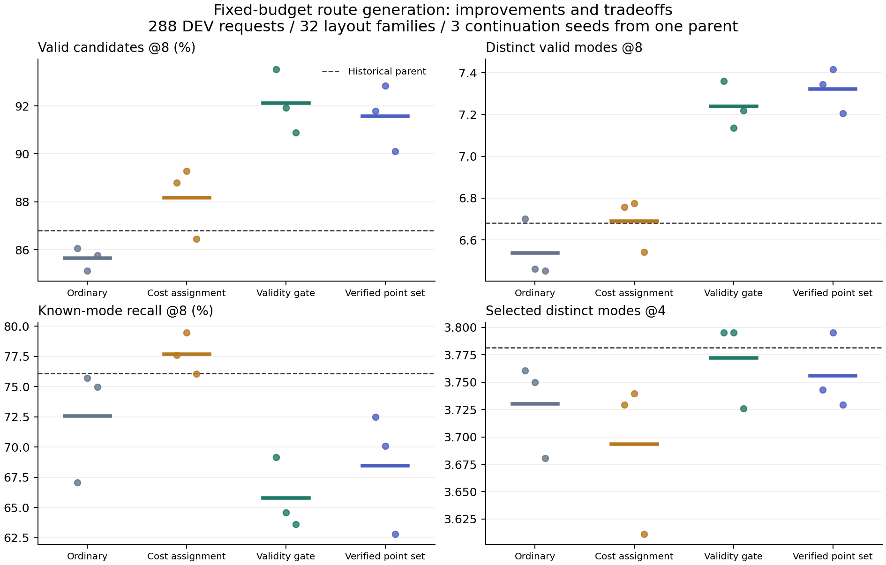

# 阶段 A/B：实现、复现与论文主线决策

2026-10-09。**本轮实现和实验已完成，但提出的新机制没有胜过最强简单对照，尚未收敛为可投稿成果。**

本轮完成18次训练及对应评估：3次受限训练集试验、15次完整训练集试验。
四个主要方法完成三组配对续训种子，另完成几何区域消融和同正例信息的普通回放。
51个远端实验任务全部正常结束；实验账本使用2935.783秒，新增7200秒额度剩4264.217秒。
没有活动训练进程或残留实验锁。原始历史预算、模型和数据保持保留。

## 实际改了什么

主线收紧为：**固定8条候选预算下，如何减少无效路线，同时保留不同的可行走法。**
继续使用冻结的缓存VLM特征，训练现有观测条件路线头；本轮没有LoRA或RFT。
新增训练端验证器、局部几何可行区域、集合分配、正例回放和完整的复现审计。
验证器的受控几何只用于训练监督与评测检查，不输入推理模型。

| 方法 | 训练规则 | 定位 |
|---|---|---|
|ordinary|原有有限正例组匹配，统一续训1200步|同更新量普通对照|
|gate|普通匹配后，对已有效且不重复的代表路线停止直接回归|简单有效性门控对照|
|budget_match|按纠正代价选择有限输出名额对应的示范模式|普通成本分配对照|
|project|锁定当前有效代表，将其余路线纠正到局部可行区域|首次候选机制，实验失败|
|set_point|加入已验证的当前路线作为正例，联合选择各模式的代表|候选集合机制|
|set_project|联合分配再加入局部可行区域|几何区域增量消融|
|replay_set_point|普通匹配读取set_point实际查询得到的逐批正例|同正例信息对照，非同在线分配|

所有公平比较使用完整1152个TRAIN请求、全部288个DEV请求、固定1200步最终模型、
相同初始参数及每个种子的实际采样流，并保持完整评分器及其观测编码器不变。
三种子是同一历史模型的续训随机性，不是三个独立预训练VLM。

## 主要结果

下表除历史原模型外为三次续训均值。有效率是8条候选中通过任务路线检查的比例，
不是实际机器人成功率，也不是Top-1成功率。已知召回只覆盖已有教师模式，不代表完整可行全集。

| 方法 | 有效率@8 | 不同有效模式@8 | 已知模式召回@8 | 返回4条的不同有效模式 |
|---|---:|---:|---:|---:|
|历史原模型|86.81%|6.681|76.10%|3.781|
|普通续训|85.65%|6.538|72.58%|3.730|
|简单有效性门控|92.12%|7.238|65.80%|3.772|
|普通成本分配|88.18%|6.691|77.70%|3.693|
|联合点集监督|91.58%|7.322|68.45%|3.756|

图中点为各续训种子，短线为均值，虚线为历史原模型；坐标轴局部放大以展示差异。

简单门控相对原模型增加0.558种有效模式，按32个布局族重采样的95%区间为
[0.373,0.738]；有效率增加5.31个百分点，但已知模式召回下降10.31个百分点。
这些区间条件于本轮三个续训种子与已有DEV分布，不能代替独立预训练随机性或新测试集不确定性。

联合点集监督相对简单门控只增加0.083种模式，区间[-0.060,0.215]，三个种子的差值分别为
-0.017、+0.281、-0.014；有效率平均降低0.54个百分点。**未通过预先注册的+0.3种模式门槛。**
它对已知召回的平均改善约2.66个百分点，也不能替代原来的主要验收指标。

返回4条路线的均值同样没有超过原模型。原模型返回路线有效率94.79%，简单门控为94.33%，
联合点集监督为93.95%。因此不能将候选池改善写成实际返回结果的稳定提升。

## 消融和失败没有被隐藏

- 硬锁代表的几何投影：seed0有效率77.08%、有效模式5.174，明显失败。
- 联合几何区域：seed0有效率92.80%、有效模式7.420，但相对同种子简单门控只增加0.059，
  已知召回降至62.53%。未达到扩展条件，停止其多种子试验。
- 普通正例回放：seed0有效率87.46%、有效模式6.990、已知召回73.17%。
  在线点集监督比它多0.354种模式，但仍未胜过简单门控。不能据此声称新增正例解释全部增益，
  也不能声称在线分配已证明必要。回放只有一个种子，而且先获取正例的成本属于两阶段总成本。
- 最初仅保留已知模式数不超过8的TRAIN请求，实际只剩384个closed场景，排除了open/shifted。
  普通续训全DEV有效率降至64.28%。这一数据分布混淆已被发现并修复；完整1152TRAIN比较才是主结果。

## 场景变化下的保留：仍未解决的核心问题

使用冻结的历史父模型场景编辑见证，固定2169个“编辑后仍可行的原模式”机会作为分母，
比较各方法在目标场景的输出。它是已有DEV的次级诊断，不是新的独立测试或完整模式枚举。

| 方法 | 固定编辑见证保留率（三续训种子均值） |
|---|---:|
|历史原模型|86.31%|
|普通续训|80.31%|
|简单门控|70.20%|
|普通成本分配|83.80%|
|联合点集监督|71.62%|

这说明“输出更多不同的有效路线”并未自动带来“场景改变后保留仍有用的原走法”。
已知召回下降本身不能证明新路线无用，但结合固定编辑诊断，当前方法不足以支持模式保留主张。

## 对CVPR主线的决策

**保留研究问题，淘汰当前投影机制作为主贡献。** 问题应聚焦为：场景或任务条件改变时，
有限路线集合能否保留仍可行的备选方案，并修复失效方案。当前完成的是可复现的诊断和强对照，
还不是这个问题的成功方法。

下一阶段的具体顺序应为：

1. 在TRAIN上做实际参数更新前后的保留诊断，区分直接回归、共享参数更新和几何/语义辅助损失。
   当前自目标只保证构造当下的直接回归为零，不保证网络更新后保持路线。
2. 加入等有效回归规模的普通损失和等遮蔽比例的随机门控，检验增益是否只是模仿权重降低。
   本轮没有这些控制，不能把门控效果归因于正确性判断这一单独因素。
3. 只有上述诊断支持独立机制，才研究按模式保留的更新约束，并与普通回放、成本分配及简单门控
   做同数据、同验证信息、同更新量比较。新阶段需事前同时规定候选覆盖、返回结果和编辑保留的验收条件；
   不能事后用另一项指标替换本轮失败的主要门槛。
4. 机制通过后，再扩展独立场景族、视觉和语言干预及代表性外部基线。是否LoRA/RFT，应由观测/语义
   瓶颈实验决定；增大可训练参数本身不能补足方法贡献。TEST_LOCKED继续保留到方案冻结后的最终评测。

当前没有切换部署默认模型，因为所有已复现方法都存在覆盖或返回结果的取舍。
集合监督和可行多样性已有直接相关工作；新颖性边界及一手来源见
[相关工作核验](../../research_v3/VERIFIED_SET_RELATED_WORK_SCOPE.md)。

## 验证与交付

25项服务端机制/等价性/评估测试通过，新增2项统计测试通过。独立验证器与原检查器在47040个TRAIN
见证、4608个损坏样本上吻合；阶段A另外核验2048个原始/构造目标槽位。
15个完整训练集模型的最终及恢复checkpoint、优化器、学习率状态、Python/NumPy/Torch/CUDA RNG、
实际采样流、源代码和回放文件哈希均完成审计。

- [完整逐种子对照](final_comparison/REPORT.md)
- [三种子统计及置信区间](replication/RESULTS.json)
- [场景编辑保留与错误归因](secondary_all/RESULTS.json)
- [模型/RNG/回放审计](artifact_audit.json)
- [预算和结束状态](CLOSURE.json)
- [复现入口和源代码版本](REPRODUCE.md)

所有实验仍是受控任务级末端路线检查，未验证全机械臂、动力学或机器人执行成功；
未访问TEST_LOCKED，也未改变评分/校准数据角色。阶段A/B已收尾，论文创新与最终泛化验收尚未完成。
