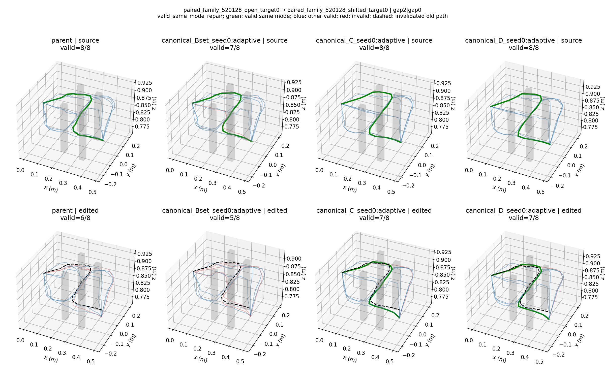
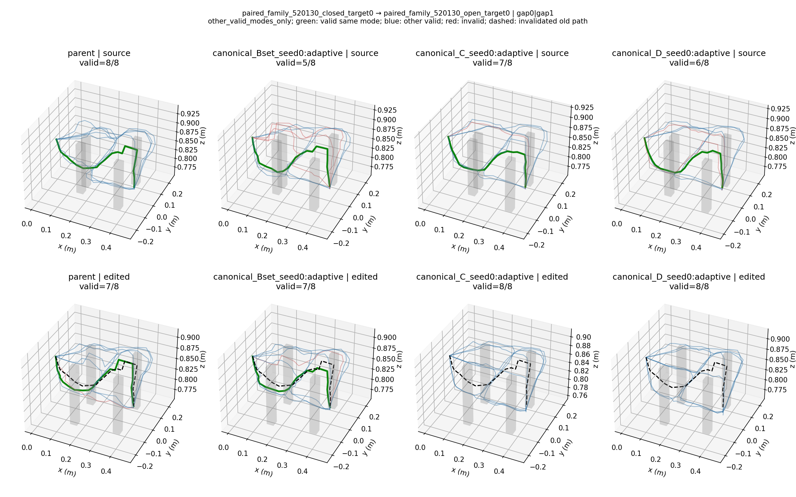
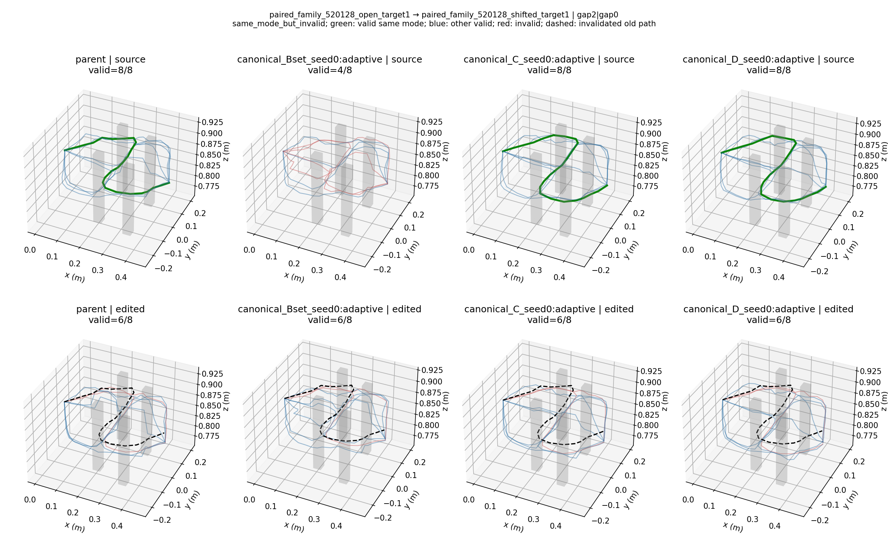

# 模式条件三维路线生成：实验结果

**生成结构已经实现并完成三种子验证；模式条件结构有收益，但原跨场景位移项没有稳定额外收益，整体尚未达到论文验收。**

所有主结果使用1152TRAIN、288DEV_MODEL、固定1200步最终checkpoint、相同父模型、冻结观测编码器、固定8候选和完整冻结评分器返回4条。B0/B_set/C/D各有种子0/1/2；初始参数与实际采样流逐种子完全一致。DEV为反复使用的32布局族，不是独立最终测试。保留所有早期失败，不挑400步或最佳种子。

## 三种子主比较

|方法|有效率@8|不同有效模式@8|已知召回@8|有效率@4|不同有效模式@4|固定编辑保留|同模式几何适配|
|---|---:|---:|---:|---:|---:|---:|---:|
|历史父模型|86.81%|6.681|76.10%|94.79%|3.781|86.31%|74.07%|
|B0：普通匹配，抽样正例|78.95%|6.289|71.50%|93.34%|3.734|79.64%|66.42%|
|B_set：普通匹配，同模式全部正例|78.11%|6.226|71.27%|94.01%|3.760|79.58%|63.46%|
|C：模式条件解码|88.89%|6.770|79.35%|94.24%|3.753|80.56%|76.79%|
|D：C＋选择性路径位移监督|87.85%|6.711|79.61%|93.26%|3.715|79.64%|77.04%|

逐种子完整表：[TABLE.md](results/three_seed_summary/TABLE.md)。原始汇总与区间：[RESULTS.json](results/three_seed_summary/RESULTS.json)。

C比候选覆盖更强的B0多0.480种有效模式，布局族配对95%区间[0.281,0.683]；有效率提高9.94个百分点，同模式几何适配提高10.37个百分点[5.53,15.37]。C也超过B_set的原始覆盖和适配，但返回4条多样性没有超过B_set。这里支持的是本协议下条件生成更容易拟合不同走法，不能外推为超过所有普通多模态方法。

D−C：不同有效模式−0.059[-0.172,0.042]，有效率−1.04个百分点，返回4条有效率−0.98个百分点，固定编辑保留−0.92个百分点[-2.25,0.21]；适配仅+0.25个百分点[-2.89,3.85]。**不能据此支持跨场景位移项的独立价值。** 区间先对三个种子取布局内均值，再重采样32个布局族，不覆盖独立预训练或最终测试不确定性。

## 固定编辑分母和真实几何适配

固定2169个父模型见证不随新模型改变。原本覆盖1872个，原本未覆盖297个：

|方法|后来丢失 /1872，均值|后来找回 /297，均值|最终保留 /2169，均值|
|---|---:|---:|---:|
|B0|193.67|49.00|1727.33|
|B_set|188.33|42.33|1726.00|
|C|200.67|76.00|1747.33|
|D|230.00|85.33|1727.33|

找回更多不能掩盖丢失更多。所有新方法仍低于父模型1872的保留水平。

几何适配固定270个“父模型原路线有效、迁移后坐标失效、目标场景已有同模式有效参考”的模式机会，按源/目标/模式去重。只有目标场景生成同模式且通过原检查器才计成功。另有255个严格子集机会，其全部旧同模式路线均失效，排除旧同模式替代路线仍可用的歧义。原父模型严格子集成功187/255；各模型严格结果保存在[逐模型分析](results/three_seed_analysis/RESULTS.json)。

完整分类保留在[适配逐项记录](results/three_seed_analysis/adaptation_rows.json)：同模式有效修复、复制旧坐标、同模式但无效、仅其他模式有效、无有效输出。复制阈值为平均点距离1毫米。本轮没有观察到该阈值内的直接旧坐标复制；不代表模型不存在更近似的模板行为。

## 历史强参照

|历史方法，三种子|有效率@8|不同有效模式@8|已知召回@8|有效率@4|不同有效模式@4|固定编辑保留|
|---|---:|---:|---:|---:|---:|---:|
|Gate|92.12%|7.238|65.80%|94.33%|3.772|70.20%|
|Set-point|91.58%|7.322|68.45%|93.95%|3.756|71.62%|

新C/D改善历史Gate/Set-point的已知召回和编辑保留，但原始覆盖较低；没有同时优于父模型的保留及返回质量。历史方法允许更新观测编码器、使用不同目标构造，故作为强质量参照，不是隔离新结构的配对因果比较。历史权重和默认部署均保持不变。

## 修正、诊断及图

候选通信移除只做一个结构因素的seed0修正，TRAIN同模式解码更稳定，但DEV覆盖/适配降低，停止扩展，详见[消融](ABLATIONS.md)。随后发现模式提议是主要丢失来源，D2把选择性配对监督接入提议头，单列报告，不能回写原D的三种子结果。

真实预测图包含改善、回退和仍失败的确定性案例，不以成功图替代全量指标。图中的障碍是真值，仅作评测可视化；模型输入仍为RGB-D/语言/状态。

全部为任务级末端路径检查，尚未验证整臂碰撞、动力学、闭环执行或真实机器人成功。预算、权重和命令索引见[复现说明](REPRODUCE.md)及最终artifact audit。
