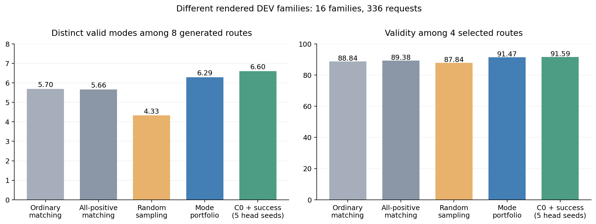
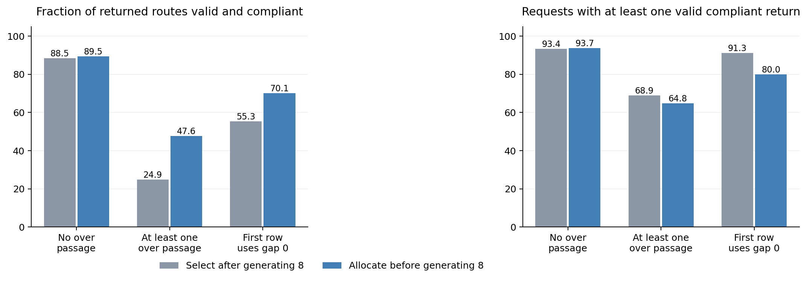
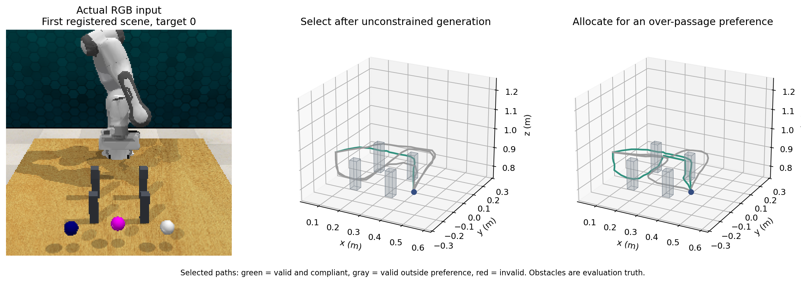

# Learning Diverse Three Dimensional Route Portfolios from Multimodal Demonstrations

Research manuscript draft. The present experiments concern task-level end-effector paths in controlled scenes; robot execution is a separate outcome.

## Abstract

Many robot instructions admit several geometrically distinct routes to the same goal. A route generator should therefore preserve useful alternatives within a limited candidate budget, rather than only imitate one demonstration or repeatedly sample the same passage. We study an observation-conditioned route portfolio that separates semantic passage proposal from continuous geometry generation. Positively witnessed passage words provide normalized proposal supervision, certified closed passages supply limited negatives, and unwitnessed modes remain unknown. A shared decoder maps each proposed word and the current RGB-D observation to a complete three dimensional path. The same representation supports a symbolic passage preference supplied after observation, using cached scene encodings. Across three matched continuations and sixteen different development layout families, the conditional system increases distinct valid alternatives from 5.695 to 6.295 at eight candidates and four-route validity from 88.84% to 91.47%. For an over-passage preference, allocating before generation improves compliant returned-route validity by 22.74 percentage points, while reducing the fraction of requests with any compliant return by 4.17 points. These results identify useful coverage and controllability directions together with their reliability tradeoffs.

## Introduction

A command such as reaching a specified object does not uniquely determine how the robot should pass intervening obstacles. A planner may approach through different gaps or travel above obstacles. These alternatives can matter when a later preference favors a particular passage or when one geometric realization becomes invalid after a scene change. Returning many nearly identical paths spends compute without providing the same range of choices.

Recent three dimensional guidance and spatial-tracing systems establish that metric paths are useful intermediate representations between language understanding and robot control. [3D HAMSTER](https://arxiv.org/html/2606.31329v1) studies metrically grounded trajectory guidance for hierarchical control, while [RoboTracer](https://arxiv.org/html/2512.13660v4) studies metric spatial reasoning and tracing. We investigate a complementary question: how should a small set of routes represent alternative passages for one task?

Our design uses operational passage words to separate discrete choices from observation-conditioned coordinates. It learns from multiple positive routes without treating every coordinate variation as a distinct mode or every missing demonstration as an impossible passage. The generator then allocates a fixed route budget before decoding geometry. A caller may also constrain the desired passage vocabulary after the scene has been encoded. This interface makes mode identity useful beyond a diversity score.

The work contributes a concrete portfolio design and an evaluation that distinguishes candidate coverage, actual passage realization, same-mode adaptation, preference compliance and downstream selection. Mode conditioning is established prior art. Our contribution is scoped to its application and measured behavior in multimodal robot route generation; it does not require universal superiority over all trajectory methods.

## Problem formulation

Given an observation x comprising RGB-D, language and current gripper state, generate P={p_1,...,p_8}, where each p_k is a 24-point three dimensional end-effector path with reach-event predictions. A complete frozen observation-based scorer q returns four routes. Goal coordinates and obstacle boxes are not deployment inputs. The evaluator checks goal semantics, the starting state, events, workspace height and continuous end-effector clearance. It does not certify whole-arm motion or dynamics.

In the controlled two-row benchmark, a word m=(m_1,m_2) records the first forward crossing of each row. Each component belongs to {gap0,gap1,gap2,over}, giving sixteen operational words. These labels are comparable across the registered scene variants but are not general homotopy classes. Only independently valid routes contribute valid-mode coverage.

For a candidate set P, define U(P) as the number of distinct words realized by valid paths and V(P) as the fraction of valid paths. Report these at both eight generated and four selected routes. For a caller's allowed word set A, preference coverage U_A(P) counts distinct valid realized words in A. Assigned query tokens do not substitute for realized words in any metric.

## Method

### Observation grounding and conditional geometry

The inherited frozen visual-language and observed-depth encoders produce a context h(x) and an estimated target anchor a(x). For mode m and within-mode occurrence v, the decoder begins with z_(m,v)=h(x)+E_m+V_v. Shared conditioned blocks generate the interior coordinates, endpoint residual and events. The first point is exactly the observed current position; endpoint offsets use the inherited bound around the learned anchor. Repeated occurrences have separate variant embeddings. There is no test-time truth checker or native motion planner in generation.

The frozen encoder is identical across the matched ordinary and conditional arms. Their shared decoder tensors and sampled observation/target streams match within each continuation seed. Ordinary assignment uses eight slot queries; semantic conditioning replaces slot identity with the witnessed passage label before coordinates are produced. The complete scorer retains its own original observation encoder, normalization and temperature.

### Partial support evidence

For each training request, let e_m belong to {1,0,unknown}. Positive evidence comes from independently checked demonstrations. Zero is assigned only to certified closed internal passages; a finite collector failure does not certify infeasibility. Unknown entries are masked from binary supervision.

The proposal objective combines normalized positive-word likelihood with binary cross-entropy on known statuses. In particular, the positive target is 1/|W_x| for each witnessed word in W_x. This learns an allocation distribution rather than reproducing the raw count of coordinate demonstrations. Its scores are not calibrated existence probabilities: normalization still induces competition involving unknown modes.

Route supervision regresses coordinates and events and retains the inherited continuous segment-clearance and workspace penalties. The core uses no cross-scene displacement objective. Earlier displacement extensions showed no additional advantage over conditioning alone and are retained as negative ablations.

### Fixed candidate allocation

The adaptive proposal ranks modes by learned score, allocates up to eight nonnegative modes and cycles available modes to fill the eight-route budget. When none has a nonnegative score, it uses the highest-ranked mode. Distinct-word ranking and categorical sampling are alternative inference policies on the same weights. Sampling repetitions are independent eight-route trials and are never pooled.

A secondary ordinary success head ranks nominal modes using generator-bound TRAIN realization feedback. This conventional predictor supplies a useful stronger allocation control. Five head seeds on one fixed generator are reported as conditional head replications, not five generator trainings.

### Preferences after observation

The caller may supply an allowed word set A. Proposal ranking and fallback operate inside A, while the decoder and complete scorer remain fixed. Empty preferences are rejected. The interface caches the current observation encodings, so separate preferences can reuse scene understanding. The proposal mask guarantees allowed query identities; actual path compliance is measured independently because geometry can realize a different word or fail.

The comparison receives the same preference after generating the unconstrained eight-route portfolio. It prioritizes compatible nominal query metadata using the same q selector and fills to four if necessary. Neither selector observes truth passage labels. Both methods spend eight generated routes per preference; the comparison differs in whether the preference informs allocation before generation.

## Experimental design

The original development benchmark contains 1,152 training requests from 128 families, 56,920 verified positive training routes, and 288 repeatedly reused development requests from 32 families. B0 uses ordinary assignment to sampled positive targets. Bset strengthens it by matching against all same-word positive coordinate examples. C adds semantic conditional decoding. Each receives 1,200 final updates in three continuations from the same pretrained parent. These are conditional continuation seeds, not independent visual-language pretraining runs.

The new frozen comparison evaluates all 336 requests from sixteen different rendered families, including open, shifted, closed, narrow, tall, noisy and occluded observations. These families were already used in an earlier study and are therefore reused development evidence. Checkpoints and all model settings are fixed before this comparison. Three categorical inference repeats are averaged within each C continuation. Confidence intervals resample scene families and continuation seeds. Reserved TEST_LOCKED data remain unopened.

Every prediction pool is hashed and sealed before independent truth geometry is used for evaluation. Every arm uses eight decoded candidates and the complete common scorer. This isolates the portfolio comparison under a fixed downstream interface; it does not establish optimal calibration for every generator.

## Existing development results

|Method|Distinct valid modes@8|Validity@8|Distinct valid modes@4|Validity@4|Same-mode geometry adaptation|
|---|---:|---:|---:|---:|---:|
|Ordinary assignment B0|6.289|78.95%|3.734|93.34%|66.42%|
|All-positive assignment Bset|6.226|78.11%|3.760|94.01%|63.46%|
|Conditional portfolio C|6.770|88.89%|3.753|94.24%|76.79%|

C minus B0 adds 0.480 valid modes, with a family interval of [0.281,0.683] after averaging the three continuations. Same-mode geometry adaptation improves by 10.37 percentage points [5.53,15.37]. The adaptation denominator fixes 270 opportunities where an old valid coordinate route fails in the edited scene and a valid same-word destination reference exists. Merely finding another valid word does not count as adaptation.

The four-route result exposes a tradeoff. C improves candidate coverage and adaptation but returns slightly fewer distinct valid modes than Bset. Historical Gate and set-point systems also achieve greater raw coverage, with lower known-mode recall and fixed edit retention. Conditional generation preserves 80.56% of the fixed edit witnesses, below the historical parent's 86.31%. We retain these comparisons rather than claim that the proposed representation dominates all objectives.

## Frozen comparison on different layout families

|Method|Distinct valid modes@8|Validity@8|Distinct valid modes@4|Validity@4|Duplicate valid routes@8|
|---|---:|---:|---:|---:|---:|
|Ordinary assignment B0|5.6954|72.17%|3.5159|88.84%|0.0784|
|All-positive assignment Bset|5.6647|71.59%|3.5377|89.38%|0.0625|
|C with categorical sampling|4.3280|79.70%|3.3482|87.84%|2.0483|
|Conditional portfolio C|6.2946|83.56%|3.6002|91.47%|0.3899|
|C0 with ordinary success head|6.6048|83.85%|3.6613|91.59%|0.1036|

All rows use the same 336 requests and eight-generated/four-returned interface. The first four rows average three generator continuations; categorical sampling also averages three independent inference trials within each continuation. The success row averages five heads conditional on fixed C0. It is not a five-generator replication.

C minus B0 adds 0.5992 valid modes, with a crossed 95% interval of [0.3383, 0.8700]. Its four-route validity improves by 2.63 percentage points [1.14, 4.46]. Relative to Bset, coverage increases 0.6300 [0.3562, 0.9107], and returned validity increases 2.08 points [0.67, 3.72]. These effects support the conditional portfolio system under the fixed downstream scorer. They do not isolate a decoder-only effect because proposal allocation is part of the system.

On the same C weights, categorical sampling produces 1.9666 fewer distinct valid modes [1.8399, 2.0966] and 1.6584 more duplicate valid slots. Thus a substantial part of the benefit comes from spending the budget on distinct proposal identities. This mechanism comparison uses every inference repeat, without constructing larger pooled candidate sets. C still has more duplicate valid slots than the ordinary assignment baselines; its advantage there is higher validity and realized coverage, not uniformly fewer duplicates.

The ordinary success head improves fixed C0 by 0.3399 valid modes [0.2518, 0.4375] and 0.0661 returned modes [0.0310, 0.1030]. The validity intervals include zero. An earlier study's separately trained centerline control reaches 6.8323 valid modes on these families, above C and C0 plus success. Its additional training and representation differ from the matched comparisons here. It remains a strong reference and prevents an absolute best-coverage claim.

## Preference compliance and reliability

|Caller preference|Valid compliant modes@8 after generation|Valid compliant modes@8 before generation|Compliant validity@4 after generation|Compliant validity@4 before generation|
|---|---:|---:|---:|---:|
|No over passage|5.509|6.201|88.47%|89.51%|
|At least one over passage|0.786|1.068|24.90%|47.64%|
|First row uses gap0|2.171|2.225|55.33%|70.09%|

The three caller predicates were fixed before their outcomes were read. Each method generates eight routes per preference, and uses no oracle labels for generation or selection. For at least one over passage, the compliant valid-return fraction improves 22.74 points [16.34, 28.67], and distinct compliant returned modes improve 0.1974 [0.0784, 0.3165]. This supplies a concrete controllability advantage under the same route budget.

Reliability remains different from route-level compliance. The proportion of requests receiving at least one valid compliant returned path changes from 68.95% to 64.78% for the over preference and from 91.27% to 79.96% for first-row gap0. Narrow preferences can concentrate failures and reduce fallback coverage, even while increasing the fraction of compliant outputs. First-row gap0 also loses 0.1359 returned distinct modes on average, with an interval crossing zero. No-over increases returned compliant validity by 1.04 points, but its distinct-return gain is inconclusive. These are raw per-predicate intervals rather than multiplicity-adjusted claims.

The example uses the first registered query and the first generator continuation, without selecting a favorable case. The image is the actual RGB input; obstacle geometry in the path plots is evaluation truth. Green selected paths are valid and compliant; gray paths are valid outside the preference, and red paths are invalid.

## Limitations and next validation

The present vocabulary assumes two registered rows and a fixed end-effector orientation; its usefulness outside these scene families requires a less restrictive representation and benchmark. Preferences are symbolic caller inputs, so this experiment does not establish understanding of preference language. Task-level validity and preference compliance do not establish safe whole-arm execution. Native controller pilots in the earlier branch are small and affected by hidden simulator-state variation; they do not support a main execution claim.

The method and its selected paper direction were developed using existing development outcomes. Positive comparisons therefore motivate a future frozen confirmation rather than untouched-test generalization. Whole-route diffusion and conditional-latent baselines with matched observation, demonstration exposure and compute are still needed for a stronger submission. The current model is a paper prototype with a focused claim and runnable interface.

## Related work

Explicit discrete modes and shared continuous refinements are well established in [MultiPath](https://arxiv.org/abs/1910.05449) and [Motion Transformer](https://arxiv.org/abs/2209.13508). Their main setting forecasts uncertain agent behavior, whereas this study allocates alternatives for one commanded robot task. [Diffusion Policy](https://arxiv.org/abs/2303.04137) provides a multimodal action-learning precedent and motivates a matched generative baseline. The route-guidance and spatial-tracing neighbors above establish the broader research interface. This work focuses on incomplete witnessed support, fixed-budget alternative coverage and passage preferences within that interface.
