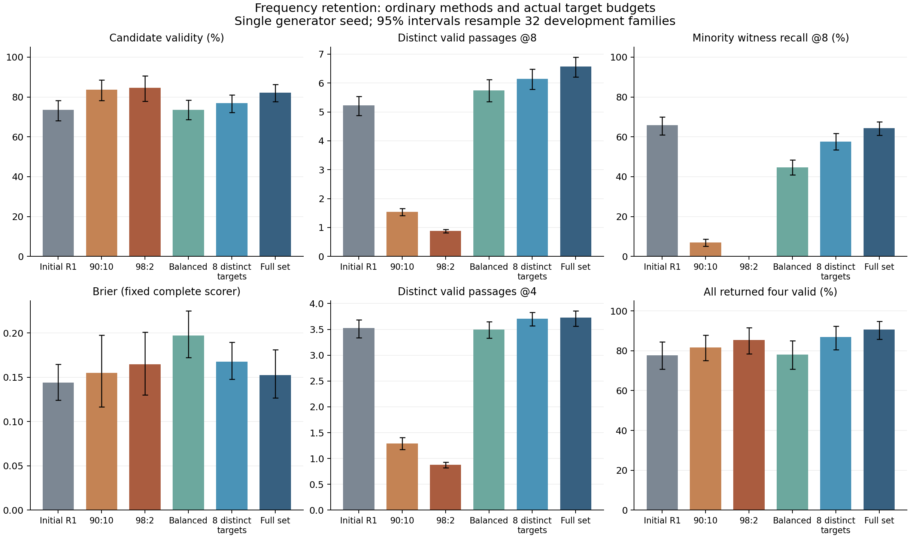
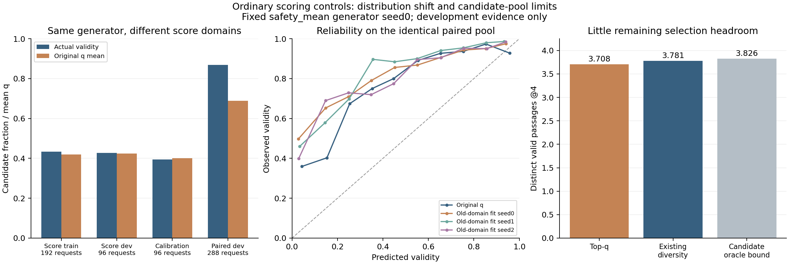

# 多峰路径与可靠性研究：2026-10-09 实证检查点

最新[强基线编辑保持审计](strong_edit_decomposition_v2/REPORT.md)确认，在排除错误端点修复后，四个编辑方向仍分别有23/40/23/23个可通过替换无效或重复候选补回的模式机会；不少模式已在参考监督中出现。这是只读的真值机会分析，不是可部署算法或方法收益。126作业闭合：121成功、5保留失败；累计5857.81/7200实验命令秒，尚余1342.19秒。下一项TRAIN对应残差诊断已登记，尚未执行。

新增[锚点导数诊断](anchor_diagnostics_v1/REPORT.md)与[优化器状态对照](optimizer_v1/REPORT.md)已闭合。恢复 Adam 状态改善首次更新稳定性，但1200步后的DEV有效率仅比同预算重置对照高0.17个百分点，95%区间跨零，门槛失败。保留原 safety_mean 参考，不将优化技巧包装为创新。291份新闭合产物已逐项SHA核验；累计5480.44/7200实验命令秒，研究仍在继续。

新增[同预算线性/二次间距损失对照](linear_v1/REPORT.md)已闭合，线性项门槛失败：
TRAIN碰撞减少，但端点错误增加，DEV有效率比同预算二次项低1.35个百分点。
额外二次训练相对原强基线也没有明确整体收益。全部checkpoint、梯度诊断、
两臂TRAIN复查和252份归档产物已核验；尚无新算法优势。

最新闭合结果见 [评分数据与定位对照](SCORE_CLOSURE_REPORT.md)：192个新父场景
全部采集成功并通过新旧数据隔离审计。固定生成器的新数据普通单q，三种子平均
Brier由0.148448降至0.076380；CAL-only仿射校准为0.107789，纯温度为0.167084。
路径质量没有改变，改善不等于算法创新。定位原型270/288对276/288，门槛失败。
下文较早的“队列仍在运行”均已由本次实际exit0及SHA验证的结果替代。

**研究仍在进行，投稿验收尚未达到。** 当前证据支持“频率偏斜会丢失有效少数走法”，但收益可被普通均衡和集合匹配解释，尚无超过强普通方法的新增机制。历史三种子模式对应 R2/R3 与45组双评分的负结果继续有效。本文不将新开发结果包装成独立测试或创新贡献。

## 已完成的真实工作

- 完整条件审计：1440请求、160布局族、11760有效教师参考；同一观测、语言、起点及坐标确有多个有效走法。原始教师计数均衡，不能声称天然长尾。三种子6912候选标签逐项复核，连续碰撞检查无分歧；47点采样漏掉182次连续碰撞。
- 频率实验：固定128 TRAIN族及32 DEV_MODEL族，验证47040条独特但相关的教师扰动。五个1200步对照及一个等参考预算对照实际完成，再完成两个同预算安全损失续训。保留所有失败、checkpoint、优化器、RNG、采样状态和实际命令。
- 评分隔离修复：原评估只固定评分头，却更新了它依赖的观测编码器。原结果保留；新评估固定原始完整评分函数。八条路径、事件及真值标签逐元素不变，实际部署 q 重放精确一致。不能将修复前后分数变化当作评分器学习收益。
- 公共推理 CLI 已实际执行，路径、事件、q、选集与保存候选完全一致。2.801秒为缓存真实 Qwen 后的新进程/路线头计时，不是在线 VLM 端到端延迟。
- 244个已闭合作业/模型/数据产物完成本地与服务器逐文件 SHA 核验。完整恢复产物保存在本地忽略目录和服务器；没有覆盖旧项目或查看 TEST_LOCKED。

## 新实验结果

以下为固定初始 R1 seed0、同一288请求的开发结果。已知模式集合不穷尽；模式是可解释的通道向量，不宣称严格同伦类。q为固定完整单q模型的原校准输出。

| 方法 | 有效率@8 | 不同有效模式@8 | 已知少数模式召回@8 | 额外更新 | 参考处理槽位 |
|---|---:|---:|---:|---:|---:|
| 初始 R1 | 73.48% | 5.226 | 65.80% | 0 | — |
| 均衡采样 | 73.61% | 5.743 | 44.64% | 1200 | 307200 |
| 90:10 | 83.59% | 1.542 | 6.90% | 1200 | 307200 |
| 98:2 | 84.59% | 0.878 | 0.00% | 1200 | 307200 |
| 八条互异模式参考 | 76.87% | 6.149 | 57.69% | 1200 | 307200 |
| 原始参考完整组匹配 | 82.20% | 6.552 | 66.37% | 1200 | 313326 |
| 完整集合匹配 | 82.20% | 6.566 | 64.36% | 1200 | 1566630 |
| 完整匹配＋平均惩罚续训 | 86.81% | 6.681 | 74.41% | 再1200 | 另1566630 |
| 完整匹配＋最大惩罚续训 | 87.02% | 6.743 | 71.30% | 再1200 | 另1566630 |

均衡与uniform两条登记训练的最终模型及全部预测精确相同，不算两次独立复验。完整集合匹配训练循环耗时约234秒，八条参考约74秒；前者并非同参考处理成本。续训使用相同父模型和新优化器，不能伪称从旧优化器状态精确恢复。

频率门槛两种偏斜均通过。相同307200参考槽位下，互异采样相对均衡增加少数召回13.044个百分点，父场景95%区间[10.006,15.903]；有效率增加3.255个百分点，[0.130,6.554]。但它仍比完整集合匹配少6.672个百分点少数召回。后来完成的原始参考消融推翻了“丰富的模式内参考仍有明显价值”这一过强归因：不使用四条扰动、保留完整组匹配时，有效率仍为82.20%，少数召回为66.37%，高于完整扩增的64.36%；但选集质量与固定q的Brier较差。参见[原始参考对照](canonical_v1/REPORT.md)，不把任一方案宣称为全面优胜。区间条件于固定训练模型，不覆盖训练种子不确定性。

最大碰撞惩罚的系数只由四个TRAIN批次匹配初始梯度范数得到。它相对同预算平均惩罚仅增加0.217个百分点有效率，区间[-1.606,1.997]；少数召回下降3.108个百分点，[-4.647,-1.519]。预设门槛失败，不再调该系数或扩展这一损失。平均惩罚续训本身明显改善了结果，说明不能把额外训练预算当成新增机制收益。

## 场景编辑与剩余问题

对已生成的同一具体路径，在编辑后的真实几何下重新检查。完整集合匹配在open→closed时丢失76/498个仍有原路径存活的模式见证；小幅平移丢失96/611。失败的具体路径不证明模式不存在；也有模式被另一个有效模式替换，所以这些数不能自动解释为总体模式覆盖损失。

平均惩罚续训后的12个空候选请求，全部八条都选错语义端点。随后固定首16 TRAIN族及全部32 DEV族的观测审计显示：432个请求都有距目标3厘米以内的可见点。平均惩罚模型12个DEV全端点失败，全部落在其共享锚点可修正范围之外。该结果指向共享语义定位/锚点选择，而非简单缺少目标观测。它尚不能证明应该扩大VLM、增加候选数或改变端点容差。

上述局部质量、语义原型、梯度及优化器对照均已完成，没有建立稳定整体优势。后续不继续锚点/优化器超参数扫描；应重新审计仍未分离的机制解释。此前部分对应、双评分、局部修正和diffusion负结果用于排除重复尝试，不从更换指标中制造新动机。

## 验收状态与复现

Gate A在受控频率保持问题上成立。Gate B/C的新增机制优势尚未成立，Gate D未达到。缺少新方法多种子、真正独立冻结评测、更多路径中间约束任务和难以由常规方案解释的收益。暂不生成声称创新成立的论文摘要。

实际数字、哈希和命令见 [实验总表](EXPERIMENT_SUMMARY.csv)、[频率报告](frequency_v1/REPORT.md)、[完整评分隔离修复](FIXED_Q_CORRECTION.md)、[安全对照](safety_v1/RESULTS.json)、[检查点产物](CHECKPOINT_ARTIFACTS_20261009.json)。推理说明见 [DEPLOYMENT.md](DEPLOYMENT.md)。研究决策及下一步以 [RESEARCH_STATE.md](RESEARCH_STATE.md) 和 [NEXT_ACTION.md](NEXT_ACTION.md) 为准。

## 后续诊断补充（研究仍在继续）

局部注意力质量锚点在TRAIN将不可修正锚点6降至1，但完整DEV路径有效率仅增加1.345个百分点，95%区间[-0.043,2.734]跨零；Brier恶化0.05185。该规则未纳入默认模型，不调带宽。

固定平均惩罚生成器、原评分特征编码器和全部候选，按原SCORE_TRAIN/DEV_SCORE/CALIBRATION独立重训三个普通单q：校准后Brier为0.164112、0.174366、0.145578，平均0.161352，高于原固定q的0.148448；预设门槛失败。实际独立公开进程的路径/事件/选集一致，q浮点差在1e-6内。生成器没有变化，不把三个评分种子当生成器复验。

同一生成器在旧评分训练/开发/校准数据的候选有效率分别为43.42%/42.71%/39.45%，当前多峰DEV为86.81%。随后已完成64个全新多峰布局族（32评分训练、16评分开发、16校准）的192个父场景采集；普通单q三种子平均Brier改善至0.076380。没有重分配现有DEV或打开封存TEST，数据量和分布同时变化，不将这一收益归为新机制。

同池选择审计：Top-q K4不同有效模式3.7083，现有简单多样性筛选3.7813，候选内真值选择上限3.8264。这不支持此时开发复杂新选择器。局部与服务器两份闭合快照共339文件逐项核验。这些队列均已闭合，当前状态与复现入口以RESEARCH_STATE.md为准。

图中三个重训评分器只使用旧评分域，可靠性曲线为同一候选池的描述性分箱，不是误差区间。新评分域及CAL-only温度/仿射对照均已完成，见SCORE_CLOSURE_REPORT.md。
