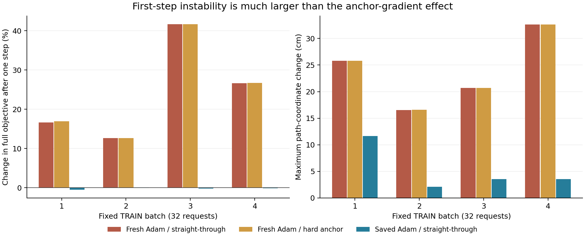

# Anchor derivative and optimizer continuation diagnostics

The hard-forward/soft-backward anchor does use a surrogate derivative. The
registered TRAIN finite differences verify that fact; they do not establish
that this estimator caused the previous continuation failures. Forward-identical
hard derivatives have no consistent advantage in the registered full-objective
scratch steps. No long hard-anchor training pair or new method is justified.

## Derivative check

Source `a3efc06b8c72225359264ef6d41a25702cddd0de`; 8 tests pass in1.73s,
wrapper2.383009s. Diagnostic exit0,30.255708s. Original safety_mean checkpoint
SHA `ff2dfbc5463a38e9acb2af740e9b605cbfda5d1317cc146f5f2c4e65c2a7a60c`.
Four fixed32-request TRAIN batches, FP64, two central-difference step sizes;
all initial paths/events/anchors exactly equal across derivative choices.
FP64 versus original FP32 max path error<=1.21e-7m, no changed peak identities.
No model updates. Original model tensors and checkpoint remain unchanged.

| Batch | STE scale derivative | Hard scale derivative | Finite difference, h=1e-4 |
|---|---:|---:|---:|
|1|1.2762671e-7|-6.0777876e-7|-6.0777876e-7|
|2|8.5696993e-9|1.7523786e-9|1.7523810e-9|
|3|-7.4584488e-9|5.9059841e-8|5.9059846e-8|
|4|1.1717573e-7|5.8070791e-8|5.8070794e-8|

The complete collision-gradient norm difference is only1.05–6.83%, cosine
>=0.99767. Scalar mismatch alone exaggerates its importance to the full model.
Hard mode removes the anchor surrogate while preserving genuine soft-attention
context gradients; no oracle geometry enters the forward input.

## Full-objective one-step updates

Source `ace519968fd8c7d5d37cd283707ebf4d19161a92`, exit0,34.420923s.
Each batch/branch starts independently from the same parent and fresh AdamW.
Full set regression +.02 grounding +160 quadratic clearance/floor, same
assignment RNG, lr3e-4/decay1e-4/clip1. Eight scratch step1 checkpoints retained.
Full gradient differences0.70–2.07%; actual update differences3.21–8.16%,
cosines>=0.99667. Hard mode increases the post-step objective on two batches
relative to STE and slightly decreases it on two. Both have a large first-step
increase and similar path-coordinate jumps. No DEV payload is read.

## Ordinary optimizer-state probe

Source `c2b6ed45acd722491260b9b820318c11ba5c32ff`, exit0,33.123137s.
Keep the original STE mode; compare fresh versus saved step1200 AdamW states.
Initial model tensors/forwards and full gradients agree exactly in every batch.
Fresh predictions also replay the previous scratch run exactly. All eight new
scratch checkpoints retained; original deployment checkpoint remains untouched.

| Batch | Initial full loss | After fresh Adam | After saved Adam | Fresh max coordinate change (m) | Saved max coordinate change (m) |
|---|---:|---:|---:|---:|---:|
|1|.0759785|.0886163|.0756016|.258109|.116618|
|2|.0753002|.0848391|.0752772|.165526|.020868|
|3|.0754424|.1069077|.0752811|.206811|.035269|
|4|.0753873|.0954799|.0753122|.326291|.035566|

Saved Adam update norms .0222–.0242 versus fresh .2391–.2399. Peak identity
changes14/7/9/1 versus32/31/30/32; a pixel identity change is not necessarily a
semantic error. Even saved-state batch1 still has a .1166m maximum coordinate
jump. This is a first-step, fixed-parent continuation diagnostic. It cannot
establish long-run validity, multi-seed benefit, novelty or Adam failure.

The separately registered [1200-step control](../OPTIMIZER_CONTINUATION_PROTOCOL.md)
tests whether this effect persists beyond the first step. All scratch batches
are kept, including unfavorable ones. No learning-rate or anchor-mode sweep.

See the three complete JSON files here for component losses, IDs, source-data
fingerprints and artifact hashes; full checkpoints/predictions and command
receipts are stored in the separately sealed closure archive.
