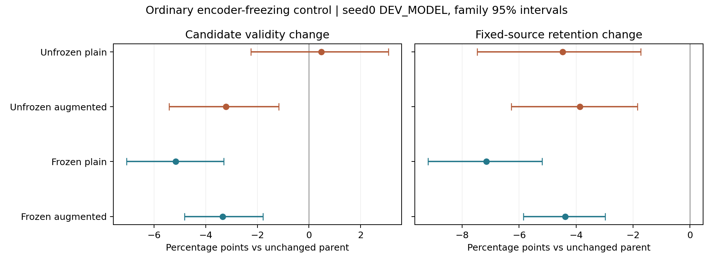

# Frozen input encoders x verified-positive augmentation

Ordinary seed0 factorial on288 DEV_MODEL requests/32families; no new algorithm or independent test claim. All models use the same complete paired-domain q seed0.

| Model | Valid@8 | Any valid | Distinct@8 | Rare recall | Brier | Retained/2169 |
|---|---:|---:|---:|---:|---:|---:|
|Parent|0.868056|0.958333|6.680556|0.744068|0.075390|1872|
|Unfrozen plain|0.872830|0.961806|6.670139|0.738426|0.077099|1775|
|Unfrozen augmented|0.835938|0.944444|6.395833|0.720139|0.100006|1788|
|Frozen plain|0.816406|0.947917|6.131944|0.711603|0.095825|1717|
|Frozen augmented|0.834635|0.958333|6.309028|0.736603|0.086163|1777|

Frozen augmentation-minus-plain retention: 0.027663,95%CI[0.008181632400297251, 0.04993537162954837]; registered gate **False**. Interaction (frozen augmentation effect minus unfrozen augmentation effect): 0.021669,95%CI[-0.02237460296047387, 0.06991948930512958]. Ordinary plain-freezing versus parent gate **False**.

Frozen geometry/feature/state tensors have identical initial/final hashes. Grounding loss is computed but constant with respect to remaining trainable parameters. Bounded endpoint residuals still train; freezing alone does not guarantee correct endpoints. Same1200 updates and actual input/group RNG; augmented targets require more processing.

The retention denominator uses fixed safety_mean source witnesses for all destination models. Confidence intervals resample families, not generator seeds. Earlier unfrozen arms are reused sealed runs. Shared loader materializes permitted DEV caches, but only TRAIN enters updates. No TEST_LOCKED, q retraining, robot execution claim or post-result threshold change.

Full metrics, direction counts, failure details and provenance remain in the closed artifact archive; compact results accompany this report.
